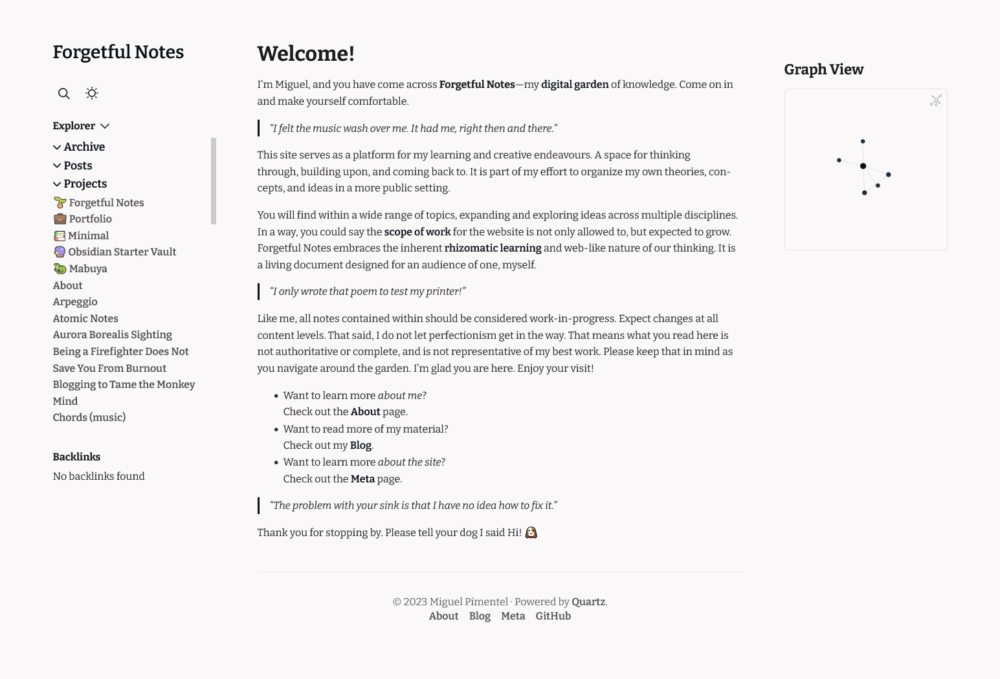
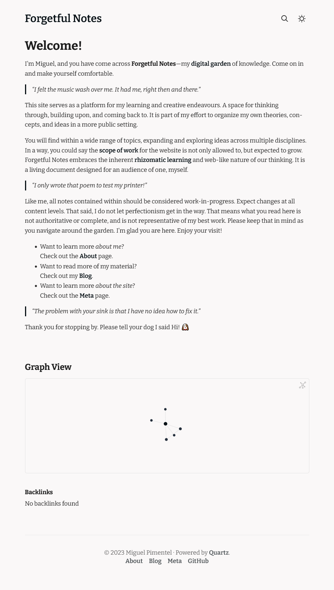
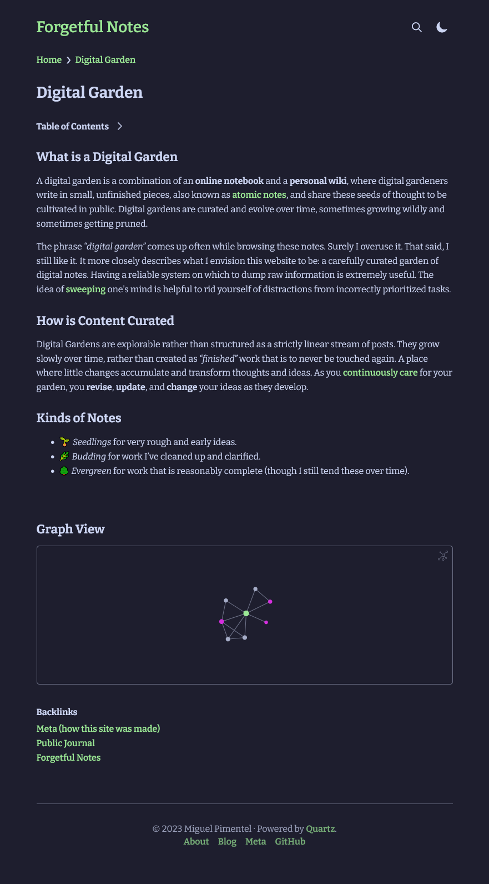

<h1 align=center>🌱 Forgetful Notes</h1>

<p align="center">
  
  
  
  
  
</p>

## Overview

This repository holds the source code for [Forgetful Notes](https://forgetfulnotes.com)—my digital garden of knowledge. It serves as a platform for my learning and creative endeavours. A space for thinking through, building upon, and coming back to.

It is powered by [Quartz](https://github.com/jackyzha0/quartz/) and [Obsidian](https://obsidian.md). You can read the [Documentation](https://quartz.jzhao.xyz/), and join the [Discord Community](https://discord.gg/cRFFHYye7t).

## Table of Contents

<details>
<summary>Show/Hide</summary>

- [Overview](#overview)
- [Table of Contents](#table-of-contents)
- [Screenshots](#screenshots)
  - [Full Width](#full-width)
  - [Slim (light)](#slim-light)
  - [Slim (dark)](#slim-dark)
- [Useful Commands](#useful-commands)
  - [Install Dependencies](#install-dependencies)
  - [Update Dependencies](#update-dependencies)
  - [Start Local Server](#start-local-server)
  - [Update Quartz](#update-quartz)
  - [Sync the Repo](#sync-the-repo)
  - [Build Only](#build-only)
  - [Find Help](#find-help)
- [Customization](#customization)
  - [Stylesheets](#stylesheets)
  - [Fonts](#fonts)
- [Folder Structure](#folder-structure)
- [Acknowledgements and Attributions](#acknowledgements-and-attributions)
- [License](#license)

</details>

## Screenshots

<details>
<summary>Show/Hide</summary>

### Full Width



### Slim (light)



### Slim (dark)



</details>

## Useful Commands

### Install Dependencies

```bash
npm i
npm install
```

### Update Dependencies

```bash
npm update
```

### Start Local Server

```bash
npm start
npm run start
npx quartz build --serve
```

### Update Quartz

```bash
npm run update
npx quartz update
```

### Sync the Repo

```bash
npm run sync
npx quartz sync
```

### Build Only

```bash
npm run build
npx quartz build
```

### Find Help

```bash
npx quartz --help
npx quartz <command> --help
```

## Customization

### Stylesheets

You can add custom CSS code within `/quartz/styles/custom.scss`. You will then need to uncomment line 4 of `/quartz/styles/base.scss` to have it take effect.

### Fonts

| Used in: |                       Font Family                        |                              Previous Font                               |
| -------- | :------------------------------------------------------: | :----------------------------------------------------------------------: |
| Headers  |    [Bitter](https://fonts.google.com/specimen/Bitter)    | [Schibsted Grotesk](https://fonts.google.com/specimen/Schibsted+Grotesk) |
| Body     |    [Bitter](https://fonts.google.com/specimen/Bitter)    |    [Source Sans Pro](https://fonts.google.com/specimen/Source+Sans+3)    |
| Code     | [Fira Mono](https://fonts.google.com/specimen/Fira+Mono) |     [IBM Plex Mono](https://fonts.google.com/specimen/IBM+Plex+Mono)     |

## Folder Structure

<details>
<summary>Show/Hide</summary>

```md
.
├── .github/
│   └── workflows/
│       ├── build.yml
│       └── deploy.yml
├── content/
│   ├── notes.md
│   ├── pages.md
│   └── ...
├── docs/
│   ├── documentation.md
│   └── ...
├── quartz/
│   ├── cli/
│   │   ├── args.js
│   │   ├── constants.js
│   │   ├── handlers.js
│   │   └── helpers.js
│   ├── components/
│   │   ├── pages/
│   │   ├── scripts/
│   │   ├── styles/
│   │   ├── Backlinks.tsx
│   │   ├── Explorer.tsx
│   │   └── ...
│   ├── plugins/
│   │   ├── emitters/
│   │   ├── filters/
│   │   ├── transformers/
│   │   ├── index.ts
│   │   ├── types.ts
│   │   └── vfile.ts
│   ├── processors/
│   │   ├── emit.ts
│   │   ├── filter.ts
│   │   └── parse.ts
│   ├── static/
│   │   ├── favicon.ico
│   │   ├── site.manifest
│   │   └── ...
│   ├── styles/
│   │   ├── base.scss
│   │   ├── callouts.scss
│   │   ├── custom.scss
│   │   ├── syntax.scss
│   │   └── variables.scss
│   ├── util/
│   │   ├── theme.ts
│   │   ├── jsx.tsx
│   │   └── ...
│   ├── bootstrp.cli.mjs
│   ├── bootstrap-worker.njs
│   ├── build.ts
│   ├── cfg.ts
│   └── worker.ts
├── .gitattributes
├── .gitignore
├── .npmrc
├── .prettierignore
├── .prettierrc
├── Dockerfile
├── LICENSE
├── README.md
├── globals.d.ts
├── index.d.ts
├── package-lock.json
├── package.json
├── quartz.config.ts
├── quartz.layout.ts
├── screenshot.png
└── tsconfig.json
```

</details>

## Acknowledgements and Attributions

Forgetful Notes is based on [Quartz](https://github.com/jackyzha0/quartz).

## License

Source code in this repository is available under the [MIT License](LICENSE).
