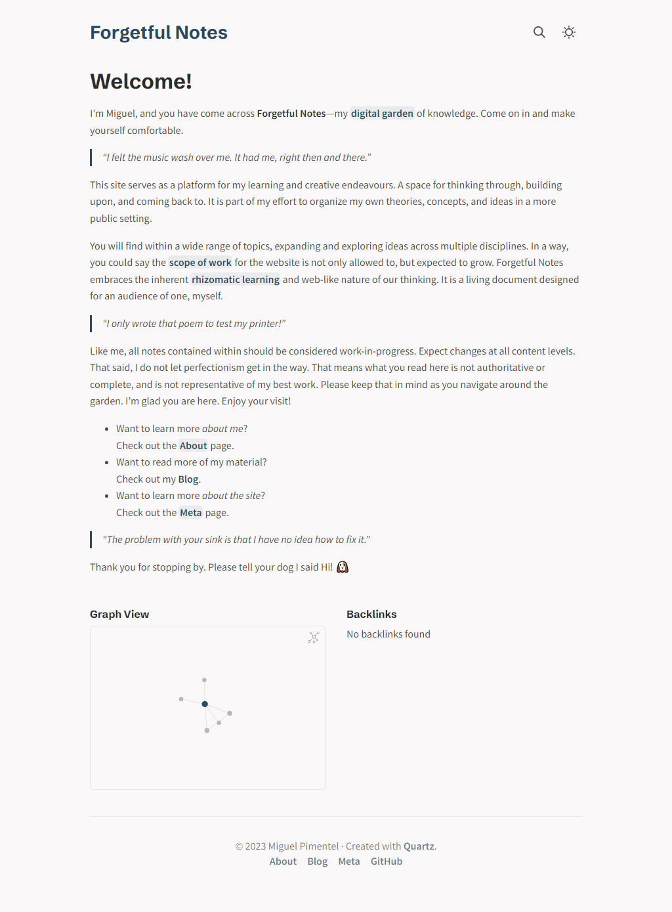

# Quartz

Host your second brain and [digital garden](https://jzhao.xyz/posts/digital-gardening) for free. Quartz features

1. Extremely fast full-text search by pressing `Ctrl` + `k`
2. Customizable and hackable design based on Hugo
3. Automatically generated backlinks, link previews, and local graph
4. Built-in CJK + Latex Support
5. Support for both Markdown Links and Wikilinks

> “[One] who works with the door open gets all kinds of interruptions, but [they] also occasionally gets clues as to what the world is and what might be important.” — Richard Hamming

🔗 Get Started: https://quartz.jzhao.xyz/

*Quartz Example Screenshot*

[Join the Discord Community](https://discord.gg/cRFFHYye7t)
