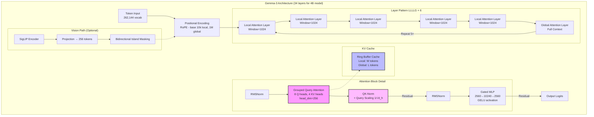

# Gemma-3: Architecture Notes

> Decoder-only Transformers with native vision. Mixed local-global attention for long context at low KV memory.



---

## 1. The Big Picture: What Makes Gemma-3 Special

Gemma-3 is like a smart reader that can handle extremely long books (128,000 tokens) without running out of memory. It achieves this through clever tricks:

- **Mixed attention**: Some layers look at everything (global), others only look nearby (local)
- **Shared resources**: Multiple query heads share the same key-value pairs (GQA)
- **Stable math**: Normalizes queries and keys to prevent numerical explosions

## 2. Attention Mechanisms

### 2.1 Grouped Query Attention (GQA) - The Resource Sharing Trick


```python
import numpy as np

def gqa_example():
    """
    Standard attention: 8 people each have their own conversation partner
    GQA: 8 people split into 2 groups, each group talks to one expert
    """
    batch_size = 1
    seq_len = 10
    d_model = 256
    
    # Configuration
    num_q_heads = 8  # 8 different questioners
    num_kv_heads = 2  # Only 2 sources of information
    head_dim = 32
    
    # Input embedding
    x = np.random.randn(batch_size, seq_len, d_model)
    
    # Weight matrices (learned during training)
    W_q = np.random.randn(d_model, num_q_heads * head_dim)
    W_k = np.random.randn(d_model, num_kv_heads * head_dim)
    W_v = np.random.randn(d_model, num_kv_heads * head_dim)
    
    # Project to Q, K, V
    Q = x @ W_q  # [1, 10, 256] @ [256, 256] = [1, 10, 256]
    K = x @ W_k  # [1, 10, 64]  - much smaller!
    V = x @ W_v  # [1, 10, 64]  - much smaller!
    
    # Reshape for multi-head
    Q = Q.reshape(batch_size, seq_len, num_q_heads, head_dim)
    K = K.reshape(batch_size, seq_len, num_kv_heads, head_dim)
    V = V.reshape(batch_size, seq_len, num_kv_heads, head_dim)
    
    # Each Q head knows which KV head to use
    q_per_kv = num_q_heads // num_kv_heads  # 4 Q heads per KV head
    
    print(f"Memory saved: {(1 - num_kv_heads/num_q_heads)*100:.0f}% on KV cache")
    print(f"Q heads 0-3 use KV head 0")
    print(f"Q heads 4-7 use KV head 1")
    
    return Q, K, V

Q, K, V = gqa_example()
```

### 2.2 Local vs Global Attention - The Sliding Window

Think of reading a long document. You don't need to remember every word from page 1 when you're on page 100. Local attention is like having a sliding notepad that only keeps recent context.

```python
def attention_patterns():
    """
    Visualize the difference between local and global attention
    """
    seq_len = 16
    window_size = 4
    
    # Global attention mask (can see everything before)
    global_mask = np.tril(np.ones((seq_len, seq_len)))
    
    # Local sliding window mask
    local_mask = np.zeros((seq_len, seq_len))
    for i in range(seq_len):
        start = max(0, i - window_size + 1)
        local_mask[i, start:i+1] = 1
    
    print("Global attention at position 8:")
    print("Can see positions:", np.where(global_mask[8])[0])
    print("\nLocal attention at position 8 (window=4):")
    print("Can see positions:", np.where(local_mask[8])[0])
    
    # Gemma-3 pattern: LLLLG (5 local, 1 global)
    layer_pattern = ['Local', 'Local', 'Local', 'Local', 'Local', 'Global']
    print("\nGemma-3 repeating pattern:", ' -> '.join(layer_pattern))

attention_patterns()
```

## 3. RoPE (Rotary Position Embeddings) - Teaching Position Through Rotation

RoPE encodes position by rotating vectors. Imagine each word as a clock hand that rotates based on its position in the sentence.

```python
def rope_intuition():
    """
    RoPE rotates embeddings based on position
    Different rotation speeds for local vs global layers
    """
    d_head = 64
    positions = [0, 5, 10, 100, 1000]
    
    # Different bases for different purposes
    local_base = 10_000   # Slower rotation, fine-grained local patterns
    global_base = 1_000_000  # Much slower rotation, preserves long-range
    
    def rotation_angle(pos, dim_idx, base):
        # Higher dimensions rotate slower
        frequency = 1 / (base ** (2 * dim_idx / d_head))
        return pos * frequency
    
    print("Position encoding angles (first dimension):")
    for pos in positions:
        local_angle = rotation_angle(pos, 0, local_base)
        global_angle = rotation_angle(pos, 0, global_base)
        print(f"Position {pos:4d}: Local={local_angle:.4f}, Global={global_angle:.6f}")
    
    print("\nWhy different bases?")
    print("- Local layers (base 10K): Better at nearby relationships")
    print("- Global layers (base 1M): Better at very distant relationships")

rope_intuition()
```

## 4. QK-Norm and Query Scaling - Preventing Attention Explosions

Without normalization, dot products between Q and K can explode to huge values, breaking the softmax function.

```python
def qk_norm_demo():
    """
    Show why we need QK normalization
    """
    d_head = 256
    seq_len = 100
    
    # Without normalization - values can explode
    q_raw = np.random.randn(seq_len, d_head) * 10  # Large values
    k_raw = np.random.randn(seq_len, d_head) * 10
    
    # Dot products without normalization
    scores_raw = q_raw @ k_raw.T
    
    # With QK-norm (RMSNorm on Q and K)
    def rms_norm(x):
        return x / np.sqrt(np.mean(x**2, axis=-1, keepdims=True) + 1e-6)
    
    q_normed = rms_norm(q_raw)
    k_normed = rms_norm(k_raw)
    
    # Query scaling (Gemma uses 1/sqrt(d_head))
    scale = 1 / np.sqrt(d_head)
    q_scaled = q_normed * scale
    
    scores_normed = q_scaled @ k_normed.T
    
    print(f"Without QK-norm: scores range [{scores_raw.min():.1f}, {scores_raw.max():.1f}]")
    print(f"With QK-norm: scores range [{scores_normed.min():.3f}, {scores_normed.max():.3f}]")
    print(f"\nSoftmax without norm: many values become 0 or 1 (saturated)")
    print(f"Softmax with norm: smooth probability distribution")

qk_norm_demo()
```

## 5. Gated MLP (GEGLU) - Smart Feed-Forward Networks

The gated MLP is like having two parallel processors: one decides what information to process, the other decides how much of it to let through.

```python
def gated_mlp_example():
    """
    Compare standard MLP vs Gated MLP
    """
    d_model = 256
    hidden_dim = 1024
    x = np.random.randn(1, d_model)
    
    # Standard MLP: x -> expand -> activate -> compress
    def standard_mlp(x):
        W_up = np.random.randn(d_model, hidden_dim)
        W_down = np.random.randn(hidden_dim, d_model)
        
        h = x @ W_up  # Expand
        h = np.maximum(0, h)  # ReLU
        out = h @ W_down  # Compress
        return out
    
    # Gated MLP: two parallel paths that multiply
    def gated_mlp(x):
        W_gate = np.random.randn(d_model, hidden_dim)
        W_up = np.random.randn(d_model, hidden_dim)
        W_down = np.random.randn(hidden_dim, d_model)
        
        def gelu(x):
            return 0.5 * x * (1 + np.tanh(np.sqrt(2/np.pi) * (x + 0.044715 * x**3)))
        
        gate = x @ W_gate  # Gate path
        up = x @ W_up      # Value path
        
        h = gelu(up) * gate  # Multiply paths (gating)
        out = h @ W_down
        return out
    
    print("Standard MLP: simple linear transformations")
    print("Gated MLP: can selectively amplify or suppress features")
    print("\nIntuition: It's like having a smart filter that learns")
    print("what information to emphasize vs ignore")

gated_mlp_example()
```

## 6. KV Cache Management - The Ring Buffer

When generating text, we need to remember previous tokens' K and V values. Gemma uses a clever ring buffer to limit memory usage.

```python
def ring_buffer_cache():
    """
    Demonstrate ring buffer for KV cache
    """
    cache_size = 8  # Small for demonstration
    sequence = "The quick brown fox jumps over the lazy dog".split()
    
    class RingBufferCache:
        def __init__(self, size):
            self.size = size
            self.buffer = [None] * size
            self.position = 0
        
        def add(self, item):
            self.buffer[self.position % self.size] = item
            self.position += 1
        
        def get_valid_items(self):
            if self.position < self.size:
                return self.buffer[:self.position]
            else:
                # Reconstruct in correct order after wrap
                start = self.position % self.size
                return self.buffer[start:] + self.buffer[:start]
    
    cache = RingBufferCache(cache_size)
    
    for i, word in enumerate(sequence):
        cache.add(word)
        valid = cache.get_valid_items()
        print(f"Step {i+1}: Added '{word}' -> Cache: {valid[-4:] if len(valid) > 4 else valid}")
    
    print(f"\nFinal cache holds last {cache_size} items")
    print("Memory is constant regardless of sequence length!")

ring_buffer_cache()
```

## 7. Vision Integration - Images as Tokens

Gemma-3 converts images into 256 special tokens that mix with text tokens. No separate vision model needed during generation.

```python
def vision_integration():
    """
    Show how images become tokens in the sequence
    """
    text_before = "Look at this image:"
    image_placeholder = "[IMAGE]"
    text_after = "It shows a cat."
    
    # Tokenization process
    tokens_before = text_before.split()  # Simplified tokenization
    tokens_after = text_after.split()
    
    # Image processing
    image_patches = 16 * 16  # 256 patches from image
    soft_tokens = f"[img_token_{i}]" for i in range(256)
    
    # Final sequence
    print("Original input:", text_before, image_placeholder, text_after)
    print("\nAfter vision processing:")
    print(f"Text tokens: {len(tokens_before)} tokens")
    print(f"Image tokens: 256 soft tokens (fixed size)")
    print(f"Text tokens: {len(tokens_after)} tokens")
    print(f"\nTotal sequence: {len(tokens_before) + 256 + len(tokens_after)} tokens")
    print("\nKey insight: Every image costs exactly 256 tokens,")
    print("making memory usage predictable")

vision_integration()
```

## 8. Model Configurations at Different Scales

```python
def model_comparison():
    """
    Compare different Gemma-3 model sizes
    """
    configs = {
        "1B": {"layers": 26, "d_model": 1152, "heads": 4, "kv_heads": 1, "window": 512},
        "4B": {"layers": 34, "d_model": 2560, "heads": 8, "kv_heads": 4, "window": 1024},
        "12B": {"layers": 48, "d_model": 3840, "heads": 16, "kv_heads": 8, "window": 1024},
        "27B": {"layers": 62, "d_model": 5376, "heads": 32, "kv_heads": 16, "window": 1024},
    }
    
    for name, config in configs.items():
        gqa_ratio = config["heads"] / config["kv_heads"]
        params_approx = (config["layers"] * config["d_model"]**2 * 12) / 1e9
        
        print(f"Gemma-3-{name}:")
        print(f"  Layers: {config['layers']}, Dimension: {config['d_model']}")
        print(f"  GQA ratio: {gqa_ratio:.0f}x (saves {(1-1/gqa_ratio)*100:.0f}% KV memory)")
        print(f"  Window: {config['window']} tokens")
        print()

model_comparison()
```

## Memory Calculation Example

Let's calculate actual memory usage for a 4B model handling 128K context:

```python
def memory_calculation():
    """
    Calculate KV cache memory for Gemma-3-4B
    """
    # Model config
    batch = 1
    context_length = 128_000
    num_layers = 34
    kv_heads = 4
    head_dim = 256
    window_size = 1024
    bytes_per_param = 2  # bfloat16
    
    # Pattern: LLLLG (5 local, 1 global per 6 layers)
    num_patterns = num_layers // 6
    local_layers = num_patterns * 5
    global_layers = num_patterns * 1
    
    # Memory per layer type
    global_memory = 2 * batch * context_length * kv_heads * head_dim * bytes_per_param
    local_memory = 2 * batch * window_size * kv_heads * head_dim * bytes_per_param
    
    # Total memory
    total_global = global_layers * global_memory / 1e9  # Convert to GB
    total_local = local_layers * local_memory / 1e9
    total = total_global + total_local
    
    # If all layers were global
    all_global = num_layers * global_memory / 1e9
    
    print(f"Gemma-3-4B KV Cache Memory (128K context):")
    print(f"  Global layers ({global_layers}): {total_global:.2f} GB")
    print(f"  Local layers ({local_layers}): {total_local:.3f} GB")
    print(f"  Total: {total:.2f} GB")
    print(f"\nIf all layers were global: {all_global:.1f} GB")
    print(f"Memory saved: {(1 - total/all_global)*100:.0f}%")

memory_calculation()
```

## Key Takeaways

1. **GQA**: Multiple queries share KV pairs → less memory, similar quality
2. **Local/Global Mix**: Most layers look nearby, few look everywhere → handles long context efficiently
3. **RoPE with different bases**: Local layers for nearby patterns, global layers for distant relationships
4. **QK-norm**: Keeps attention mathematically stable without capping
5. **Gated MLP**: More expressive than standard MLP at same parameter count
6. **Ring buffer cache**: Constant memory regardless of generation length
7. **Vision as tokens**: Images become 256 tokens, reusing the language stack

The genius of Gemma-3 is combining all these optimizations to achieve 128K context on consumer hardware while maintaining quality.

---

## Resources and Links

- Model Weights: https://huggingface.co/google/gemma-3
- Documentation: https://ai.google.dev/gemma
- Fine-tuning Guide: [[MedGemma|MedGemma Example]]
- Community: https://discord.gg/gemma

---

### Navigation

[← Back to Foundations Index](Index.md) | [Next: MedGemma →](../../Healthcare/MedGemma.md)

### Related Topics
- [[Large Language Models|LLM Foundations]]
- [[MedGemma|Medical Fine-tuning]]
- [[Metrics and Calibration|Performance Evaluation]]
- [[VLM Basics|Multimodal Architecture]]
