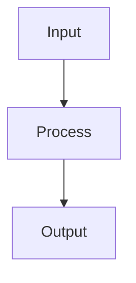

# Chapter Title: [Attack Type/Defense Strategy/Evaluation Framework]

> One-line description capturing the essence of this chapter

[← Previous Chapter](previous.md) | [Back to Attacks Index](index.md) | [Next Chapter →](next.md)

---

## Executive Summary

**Key Finding**: [Main contribution in 1-2 sentences with quantitative results]

**Clinical Impact**: [Why this matters for medical VLMs and healthcare applications]

**TL;DR**: [3-4 bullet points summarizing the chapter]
- 
- 
- 
- 

---

## 1. Introduction

### Context and Motivation
[Why this topic matters in the context of VLM security]

### Problem Statement
[Specific challenge being addressed]

### Related Work
- [[Link to related chapter]] — Brief connection
- [[Another related topic]] — How it relates
- External reference: [Paper/Resource]

---

## 2. Technical Foundation

### Mathematical Formulation
[Key equations and theoretical framework]

$$
\text{Core equation here}
$$

### Key Concepts
1. **Concept 1**: Definition and importance
2. **Concept 2**: Definition and importance
3. **Concept 3**: Definition and importance

### Threat Model / Assumptions
- **Attacker capabilities**: 
- **Defender resources**: 
- **Environmental constraints**: 

---

## 3. Methodology

### Attack/Defense Algorithm
```python
def method_name(params):
    """
    Clear docstring explaining the method
    """
    # Implementation with comments
    pass
```

### Implementation Details
- **Parameters**: Standard configurations
- **Optimization**: Key tricks and considerations
- **Computational requirements**: Time/space complexity

### Experimental Setup
| Component | Details |
|-----------|---------|
| Models tested | |
| Datasets | |
| Metrics | |
| Baselines | |

---

## 4. Results and Analysis

### Quantitative Results
| Method | Metric 1 | Metric 2 | Metric 3 |
|--------|----------|----------|----------|
| Baseline | | | |
| Our method | | | |
| Improvement | | | |

### Key Findings
1. **Finding 1**: [Description with evidence]
2. **Finding 2**: [Description with evidence]
3. **Finding 3**: [Description with evidence]

### Ablation Studies
[What components contribute most to performance]

### Visualization


---

## 5. Medical Domain Applications

### Clinical Relevance
[How this applies to healthcare VLMs]

### Case Studies
1. **Diagnostic imaging**: 
2. **Report generation**: 
3. **Treatment planning**: 

### Safety Considerations
- **Risk assessment**: 
- **Mitigation strategies**: 
- **Regulatory compliance**: 

---

## 6. Limitations and Future Work

### Current Limitations
1. 
2. 
3. 

### Open Research Questions
- 
- 
- 

### Future Directions
[Promising avenues for extension]

---

## 7. Practical Implementation Guide

### Quick Start
```bash
# Installation
pip install required-packages

# Basic usage
python attack.py --model clip --epsilon 8/255
```

### Advanced Configuration
```python
config = {
    'attack_params': {},
    'defense_params': {},
    'evaluation_params': {}
}
```

### Troubleshooting
| Issue | Solution |
|-------|----------|
| Common error 1 | Fix 1 |
| Common error 2 | Fix 2 |

---

## 8. Key Takeaways

### For Researchers
- 
- 
- 

### For Practitioners
- 
- 
- 

### For Medical Professionals
- 
- 
- 

---

## References

1. [Primary paper if applicable]
2. [Key related work]
3. [Implementation resources]

---

## Navigation

[← Previous Chapter](previous.md) | [Back to Attacks Index](index.md) | [Next Chapter →](next.md)

### Related Topics
- [[Related Chapter 1]] — Connection
- [[Related Chapter 2]] — Connection
- [[External Topic]] — Why relevant

### Further Reading
- [Resource 1]
- [Resource 2]
- [Resource 3]