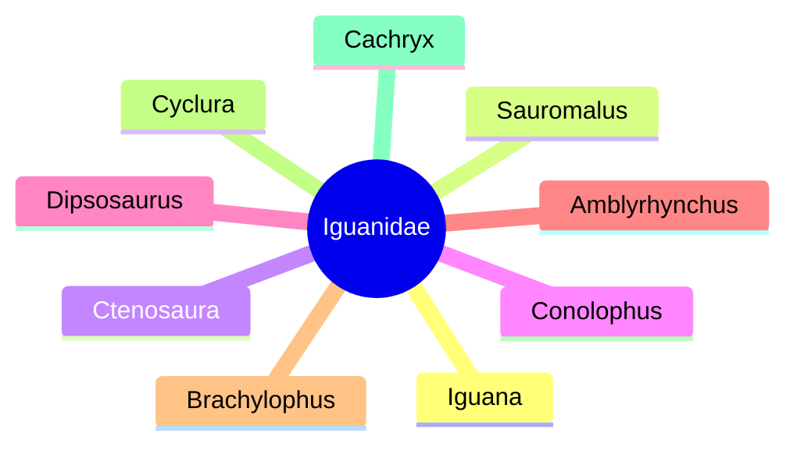

Chuckwallas are lizards found primarily in arid regions of the southwestern United States and northern Mexico, with some also inhabiting coastal islands. There are five species of chuckwallas, all belonging to the genus _Sauromalus_. They are members of the iguanid family, _Iguanidae_, which includes iguanas, chuckwallas, and their prehistoric relatives.

Chuckwallas have a robust build with wide bodies and flattened midsections. Their bellies are prominent, and their tails are thick, tapering to a blunt tip. Loose folds of skin can be observed on the neck and sides of their bodies, which are covered in small, coarsely granular scales. Chuckwallas vary in length, ranging from 15 inches to 30 inches.

## Iguanidae (lizard family)

<!--  -->

