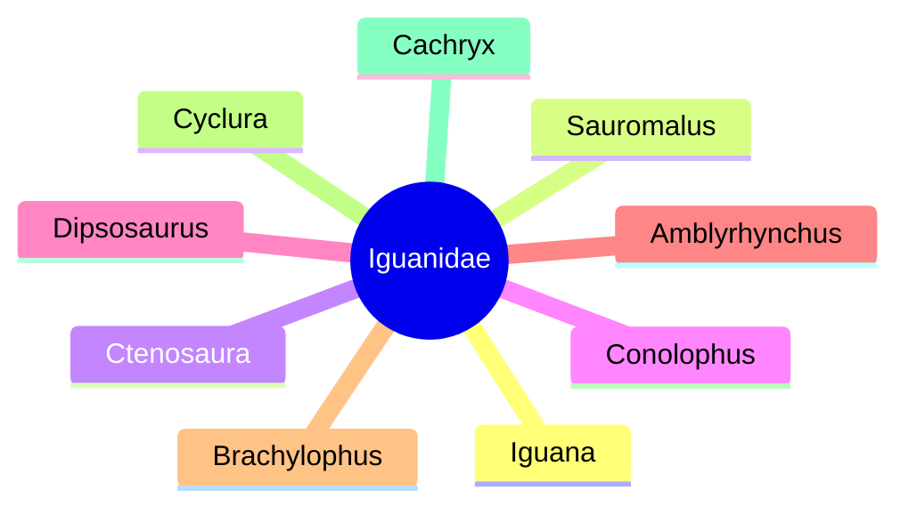

Chuckwallas are lizards found primarily in arid regions of the southwestern United States and northern Mexico. Some are found on coastal islands. The five species of chuckwallas are all placed within the genus _Sauromalus_; they are part of the iguanid family, _Iguanidae_—composed of iguanas, chuckwallas, and their prehistoric relatives.

Chuckwallas are stocky, wide-bodied lizards with flattened midsections and prominent bellies. Their tails are thick, tapering to a blunt tip. Loose folds of skin characterize the neck and sides of their bodies, which are covered in small, coarsely granular scales. Their length ranges from 15 inches up to 30 inches.

## Iguanidae (lizard family)

