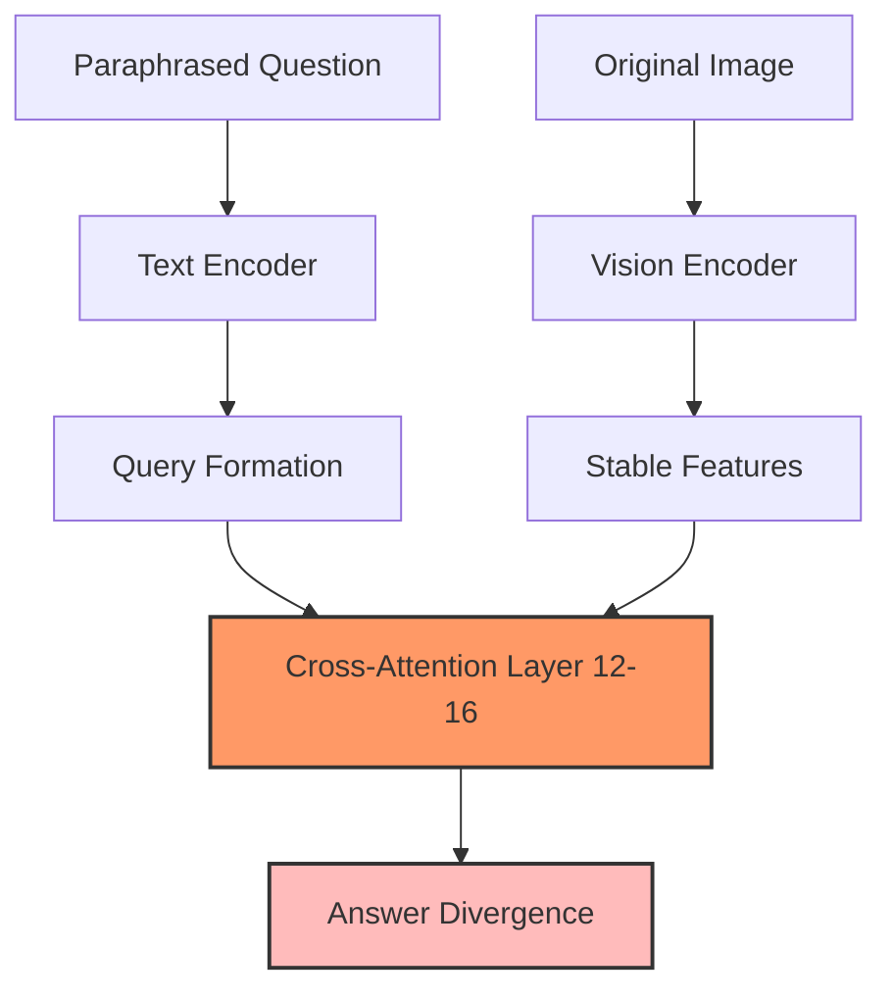

# Research Thrusts: From Discovery to Deployment

> Four interconnected thrusts addressing measurement, causality, mitigation, and safe deployment of phrasing-robust medical VLMs

[← Key Concepts](02-key-concepts.md) | [Timeline →](03-timeline.md)

---

## Thrust 1: Measuring Linguistic Brittleness Through VSF Med

### Objective
Establish comprehensive measurement framework and dataset to quantify flip-with-stable-focus (FSF) and error-faithfulness gap (EFG) phenomena in medical VLMs.

### Key Components

#### VSF Med Dataset
- **Scale**: 2,000+ radiological questions from MIMIC-CXR
- **Paraphrases**: 8-10 validated variants per question (16,847 total)
- **Categories**: 
  - Binary finding detection (40%, 800 questions)
  - Localization queries (20%, 400 questions)
  - Severity assessment (15%, 300 questions)
  - Differential diagnosis (15%, 300 questions)
  - Temporal comparison (10%, 200 questions)

#### Paraphrase Generation Protocol
Three-stage validation process:
1. **Linguistic Generation**: Systematic variation across 5 dimensions
   - Lexical: Medical synonym mapping (23.1%)
   - Syntactic: Parse tree transformation (19.1%)
   - Pragmatic: Confidence modulation (15.9%)
   - Negation: Polarity inversion (14.6%)
   - Scope: Modifier reattachment (13.6%)
2. **Clinical Filtering**: Radiology resident review (15% rejection)
3. **Semantic Validation**: Board-certified radiologist (8% additional rejection)

#### ROI Annotation Framework
1,500 images with three annotation types:
- **Primary ROIs**: Direct pathology evidence (Dice = 0.78 ± 0.12)
- **Contextual ROIs**: Interpretive context (Dice = 0.64 ± 0.18)
- **Negative ROIs**: Exclusion regions

### Key Findings

#### Overall Metrics
| Model | Accuracy | Flip Rate | FSF Index | EFG (Del) | AAC |
|-------|----------|-----------|-----------|-----------|-----|
| MedGemma-4b-it | 0.724 | 12.7% | 0.683 | 0.342 | 0.214 |
| LLaVA-Rad | 0.689 | 15.6% | 0.714 | 0.387 | 0.186 |
| Human Radiologist | 0.892 | 2.3% | N/A | N/A | N/A |

#### Phenomenon-Specific Flip Rates
- Negation patterns: >22% (highest risk)
- Scope ambiguities: 18-20%
- Syntactic variations: 12-15%
- Lexical substitutions: 8-10%

#### Attention Stability Paradox
- Average SSIM across paraphrases: 0.876 ± 0.082
- No significant difference between flipping (0.871) and consistent (0.879) pairs
- Confirms visual processing stability despite answer changes

### Clinical Risk Stratification

**High-risk applications** (require human oversight):
- Emergency triage with negation-heavy queries
- Automated reporting systems
- Teaching/training scenarios

**Moderate-risk** (with safeguards):
- Workflow prioritization with mandatory review
- Quality assurance with ensemble voting
- Research applications with aggregate statistics

**Lower-risk** (current deployment suitable):
- Administrative routing by modality
- Training data curation
- Retrospective analysis with validation

## Thrust 2: Causal Analysis of Failure Mechanisms

### Objective
Identify computational pathways through which linguistic variation propagates to cause FSF and EFG, enabling targeted interventions.

### Methodological Approach

#### Layer-wise Representation Analysis
Track similarity degradation through model layers:
```python
LayerSim_l = cos(h_l^(p1), h_l^(p2))
```

Key findings:
- **MedGemma**: Sharp drop at layers 12-16 (cross-attention)
- **LLaVA-Rad**: Earlier divergence at layers 8-12
- Vision encoder maintains >0.92 similarity throughout

#### Cross-Attention Interchange Experiments
Systematic component swapping to isolate failure sources:
1. Swap queries while keeping K,V fixed
2. Swap key-value pairs while keeping Q fixed
3. Full cross-attention replacement

Results:
- K,V swapping reduces flips by 38-43%
- Query formation (text encoding) drives failures
- Vision-language alignment remains stable

#### Gradient-Based Token Importance
```python
I_token = ||∂L_flip/∂e_token||_2
```

Findings:
- Negation tokens: 2.8× average importance
- Medical terminology: 1.6× average
- Image patches: Uniform (SD < 0.12)

### Causal Pathway Mapping



### Mediation Analysis Results
- Total effect: 15.6% flip rate
- Direct effect (bypassing attention): 9.2%
- Mediated effect: 6.4% (41% of total)
- **Conclusion**: Cross-attention mediates but doesn't fully explain FSF

## Thrust 3: Parameter-Efficient Mitigation

### Objective
Develop targeted interventions that reduce FSF to <5% while maintaining diagnostic accuracy using minimal computational resources.

### Theoretical Framework

#### Design Space of Interventions
1. **Architectural Modifications**
   - Attention regularization
   - Cross-modal fusion redesign
   - Linguistic encoding stabilization

2. **Training Objectives**
   - Paraphrase consistency loss
   - Contrastive learning on variants
   - ROI-aligned supervision

3. **Inference Strategies**
   - Ensemble voting
   - Calibrated abstention
   - Linguistic preprocessing

### Practical Implementation

#### LoRA-Based Targeted Adaptation
Focus on causally-identified components:
```python
# Target layers 12-16 for MedGemma
lora_config = LoraConfig(
    r=16,  # Low rank
    lora_alpha=32,
    target_modules=["q_proj", "v_proj"],  # Query and value projections
    layers=[12, 13, 14, 15, 16]  # Causal hotspots
)
```

#### Multi-Objective Training
```python
L_total = λ₁L_task + λ₂L_consistency + λ₃L_attention
```
Where:
- `L_task`: Standard VQA loss
- `L_consistency`: KL divergence between paraphrase outputs
- `L_attention`: Attention stability regularization

### Expected Outcomes
- FSF reduction: 12-18% → <5%
- Parameters modified: <1% (50M of 4B)
- Training time: 8-12 epochs on 8× A100s
- Accuracy delta: ±2% on diagnostic tasks

## Thrust 4: Safe Clinical Deployment

### Objective
Integrate robust models into clinical workflow with selective prediction and calibrated abstention achieving >99% sensitivity for critical findings.

### Selective Conformal Triage Framework

#### Uncertainty Quantification
Multiple uncertainty sources:
1. **Paraphrase Disagreement**: Ensemble variance
2. **Model Uncertainty**: MC dropout, temperature scaling
3. **Attention Instability**: Cross-paraphrase SSIM variance

#### Triage Decision Logic
```python
def triage_decision(image, question):
    # Get predictions across paraphrases
    predictions = [model(image, p) for p in paraphrases]
    
    # Check consensus
    if variance(predictions) > τ_consensus:
        return "defer", "paraphrase_disagreement"
    
    # Check confidence calibration
    confidence = calibrated_confidence(predictions)
    if confidence < τ_confidence:
        return "defer", "low_confidence"
    
    # Check for critical findings
    if any_critical_finding(predictions):
        return "radiologist_review", "critical_finding"
    
    # Safe to auto-clear if normal with high confidence
    if all_normal(predictions) and confidence > 0.95:
        return "auto_clear", "normal"
    
    return "radiologist_review", "needs_review"
```

### Deployment Metrics

#### Safety Guarantees
- Critical finding sensitivity: >99%
- False negative rate (normal cases): <0.1%
- Calibration error (ECE): <0.05

#### Efficiency Gains
- Auto-clearance rate: 30-40% of normal cases
- Radiologist time savings: 25-30%
- Average turnaround reduction: 2-3 hours

### Integration Requirements

#### Technical Infrastructure
- PACS integration for seamless workflow
- Real-time inference (<2 seconds per case)
- Audit trail for all decisions
- Fallback mechanisms for system failures

#### Human Factors
- Clear uncertainty communication
- Explanation interfaces showing attention
- Training for radiologists on system limitations
- Feedback loops for continuous improvement

## Cross-Thrust Integration

### Data Flow
```
Thrust 1 (VSF Med) → Thrust 2 (Causal Analysis) → Thrust 3 (Mitigation) → Thrust 4 (Deployment)
     ↓                        ↓                          ↓                        ↓
  Dataset               Failure Pathways           Robust Models           Clinical System
```

### Iterative Refinement
- Thrust 4 deployment reveals new failure modes → Thrust 1 measurement
- Thrust 2 analysis guides Thrust 3 intervention targets
- Thrust 3 models enable Thrust 4 safety guarantees

### Open Science Contributions
Each thrust produces reusable artifacts:
1. **VSF Med dataset** (Thrust 1)
2. **Causal analysis toolkit** (Thrust 2)
3. **Robust model checkpoints** (Thrust 3)
4. **Deployment framework** (Thrust 4)

## Timeline Integration

### Phase 1 (Sep-Dec 2025): Foundation
- Complete VSF Med construction
- Initial causal analysis
- Baseline measurements

### Phase 2 (Jan-Apr 2026): Development
- Full causal investigation
- Mitigation implementation
- Model training and validation

### Phase 3 (May-Aug 2026): Deployment
- Clinical evaluation
- Safety validation
- Thesis completion

## Success Criteria

### Quantitative Targets
- FSF rate: <5% (from 12-18%)
- EFG elimination: Faithfulness independent of correctness
- Deployment metrics: >99% sensitivity, 30% auto-clearance

### Qualitative Goals
- Radiologist trust and adoption
- Regulatory pathway clarity
- Open science impact

This integrated approach transforms the discovery of FSF and EFG from concerning observations into actionable insights, enabling safe deployment of medical VLMs in clinical practice.