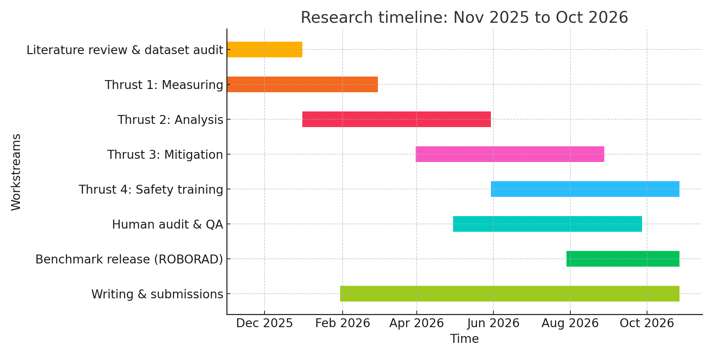

# Timeline and Resources

## Timeline and Milestones

The research timeline spans thirteen months from October 2025 through October 2026. The work proceeds through overlapping phases that balance focused investigation with opportunities for iteration.

*Research timeline showing parallel and sequential workstreams across four thrusts. Literature review and dataset construction establish foundations. Causal analysis, mitigation, and safety evaluation proceed in overlapping phases. Continuous quality assurance and writing ensure integration across components.*

### Phase 1: Foundation (October 2025 - January 2026)

The initial phase establishes foundations through comprehensive literature review and dataset construction. Literature review proceeds iteratively rather than as a front-loaded exercise. As I encounter challenges in later phases, I revisit the literature with more specific questions.

Dataset audit ensures quality through multiple validation passes, with radiologist review concentrated in November and December to establish annotation reliability before experimental work begins.

### Phase 2: Measurement (November 2025 - March 2026) 

Thrust 1 measurement work overlaps with dataset construction, enabling rapid iteration as I discover edge cases requiring additional annotation. By mid-December, I transition from dataset refinement to systematic measurement of phrasing-sensitive failure and Misleading Explanation Effect across baseline models.

This five-month window provides sufficient time for extensive evaluation across multiple models, paraphrase strategies, and clinical scenarios.

### Phase 3: Causal Analysis (January - June 2026)

Thrust 2 causal analysis begins once I have stable measurements of failure modes. The six-month duration reflects the exploratory nature of mechanistic interpretability work. I expect to iterate between different intervention strategies as results reveal unexpected complexity in how linguistic variation propagates through model components.

Starting this phase while Thrust 1 continues enables me to target causal investigations toward the most prevalent failure patterns.

### Phase 4: Mitigation (March - August 2026)

Thrust 3 mitigation overlaps substantially with causal analysis, allowing insights from mechanistic investigations to inform intervention design. The six-month duration accommodates both theoretical framework development and practical implementation through parameter-efficient fine-tuning.

I expect multiple training runs as I refine hyperparameters and discover which combinations of techniques work best for different failure modes.

### Phase 5: Safety Evaluation (May - October 2026)

Thrust 4 safety evaluation integrates adapted models into realistic deployment scenarios. The six-month window allows time for careful collaboration with radiologists, iterative refinement of selective prediction thresholds, and documentation of when models should defer to human expertise.

This phase begins late enough to incorporate mitigation strategies from Thrust 3 but early enough to influence final model design if safety evaluation reveals unexpected issues.

## Required Resources and Current Availability

The majority of critical infrastructure is already secured through institutional resources, with modest additional funding needed primarily for API access and conference dissemination.

### Computational Infrastructure

| **Resource** | **Requirements** | **Status** |
|--------------|------------------|------------|
| GPU compute | 8× NVIDIA A100 80GB | Available (shared cluster) |
| Storage | 2TB fast SSD for datasets | Available |
| Memory | 256GB RAM for preprocessing | Available |
| Network | High-bandwidth for model downloads | Available |

### Datasets and Models

| **Resource** | **Requirements** | **Status** |
|--------------|------------------|------------|
| MIMIC-CXR | Access credentials | Obtained (PhysioNet) |
| Chest ImaGenome | Annotations and regions | Downloaded |
| MedGemma-4b-it | Model weights (16GB) | Downloaded |
| LLaVA-Rad | Model weights (14GB) | Downloaded |

### Software and Tools

| **Resource** | **Requirements** | **Status** |
|--------------|------------------|------------|
| PyTorch 2.0+ | Deep learning framework | Installed |
| Transformers library | Model implementations | Installed |
| Weights & Biases | Experiment tracking | Edu Licensed |
| Medical imaging tools | DICOM processing (pydicom, nibabel) | Available |

### Human Resources

| **Resource** | **Requirements** | **Status** |
|--------------|------------------|------------|
| Radiologist validation | 20 hours for review | Committed |
| Technical mentorship | Architecture and methods guidance | Ongoing |

### Additional Needs

| **Resource** | **Requirements** | **Status** |
|--------------|------------------|------------|
| OpenAI API access | Paraphrase generation ($2500 estimated) | Required |
| Cloud compute credits | Scalability experiments ($500 estimated) | Requested |
| Conference travel | CVPR, ICML presentations | Pending funding |

## Resource Summary

The combination of university infrastructure, public datasets, open-source tools, and focused human expertise provides a sufficient foundation for this investigation. The most critical need is funding for API access to generate diverse paraphrases and some conference travel support to disseminate results.