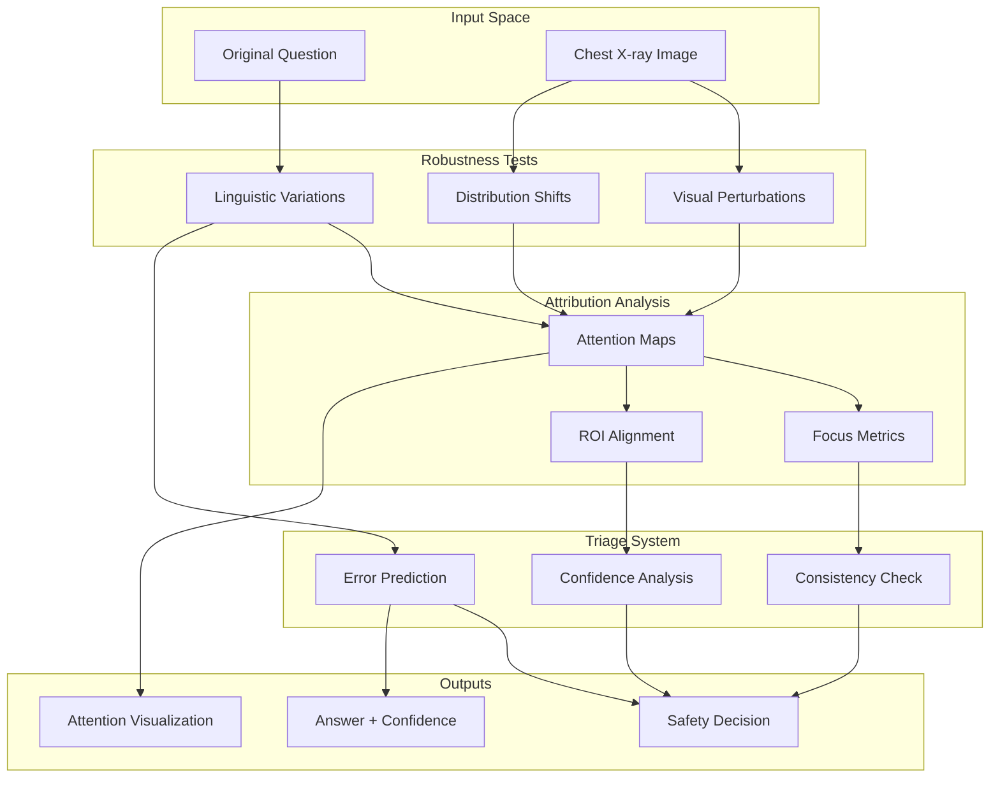

# The Robustness Gauntlet Framework (Archived)

> **Note**: This framework has evolved into the [[phrasing-robustness-framework|Phrasing Robustness Framework]], which focuses specifically on the critical issue of VLM brittleness to question paraphrasing. Please see the new framework for current research direction.

> Original: A comprehensive evaluation and training framework to stress-test medical Vision-Language Models for chest X-ray visual question answering

[← Evaluation Index](index.md) | [New Framework →](phrasing-robustness-framework.md) | [Toolkit GitHub →](https://github.com/thedatasense/medical-vlm-intepret)

---

## Overview

The **Robustness Gauntlet** is a rigorous testing framework designed to comprehensively evaluate and enhance the reliability of medical VLMs. It addresses three critical dimensions:

1. **Robustness**: Testing linguistic and visual variations
2. **Interpretability**: Analyzing attention grounding and attribution
3. **Safety**: Implementing triage mechanisms for clinical deployment

## Framework Architecture



## Core Components

### 1. Robustness Evaluation Suite

#### Linguistic Robustness Testing
```python
# Paraphrase categories tested
paraphrase_types = [
    "synonymy",        # "pneumonia" → "lung infection"
    "negation",        # "Is there..." → "Is there no..."
    "hedging",         # Adding "possibly" or "likely"
    "temporality",     # "current" → "new" → "recent"
    "quantifiers",     # "any" → "some" → "significant"
    "units",          # "5cm" → "50mm"
    "clinical_style"   # Formal vs conversational phrasing
]

# Key metrics
metrics = {
    "flip_rate": "% of paraphrases changing answer",
    "consistency_score": "Agreement across variants",
    "confidence_drift": "Stability of confidence scores"
}
```

#### Visual Robustness Testing
- **Perturbations**: Gaussian noise, rotation, brightness/contrast
- **Compression**: JPEG artifacts at different quality levels
- **Occlusion**: Systematic masking of image regions
- **Distribution shifts**: Cross-dataset evaluation (MIMIC → CheXpert)

### 2. Interpretability Analysis

#### Attention Extraction
Unified interface for extracting attention maps across architectures:
- LLaVA-style decoder attention
- Cross-attention from encoder-decoder models
- Token-to-patch attention mappings

#### Grounding Metrics
```python
class GroundingMetrics:
    def focus_score(self, attention_map):
        """Entropy-based measure of attention concentration"""
        return -np.sum(attention_map * np.log(attention_map + 1e-8))
    
    def roi_support(self, attention_map, ground_truth_roi):
        """Overlap between attention and clinical ROI"""
        return np.sum(attention_map * ground_truth_roi) / np.sum(attention_map)
    
    def spurious_detection(self, attention_maps, question_type):
        """Identify systematic misalignment patterns"""
        # Check if model consistently looks at wrong regions
        # for specific question types
```

### 3. Clinical Triage System

#### Multi-Signal Decision Making
```python
class TriageModule:
    def __init__(self, threshold_confident=0.85, threshold_defer=0.3):
        self.threshold_confident = threshold_confident
        self.threshold_defer = threshold_defer
    
    def should_defer(self, prediction_data):
        signals = {
            "consistency": self.check_paraphrase_consistency(),
            "confidence": prediction_data.confidence,
            "attention_focus": self.compute_attention_entropy(),
            "question_difficulty": self.assess_question_complexity()
        }
        
        # Learned error predictor
        error_probability = self.error_model.predict(signals)
        
        if error_probability > self.threshold_defer:
            return True, "High uncertainty detected"
        return False, None
```

## Evaluation Protocol

### Phase 1: Baseline Assessment
1. Run comprehensive linguistic robustness tests
2. Apply visual perturbation battery
3. Extract and analyze attention patterns
4. Establish baseline metrics for each model

### Phase 2: Enhancement Development
1. Implement targeted training strategies
2. Fine-tune with augmented data
3. Add architectural improvements
4. Validate improvements on held-out sets

### Phase 3: Clinical Validation
1. Integrate triage system
2. Conduct radiologist user studies
3. Measure safe accuracy with deferral
4. Develop deployment guidelines

## Benchmark Datasets

### Paraphrase Test Sets
- **Base questions**: 500+ clinical queries from VQA-RAD
- **Variants**: 7-10 paraphrases per question
- **Annotation**: Expert-verified semantic equivalence

### Visual Challenge Sets
- **Perturbation suite**: Systematic modifications
- **OOD collection**: External hospital data
- **Hard negatives**: Confusing similar cases

### Grounding Annotations
- **ROI masks**: From Chest ImaGenome
- **Finding locations**: GEMeX groundings
- **Expert annotations**: Radiologist-verified regions

## Expected Outcomes

### Robustness Improvements
- Flip-rate: >30% → <20%
- Consistency: 60-70% → >80%
- OOD performance: Minimal degradation

### Interpretability Gains
- Focus scores: Improved concentration
- ROI alignment: ~70% → >85%
- Spurious correlations: Identified and mitigated

### Clinical Safety
- Error detection: >80% catch rate
- Deferral rate: 15-20% of queries
- Safe accuracy: ~90% post-triage

## Implementation Tools

### Open-Source Toolkit
- **GitHub**: [medical-vlm-interpret](https://github.com/thedatasense/medical-vlm-intepret)
- **Features**: Batch evaluation, visualization, metrics
- **Models**: LLaVA-Rad, MedGemma, extensible to others

### Integration Examples
```python
from robustness_gauntlet import RobustnessEvaluator, TriageSystem

# Initialize evaluator
evaluator = RobustnessEvaluator(
    model="llava-rad-7b",
    dataset="vqa-rad-test",
    perturbation_suite="standard"
)

# Run comprehensive evaluation
results = evaluator.run_gauntlet()

# Deploy with triage
triage = TriageSystem(error_threshold=0.2)
safe_predictions = triage.filter_predictions(results)
```

## Clinical Deployment Path

### Prerequisites
1. Pass all robustness thresholds
2. Demonstrate grounding accuracy
3. Validate triage effectiveness
4. Complete user acceptance testing

### Deployment Modes
- **Assistive mode**: Second-reader with explanations
- **Triage mode**: Prioritization of urgent cases
- **Educational mode**: Training tool with uncertainty

### Monitoring & Feedback
- Continuous performance tracking
- Radiologist feedback integration
- Periodic model updates
- Safety incident reporting

## Related Resources

- [[01-medphr-rad|MedPhr-Rad]]: Paraphrase robustness component
- [[02-paraphrase-robustness|Paraphrase Metrics]]: Detailed metric definitions
- [[../Safety/02-selective-conformal-triage|Conformal Triage]]: Mathematical guarantees
- [[../Healthcare/03-llava-rad|LLaVA-RAD]]: Primary evaluation model