# Clinically Robust Vision-Language Models for Diagnostic Applications

**PhD Proposal** | Binesh Sadanandan | Advisor: Dr. Vahid Behzadan, University of New Haven

---

## Clinical Motivation

Healthcare is facing a structural workforce crisis that threatens diagnostic capacity worldwide. By 2033, the Association of American Medical Colleges projects a shortage of **17,000 to 42,000 diagnostic specialists**, including radiologists and pathologists. Meanwhile, imaging volumes continue to grow at approximately 5% per year, while residency training positions increase only about 2%. This mismatch creates what industry reports describe as a "vicious circle": more studies per clinician lead to burnout, burnout leads to attrition, and attrition increases workload for those who remain.

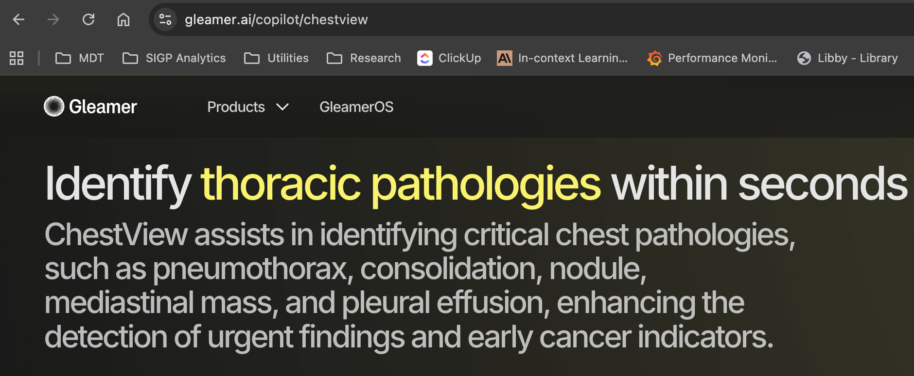

In this context, AI has been promoted as a promising solution. Commercial tools are now FDA-cleared and deployed in clinical environments, claiming to identify thoracic pathologies within seconds and potentially reduce reporting burden and turnaround time.

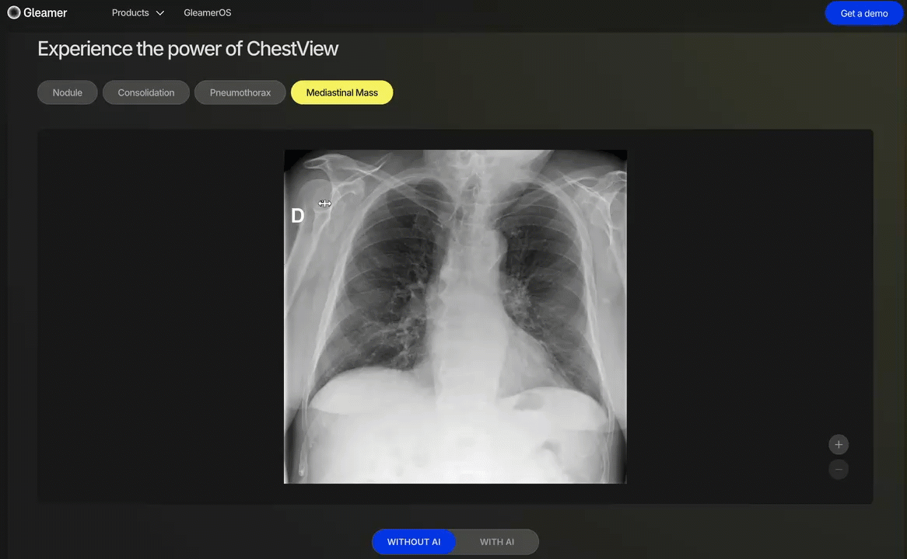

Tools like Gleamer's ChestView offer automated detection for nodules, consolidation, pneumothorax, and mediastinal masses. This demonstrates that AI in radiology is no longer theoretical—it is already influencing clinical decisions. But this raises a critical question: **when these AI tools provide diagnostic suggestions, how robust are they?** Do they behave consistently when radiologists ask similar questions with slightly different phrasing?

---

## The Core Problem: When AI Radiologists Get Confused

We have identified a critical vulnerability in medical Vision-Language Models (VLMs). Consider the same chest X-ray with two clinically equivalent questions—one asks about lung "volumes," the other replaces this with "capacity." In standard clinical usage, these terms are essentially synonyms in this context.

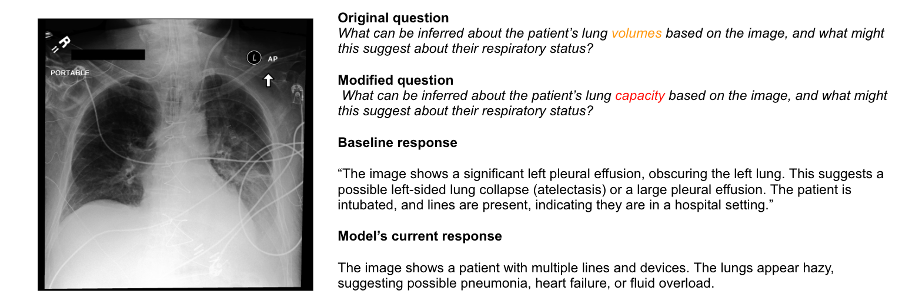

With the original question, the model provides an excellent answer: it detects a large left pleural effusion obscuring the lung and mentions possible atelectasis. But when we only change "volumes" to "capacity," the model suddenly describes hazy lungs and suggests pneumonia or heart failure. **The main pleural effusion is not reported.**

The image did not change. The clinical intent did not change. But the AI gives completely different diagnoses.

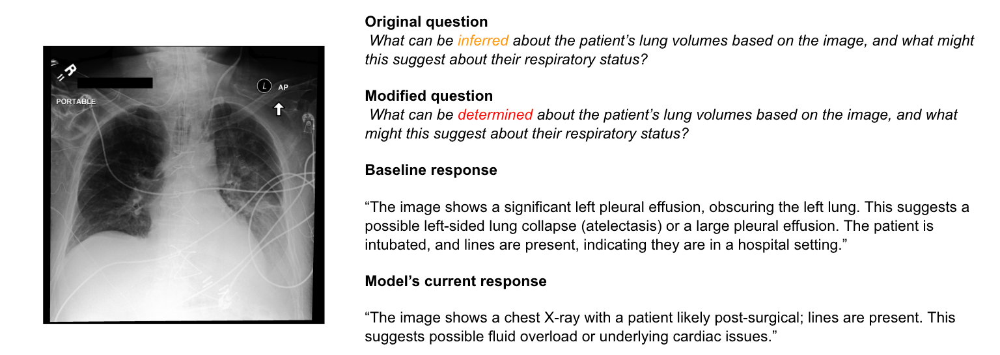

This pattern repeats across different types of paraphrases. Even subtle changes—like replacing "inferred" with "determined"—can cause the model to shift from correctly identifying a significant pleural effusion to producing vague responses about post-surgical states or cardiac issues.

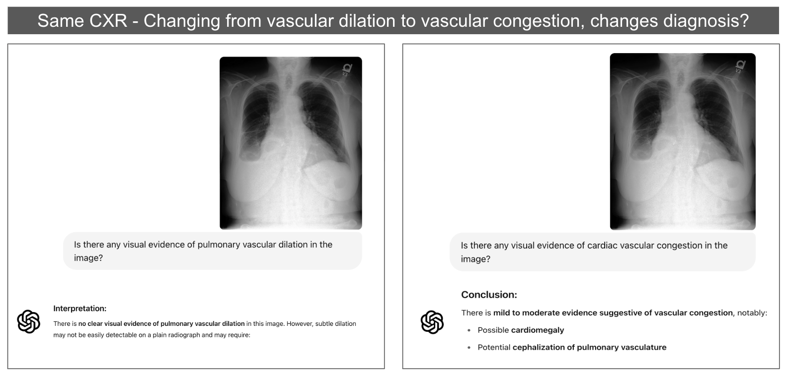

The problem is not limited to specialized medical models. In testing with GPT-4 with vision capabilities, we observe similar behavior. One query about "pulmonary vascular dilation" returns "no clear evidence," while a related query about "cardiac vascular congestion" on the same image reports "mild to moderate congestion" with cardiomegaly. These findings are clinically related—a model should not claim "no evidence" for one formulation and "moderate evidence" for another on the same image.

---

## The Surprising Discovery: Stable Attention, Unstable Answers

What makes this particularly concerning is what we found when examining the model's internal attention patterns.

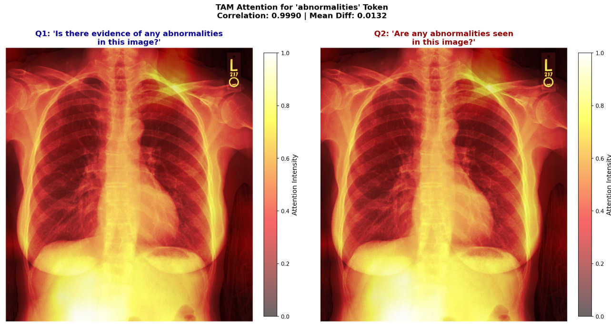

We computed attention maps for semantically equivalent questions like "Is there evidence of any abnormalities in this image?" versus "Are any abnormalities seen in this image?" The correlation between the two attention maps is **0.999**—essentially identical. Both heatmaps focus on the same lung regions and thoracic structures.

However, the outputs are completely different:
- **Question 1**: Reports pleural effusion, pneumothorax, and fractures
- **Question 2**: Reports masses and nodules, says thoracic structure is intact

**The model is looking at the right place but still producing contradictory interpretations.**

---

## Framing the Failure Modes

From these observations, we formalize two coupled failure modes that threaten safe clinical deployment:

### Phrasing-Sensitive Failure (PSF)
Semantically equivalent clinical questions yield contradictory answers, even though visual attention remains stable. The model produces different diagnoses based on superficial linguistic variation rather than the actual image content.

### Misleading Explanation Effect (MEE)
The model generates explanations—both text and attention maps—that appear anatomically correct and highly faithful, even when the underlying diagnosis is wrong. Standard faithfulness metrics (like deletion AUC) cannot distinguish correct from incorrect predictions.

> **The Dangerous Interaction**: A model can produce a wrong answer while maintaining stable attention on the correct anatomical region, and existing metrics will still rate the explanation as highly faithful. This creates false assurance exactly when clinicians should be most skeptical.

---

## Central Research Question

> **How can we make medical vision-language models reliable across natural linguistic variation, while ensuring their explanations faithfully reflect the evidence used for decisions?**

### Central Hypothesis
PSF and MEE arise from specific interactions between language, vision, and fusion components of medical VLMs. If we can identify these interactions through causal analysis, then we can apply targeted interventions—such as parameter-efficient fine-tuning—to reduce failures without degrading diagnostic accuracy.

---

## Background: Vision-Language Model Architecture

To understand where these failures originate, we need to examine VLM architecture.

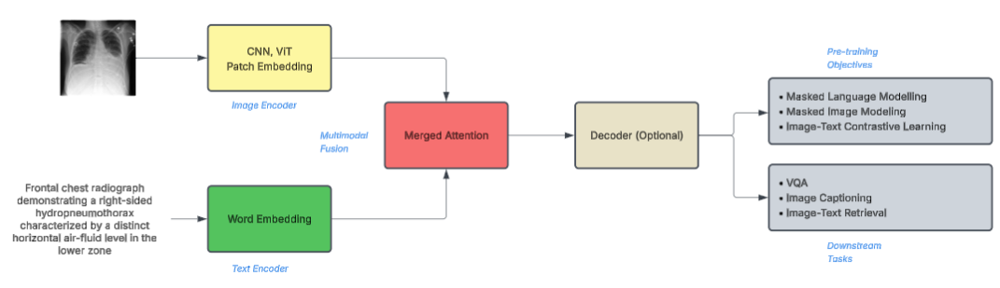

Medical VLMs typically consist of:
1. **Image Encoder**: Usually a CNN or Vision Transformer (ViT) that converts chest X-rays into visual tokens or patch embeddings
2. **Text Encoder**: Converts clinical questions or prompts into word embeddings
3. **Fusion Module**: Cross-attention layers where visual and textual information combine into unified representations

These models are often pre-trained with contrastive objectives (CLIP, SigLIP) and fine-tuned on medical VQA, captioning, and retrieval tasks. Our preliminary experiments suggest that **phrasing sensitivity originates in the fusion layers** rather than the pure visual encoder.

### Target Models

| Aspect | LLaVA-Rad | MedGemma-4B-it |
|--------|-----------|----------------|
| Base Architecture | LLaVA v1.5 + Vicuna-7B | Gemma 3 + SigLIP encoder |
| Visual Encoder | BiomedCLIP-CXR (domain-specific) | SigLIP pre-trained on medical images |
| Parameters | 7B | 4B |
| Training Strategy | Projector alignment → LoRA fine-tuning | Continued pre-training + instruction tuning |
| Training Data | 697K radiology image-text pairs (MIMIC-CXR) | MIMIC-CXR, SLAKE, PMC-OA, ChestImaGenome + proprietary |

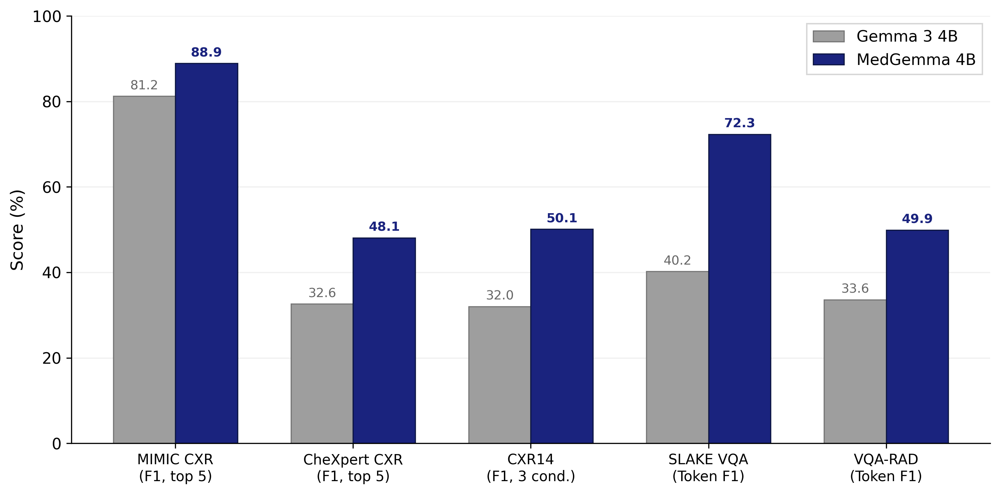

Both models achieve strong performance on standard benchmarks—MedGemma reaches ~89% F1 on MIMIC-CXR, and LLaVA-Rad significantly outperforms GPT-4V on radiology-specific tasks. **But these benchmarks only tell us how often the model is correct for a fixed wording. They do not tell us whether the model remains correct when a clinician rephrases the question.**

---

## Research Approach: Four Integrated Thrusts

The research is organized into four thrusts, where each builds on insights from the previous—measurement informs analysis, analysis guides intervention, and intervention enables safe deployment.

---

## Thrust 1: Measuring PSF and MEE

We are developing the **VSF-Med benchmark** to systematically quantify phrasing-sensitive failures and misleading explanations.

### Benchmark Design

**Data Sources:**
- **MIMIC-CXR**: 377,110 chest X-ray images from 227,827 studies
- **Chest ImaGenome**: Expert bounding boxes for 29 anatomical structures (IoU > 0.85)

**Design Principles:**
1. Paraphrases must preserve exact clinical meaning
2. Reflect natural clinical variation, not artificial perturbations
3. Each paraphrase explicitly annotated with linguistic phenomenon (negation, passive voice, scope ambiguity, synonym substitution, question form)

**Question Categories:**
- Binary detection (presence/absence of pathology)
- Localization (anatomical position)
- Severity grading (mild/moderate/severe)

### Evaluation Metrics

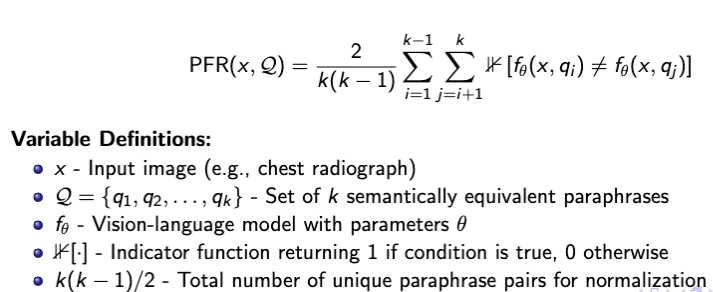

**Paraphrase Flip Rate (PFR)**: For a given image and its set of k paraphrases, we consider all k(k-1)/2 pairs. PFR is the proportion where the model gives clinically inconsistent answers—meaning at least one diagnosis or key label would change, not just superficial wording. We compute PFR per pathology and per linguistic phenomenon.

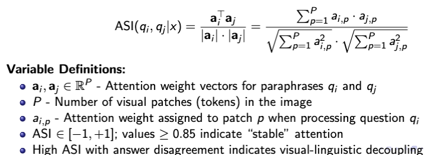

**Attention Stability Index (ASI)**: Measures how consistently the model attends to the same image regions across different paraphrases. Computed as cosine similarity between attention weight distributions over visual tokens. Values above 0.80 indicate stable attention. High ASI combined with answer disagreement indicates **visual-linguistic decoupling**.

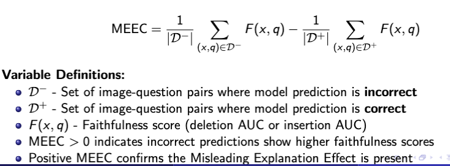

**MEE Coefficient (MEEC)**: Quantifies the Misleading Explanation Effect by comparing faithfulness metrics (deletion AUC) between correct and incorrect predictions. MEEC = E[DelAUC|wrong] - E[DelAUC|correct]. If MEEC ≥ 0, explanations for wrong predictions are as faithful or more faithful than correct ones—indicating strong MEE.

### Pilot Results

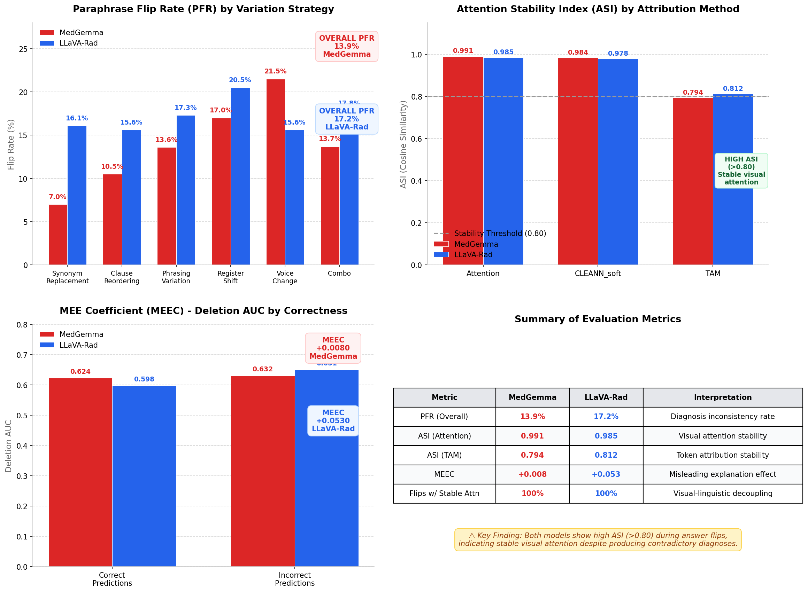

Our pilot run (1,600 samples) reveals:
- **Flip rates up to 17%** across paraphrase pairs
- **100% of flips occur with stable attention** (ASI > 0.80), confirming visual-linguistic decoupling
- **Positive MEEC values** for both models (MedGemma: +0.008, LLaVA-Rad: +0.053), confirming MEE is present

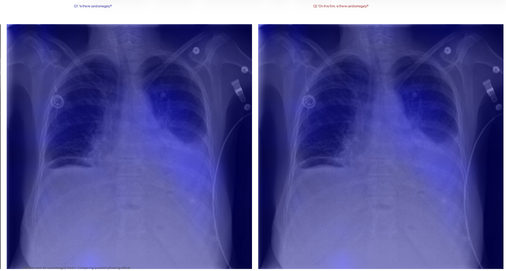

The attention heatmap comparison shows ASI = 0.936 between paraphrases—high spatial correlation despite answer flip. This confirms that **the problem is not in the vision encoder**; interventions should target language processing and cross-modal fusion components.

### Thrust 1 Deliverables
- VSF-Med Benchmark: 2,000 base questions → 16,000 question-image pairs
- Novel metrics (PFR, ASI, MEEC) for joint characterization
- Empirical documentation of failure patterns across models and phenomena
- Open-source evaluation infrastructure

---

## Thrust 2: Causal Analysis

Thrust 2 traces failures to specific model components through mechanistic interpretability, moving beyond correlational observations to establish causal links.

### Research Questions
- **RQ2.1**: Which architectural components are causally responsible for phrasing sensitivity? Can we identify specific layers and attention heads?
- **RQ2.2**: How do direct versus indirect effects contribute to prediction flips? Does visual grounding amplify or mitigate sensitivity?

### Structural Causal Model

We decompose the total effect of phrasing changes into:
- **Natural Direct Effect (NDE)**: Q → T → Y (through language only)
- **Natural Indirect Effect (NIE)**: Q → F → Y (through fusion)

**Hypothesis**: Natural indirect effects through fusion will account for the majority of phrasing sensitivity, while the vision encoder remains stable.

### Intervention Methods

**Activation Patching**: Replace activations from one paraphrase with another at specific layers. Run two forward passes (base question and paraphrase), cache intermediate activations, construct hybrid passes with selective replacement. Changes in output reveal causal importance of that component.

**Region-Constrained Evaluation**: Use Chest ImaGenome bounding boxes to create masked images retaining only clinically relevant pixels. If flip rate persists under masking, sensitivity is linguistic rather than visual—confirming visual-linguistic decoupling.

**Attention Analysis**: Decompose attention patterns at head-level granularity using the Decomposed Attention (D-Attn) framework. Separate cross-attention to visual tokens from self-attention to textual tokens. Compute layer-wise alpha profiles and flip-conditioned divergence.

**Token Ablation**: Identify differing tokens between paraphrase pairs, remove each systematically, determine which tokens are necessary for the flip. Aggregation reveals high-impact linguistic elements (negation words, scope markers, synonym substitutions).

### Expected Findings
- PSF concentrates in middle-to-late layers (approximately layers 8-16) where cross-modal fusion occurs
- Specific heads specialize in handling negation versus scope phenomena
- Natural Indirect Effects through fusion dominate phrasing sensitivity

### Thrust 2 Deliverables
- Causal Attribution Atlas: Layer and head-level sensitivity maps for both models
- Effect decomposition tables (NDE/NIE breakdown per phenomenon)
- Open-source tools: PyTorch hooks, mediation estimators, validation protocols

---

## Thrust 3: Robustness Interventions

Thrust 3 develops parameter-efficient fine-tuning to reduce phrasing sensitivity while preserving diagnostic accuracy.

### Research Questions
- **RQ3.1**: Can parameter-efficient fine-tuning reduce phrasing sensitivity while preserving accuracy? What is the optimal trade-off?
- **RQ3.2**: How effective are different training strategies (consistency losses, contrastive alignment, paraphrase augmentation)?

### LoRA Architecture

We freeze both vision encoder and language model backbone, applying LoRA adapters only to:
- Language attention projections (Q, K, V, O matrices)
- Image-text projector

This trains **< 1% of model parameters** while targeting components identified by Thrust 2's causal analysis. Preliminary analysis suggests sensitivity concentrates in layers 12-16 (MedGemma) and 8-12 (LLaVA-Rad).

### Loss Function Design

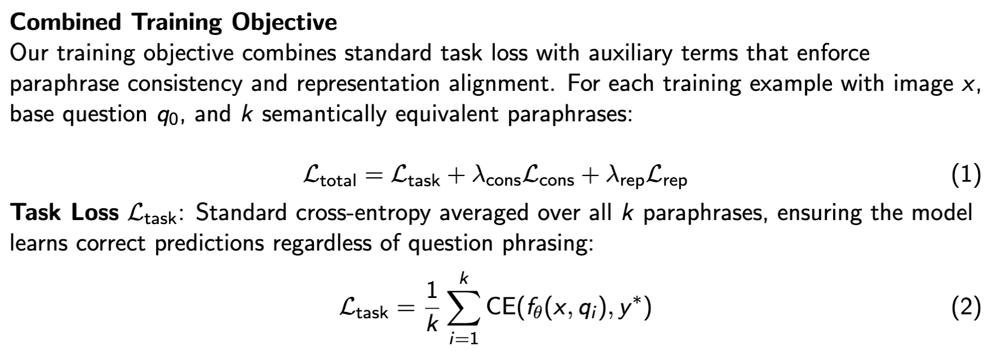

The training objective combines three components:

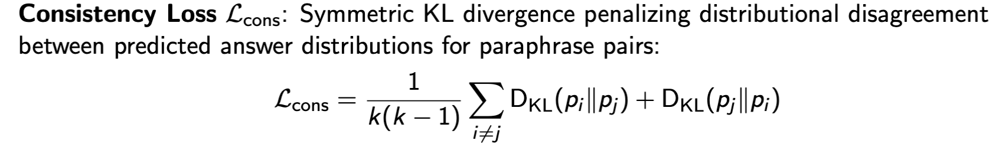

**Task Loss**: Standard cross-entropy averaged over all paraphrases, ensuring correct predictions regardless of phrasing.

**Consistency Loss**: Symmetric KL divergence penalizing distributional disagreement between paraphrase pairs. If two semantically equivalent questions should have the same answer, their output distributions should match.

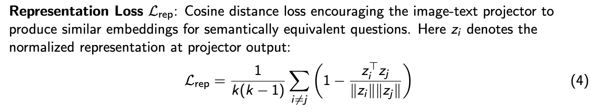

**Representation Loss**: Cosine distance encouraging the image-text projector to produce similar embeddings for semantically equivalent questions. While consistency loss operates on output distributions, representation loss operates on internal representations at the fusion point.

### Thrust 3 Deliverables
- Theoretical framework documenting mitigation design space
- Trained LoRA adapters for MedGemma-4b-it and LLaVA-Rad
- Ablation studies on parameter-performance trade-offs
- Deployment guidelines with safe thresholds

---

## Thrust 4: Clinical Safety Framework

Thrust 4 translates measurement, causal understanding, and mitigation techniques into practical deployment architecture that places patient safety above all other considerations.

### Research Questions
- **RQ4.1**: Will safety fine-tuning transfer across imaging modalities (chest X-ray → CT, MRI)?
- **RQ4.2**: What residual risks remain under adaptive attacks? How should evaluation frameworks capture these?

### Safety Architecture

The safety layer combines multiple complementary uncertainty signals because no single indicator reliably predicts all failure modes:

- **Probabilistic confidence**: Model's own uncertainty estimates
- **Paraphrase agreement rate**: Consistency across reformulations
- **Out-of-distribution detection**: Novel input identification
- **Faithfulness diagnostics**: MEEC-style checks

**Protective Mechanisms:**
- Input guardrails for low-quality images
- Automatic abstention when paraphrase instability detected
- Faithfulness-aware veto when attention peaks fall outside annotated regions

### Deployment Scenarios

| Scenario | Priority | Threshold Strategy |
|----------|----------|-------------------|
| Rule-out Triage | High sensitivity | Accept false positives to avoid missing cases |
| Rule-in Alerting | High specificity | Minimize false alarms |
| Assistive Reporting | Balanced | Human verification for all predictions |

### Human-in-the-Loop Workflows

The goal is effective human-AI collaboration, not full automation. Models should know when to defer to human expertise.

- **Escalation**: Uncertain cases route to radiologist review with attention overlays and confidence scores
- **Evidence Presentation**: Visual explanations supporting appropriate trust calibration
- **Feedback Loop**: Radiologist decisions enable continuous model refinement and threshold calibration

### Expected Outcomes
- Flip rate reduction of 4-6 percentage points
- PSF index decrease of ~15%
- MEEC reduction of 0.08-0.12

### Thrust 4 Deliverables
- Safety layer implementation with multi-signal uncertainty fusion
- Coverage-risk analysis curves for each deployment scenario
- Clinical interface mockups
- Deployment guidelines and monitoring protocols

---

## Expected Contributions

1. **VSF-Med Benchmark**: First paraphrase robustness benchmark for medical VQA with 16,000+ question-image pairs
2. **Novel Metrics**: PFR, ASI, and MEEC for joint characterization of failures
3. **Mechanistic Understanding**: Causal attribution atlas localizing failure origins to specific layers and heads
4. **Practical Interventions**: Parameter-efficient robustness framework with causally-guided LoRA placement
5. **Clinical Deployment**: Safety layer architecture with multi-signal fusion and human-in-the-loop workflows

All code, datasets, and evaluation tools will be released open-source for community use.

---

## Broader Impact

- **Clinical Impact**: Safer AI-assisted radiology with models that know when to defer to human expertise; reduced risk of diagnostic errors from phrasing variations
- **Research Impact**: New evaluation paradigm beyond single-question accuracy; generalizable methods applicable to other high-stakes VLM domains
- **Accessibility**: Parameter-efficient methods make robustness improvements feasible for resource-constrained medical institutions worldwide
- **Responsible AI**: Framework for evaluating and mitigating failures before deployment, contributing to trustworthy medical AI development

---

## Summary

**The Problem**: Medical VLMs exhibit Phrasing-Sensitive Failure (contradictory answers to equivalent questions) and Misleading Explanation Effect (faithfulness metrics favor wrong predictions). These coupled failures threaten safe clinical deployment.

**Our Approach**: Four integrated thrusts—Measure failures with VSF-Med benchmark → Analyze causes through mechanistic interpretability → Mitigate with parameter-efficient fine-tuning → Deploy safely with human-in-the-loop workflows.

**Expected Outcome**: Principled understanding of phrasing-sensitive failures, practical methods to mitigate them, and a safety framework connecting model behavior to real clinical decision-making.

---

## Resources

- **VSF-Med Benchmark**: [github.com/UNHSAILLab/VSF-Med](https://github.com/UNHSAILLab/VSF-Med)
- **Experiment Tracking**: [WandB Dashboard](https://wandb.ai/bineshkumar-saillab-unh/med-vlm-robustness)
- **Interpretation Tools**: [github.com/UNHSAILLab/lvlm-interpret-medgemma](https://github.com/UNHSAILLab/lvlm-interpret-medgemma)
- **HuggingFace Dataset**: [saillab/medical-vqa-robustness-analysis](https://huggingface.co/datasets/saillab/medical-vqa-robustness-analysis)

---

*All experiments conducted on publicly available datasets (MIMIC-CXR, Chest ImaGenome) following established ethical guidelines for AI safety research. This work is intended solely for research purposes to enable development of safer medical AI systems.*

---

**Archive**: Previous portal content available in `content/archive/2025-12-18-portal-backup/`
