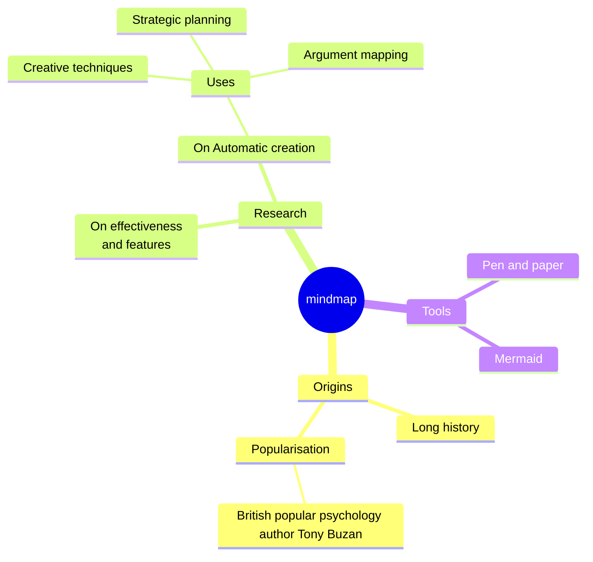

Mermaid JS is a JavaScript based diagramming and charting tool that renders Markdown-inspired text definitions to create and modify diagrams dynamically. Mermaid lets you create diagrams and visualizations using text and code.

Check out the [Documentation](https://mermaid.js.org/intro/).

## Graph Examples

### Git Graph

https://mermaid.js.org/syntax/gitgraph.html  

```
gitGraph
   commit
   commit
   branch develop
   checkout develop
   commit
   commit
   checkout main
   merge develop
   commit
   commit
```


### Mindmap

https://mermaid.js.org/syntax/mindmap.html  

```
mindmap
  root((mindmap))
    Origins
      Long history
      ::icon(fa fa-book)
      Popularisation
        British popular psychology author Tony Buzan
    Research
      On effectiveness<br/>and features
      On Automatic creation
        Uses
            Creative techniques
            Strategic planning
            Argument mapping
    Tools
      Pen and paper
      Mermaid
```


