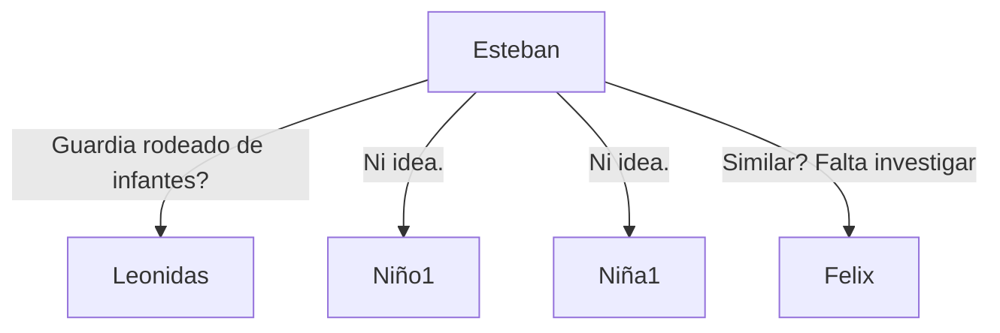

# Sesión 1.

## Escena 1.

Todos los acontecimientos narrados desde la perspectiva de [[Esteban Gallardo|Celedos]].

Durante el turno, cerca del final, [[Deciderio Rojas]] se acerca para un break, con un sandwich y bebida, cortesía de la jefa [[Sofía Benavente]].
[[Hospital las Higueras de Talcahuano]]

Interrumpido por [[Camillero 1]] quien me pide ayuda con un paciente.
En morgue se encuentra el cuerpo de [[El Connor]], al borde de la muerte, con multiples marcas de pinchazos. Dado que el ascensor se encuentra en mantención, y rumores de extrañas [[Cabezas con patas]] por parte del personal, la camilla con el paciente es subida por el montacargas.
Es llevado a la habitación 406, dado que es una habitación desocupada para este particular caso.

Asistenta Enfermería: [[Florencia Pérez]].

## Escena 2.

[[El Connor]] recibe la visita del Dr [[Eduardo Filipo]], quien realiza un par de procedimientos poco estandar en el pacientem, usando una especie de linterna. El paciente tiene sus pertenencias a mano, de las cuales brota un ligero aroma a hierbas _medicinales_. Tras una breve conversación en los estacionamientos con el Dr, me entero que trabaja para la [[PDI]].

[[Miranda]] contacta, ofreciendo un nuevo peusto de trabajo, muy en contra del estilo de vida ascético, pero por respeto a su persona lo acepto, por un período de un mes. Como primer trabajo, debo realizar un informe sobre el estado de las camillas, para las mantenciones.

| N° de camilla | Problema                                  | Acción a tomar                                |
|---------------|-------------------------------------------|-----------------------------------------------|
| TH-001        | Ruedas dañadas                            | Reemplazar las ruedas y asegurar la alineación|
| TH-007        | Correas de restricción del paciente rasgadas | Reparar o reemplazar las correas             |
| TH-014        | Difícil ajuste de altura y rígido         | Lubricar y verificar problemas mecánicos     |
| TH-025        | Colchón desgastado                        | Reemplazar con un nuevo colchón              |
| TH-032        | Estructura inestable                      | Reforzar la estructura                        |
| TH-046        | Riel lateral roto                        | Reparar o reemplazar el riel lateral         |
| TH-052        | Sistema de frenos defectuoso              | Inspeccionar y reparar el mecanismo de frenos|
| TH-067        | Etiqueta de identificación desgastada     | Reemplazar la etiqueta de identificación     |
| TH-078        | Manijas flojas                            | Ajustar o reemplazar las manijas             |
| TH-083        | Etiquetas de seguridad faltantes          | Colocar nuevas etiquetas de seguridad        |
| TH-101        | Ajuste desigual de altura                 | Calibrar y asegurar ajustes de altura        |
| TH-115        | Accesorios de poste IV enredados          | Desenredar y asegurar los accesorios del poste IV|
| TH-123        | Estructura agrietada                      | Evaluar la integridad estructural y reemplazar|
| TH-138        | Base tambaleante                          | Ajustar tornillos e inspeccionar la estabilidad|

Terminando de envíar el informe, termino mi turno por el día.

## Escena 3.

Llendo a la plaza de siempre (Canelo 540-548, Talcahuano), utilizo mi _talento_ una vez más mientras fumo un cigarillo, dibujando aquellas formas en el suelo con el pie mientras doy un breve paseo, solo que esta ves tiene éxito.

Cuatro figuras se manifiestan:
[[Leonidas]], [[Seguridad ciudadana]] del parque.
[[Niño 1]], aparentemente conocido de [[Leonidas]].
[[Niña 1]], aparentemente conocida de [[Leonidas]].
[[Felix]], al parecer un oficial. Porta un curioso símbolo de [[Defensor]].

A falta de tiempo, se realiza el plan de fingir un ataque por parte de [[Felix]], para lo que manda a los niños a comprar pastillas efervescentes en la farmacia. Considerando que el plan no engañaría a paramédicos preparados, decido darle realismo, usando algo de electricidad propinada por un tazer de [[Leonidas]].

