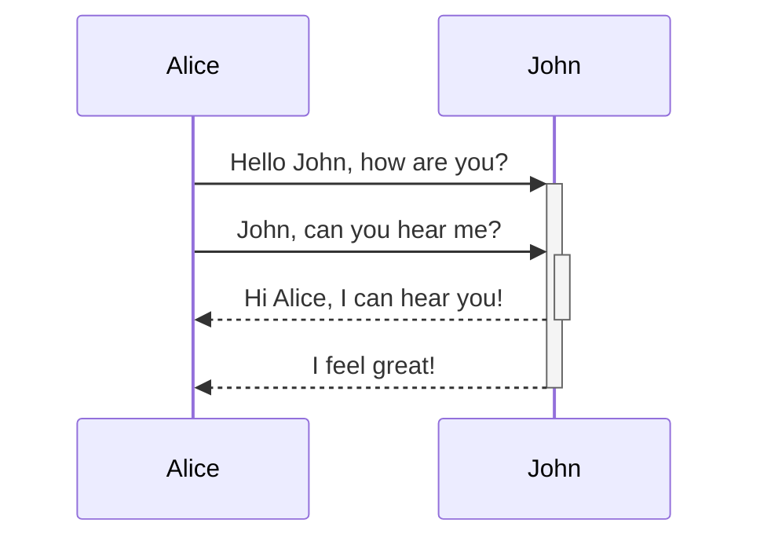

Obsidian uses [Mermaid](https://mermaid-js.github.io/) to render diagrams and charts. Mermaid also provides [a helpful live editor](https://mermaid-js.github.io/mermaid-live-editor).

<pre><code>```mermaid
sequenceDiagram
    Alice->>+John: Hello John, how are you?
    Alice->>+John: John, can you hear me?
    John-->>-Alice: Hi Alice, I can hear you!
    John-->>-Alice: I feel great!
```</code></pre>



Obsidian supports linking to notes in Mermaid:
<pre><code>```mermaid
graph TD

Biology --> Chemistry

class Biology,Chemistry internal-link;
```</code></pre>

An easier way to do it is the following: ^376b9d
<pre><code>```mermaid
graph TD

A[Biology]
B[Chemistry]

A --> B

class A,B,C,D,E,F,G,H,I,J,K,L,M,N,O,P,Q,R,S,T,U,V,W,X,Y,Z internal-link;
```</code></pre>

This way, all the note names (at least until `Z[note name]`) are all automatically assigned the class `internal-link` when you use this snippet.

If you use special characters in your note names, you need to put the note name in double quotes.
`"⨳ special character"`
It looks like this if you follow the [[Format your notes#^376b9d|second option]]:
`A["⨳ special character"]`