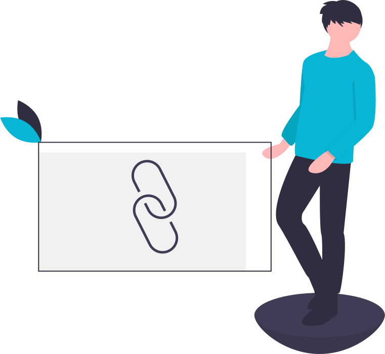
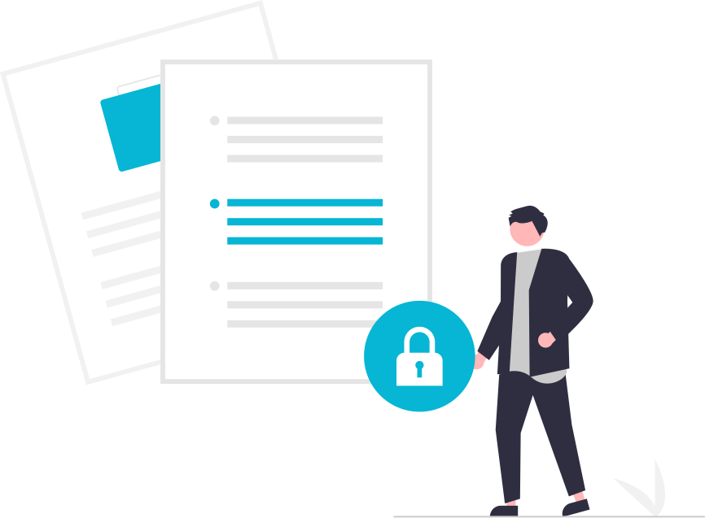

<article class="index-container">
    

        <h1 class="hero-title" >Quick Notes Aren't "[[posts/put-quick-notes-into-obsidian-from-anywhere|Quick]]" Enough in Obsidian</h1>
        
Take [[posts/writing-connected-and-personalized-blogs/|linked]] and speedy notes in a browser extension, a mobile app, or a web app and [[posts/sync-fleeting-notes-with-obsidian|sync the notes with Obsidian]].

        
How speedy? Try it yourself:

    

    

        

                
            <iframe id=flutter-container class="embed-size" width=800 height=500 src="https://my.fleetingnotes.app/" ></iframe>
            

                <a href="/download" class="button premium-btn">Try the webapp instead</a>
            

        

        

        

    

    

        

            

                

                    <h2 class="feature-title">Capture Ideas Anytime, Anywhere</h2>
                    
Create and sync your fleeting notes on different platforms:

                    <ul class="feature-list">
                        <li>Highlight and save using the <a href="https://chrome.google.com/webstore/detail/fleeting-notes/gcplhmogdjioeaenmehmapbdonklmdnc">Chrome</a> or <a href="https://addons.mozilla.org/en-CA/firefox/addon/fleeting-notes/">Firefox</a> extension</li>
                        <li>Take notes on the go with the <a href="https://apps.apple.com/gb/app/fleeting-notes/id1615226800">iOS</a> or <a href="https://play.google.com/store/apps/details?id=com.fleetingnotes">Android</a> app</li>
                        <li>Access your notes on any device using the <a href="https://my.fleetingnotes.app/">web app</a> or <a href="https://youtu.be/jausylB4Pzw">pop-out window</a></li>
                    </ul>
                

                

                    </img>
                

            

        

        

            

                

                        </img>
                

                

                    <h2 class="feature-title">Keep track of any source</h2>
                    
From links to images to files

                    <ul class="feature-list">
                        <li>Cloud hosting for attachments</li>
                        <li>Take notes side by side</li>
                        <li>Automatically [[posts/best-in-browser-note-taking-and-web-clipping-app-for-obsidian|include URLs]] upon note creation</li>
                        <li>Include [[posts/best-way-to-take-youtube-notes-for-obsidian|YouTube timestamps]] when watching on the web</li>
                    </ul>
                

            

        

        

            

                

                    <h2 class="feature-title">Made for Obsidian MD</h2>
                    
Use the [[posts/sync-fleeting-notes-with-obsidian|Fleeting Notes plugin]] to sync and process notes

                    <ul class="feature-list">
                        <li><a href="notes/How-to-copy-Obsidian-links-to-Fleeting-Notes">Import your wikilinks</a> and start connecting your notes</li>
                        <li>Choose your syncing type (delete after sync, two-way)</li>
                        <li>Run commmands to show unprocessed or same-source notes</li>
                        <li>Customize your own import note template with metadata</li>
                    </ul>
                

                

                    
                

            

        

        

            

                

                    </img>
                

                            

                    <h2 class="feature-title">Control Your Notes</h2>
                    
We value your privacy and security :)

                    <ul class="feature-list">
                        <li>[[/posts/end-to-end-encryption-in-fleeting-notes|Enable end-to-end encryption]]</a></li>
                        <li>100% of your notes are stored locally with optional sync</li>
                        <li>[[posts/shared-connected-notes|Share links]] to your notes with anyone</li>
                        <li>Export all notes into Markdown or JSON</li>
                    </ul>
                

            

        

    

</article>

    <h1>What our users say:</h1>
    
        <iframe id="testimonialto-carousel-all-fleeting-notes-testimonial-light" src="https://embed.testimonial.to/carousel/all/fleeting-notes-testimonial?theme=light&autoplay=off&showmore=off&one-row=off&same-height=off" frameborder="0" scrolling="no" width="100%"></iframe>
    

<h1>Got any questions? We're here to help.</h1>

Email us at fleetingnotesapp@gmail.com

Join the <a href="https://discord.gg/xrj6yuGNmx">Discord channel</a> to get in touch with the team and other users.
 
