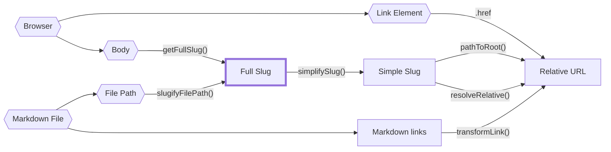

Paths are pretty complex to reason about because, especially for a static site generator, they can come from so many places.

A full file path to a piece of content? Also a path. What about a slug for a piece of content? Yet another path.

It would be silly to type these all as `string` and call it a day as it's pretty common to accidentally mistake one type of path for another. Unfortunately, TypeScript does not have [nominal types](https://en.wikipedia.org/wiki/Nominal_type_system) for type aliases meaning even if you made custom types of a server-side slug or a client-slug slug, you can still accidentally assign one to another and TypeScript wouldn't catch it.

Luckily, we can mimic nominal typing using [brands](https://www.typescriptlang.org/play#example/nominal-typing).

```typescript
// instead of
type FullSlug = string

// we do
type FullSlug = string & { __brand: "full" }

// that way, the following will fail typechecking
const slug: FullSlug = "some random string"
```

While this prevents most typing mistakes _within_ our nominal typing system (e.g. mistaking a server slug for a client slug), it doesn't prevent us from _accidentally_ mistaking a string for a client slug when we forcibly cast it.

Thus, we still need to be careful when casting from a string to one of these nominal types in the 'entrypoints', illustrated with hexagon shapes in the diagram below.

The following diagram draws the relationships between all the path sources, nominal path types, and what functions in `quartz/path.ts` convert between them.



Here are the main types of slugs with a rough description of each type of path:

- `FilePath`: a real file path to a file on disk. Cannot be relative and must have a file extension.
- `FullSlug`: cannot be relative and may not have leading or trailing slashes. It can have `index` as it's last segment. Use this wherever possible is it's the most 'general' interpretation of a slug.
- `SimpleSlug`: cannot be relative and shouldn't have `/index` as an ending or a file extension. It _can_ however have a trailing slash to indicate a folder path.
- `RelativeURL`: must start with `.` or `..` to indicate it's a relative URL. Shouldn't have `/index` as an ending or a file extension but can contain a trailing slash.

To get a clearer picture of how these relate to each other, take a look at the path tests in `quartz/path.test.ts`.
