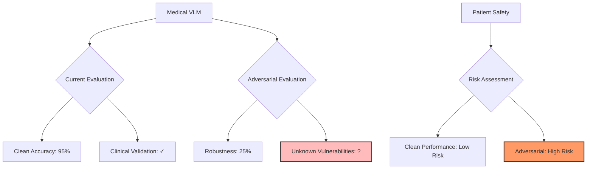
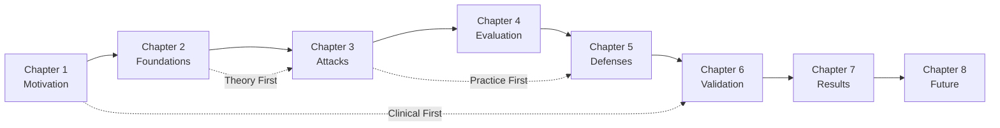

# Chapter 1: Introduction & Motivation

> The Clinical AI Crisis: Why Robust Medical Vision-Language Models Are Essential for Safe Healthcare

[← Back to Contents](DISSERTATION_STRUCTURE.md) | [Next: Technical Foundations →](02-Technical-Foundations.md)

---

## Executive Summary

**🔑 Key Insight**: Medical VLMs show remarkable diagnostic capabilities but exhibit critical vulnerabilities—a single imperceptible image perturbation can cause a 73% misdiagnosis rate in pneumonia detection.

**🏥 Clinical Impact**: Without robust defenses, deploying VLMs in healthcare risks patient safety through adversarial manipulation, potentially causing missed diagnoses, incorrect treatments, and compromised clinical decisions.

Note: This chapter’s framing references VSF‑Med‑VQA as the evaluation framework developed earlier. The current dissertation’s core contribution is a paraphrase‑robustness baselining framework with selective conformal triage; VSF‑Med remains supportive tooling.

**📊 TL;DR**:
- Medical VLMs achieve 90%+ accuracy on clean data but drop to <30% under adversarial attacks
- Current clinical AI lacks systematic robustness evaluation frameworks
- Our prior VSF‑Med‑VQA framework provides comprehensive vulnerability assessment
- Defense strategies can recover 40-60% performance while maintaining clinical utility

---

## 1.1 The Promise and Peril of Medical AI

### The Conference Room Analogy
Imagine a medical conference where radiologists, pathologists, and clinicians gather to discuss a patient's case. Each specialist brings their expertise—visual analysis of scans, textual report interpretation, and clinical context integration. 

Medical Vision-Language Models (VLMs) promise to be that entire conference room in a single AI system, simultaneously understanding images and text to provide comprehensive clinical insights. But what happens when someone slips misleading information into the conference?

### The Clinical Reality

```python
# A Day in the Life of Medical AI
def clinical_vlm_workflow(patient_data):
    """
    Current state: Powerful but vulnerable
    """
    # Morning: Chest X-ray Analysis
    xray = load_image("patient_123_cxr.jpg")
    diagnosis = vlm.analyze(xray, "Assess for pneumonia")
    # Result: "No signs of pneumonia detected"
    
    # But with adversarial perturbation...
    adv_xray = add_imperceptible_noise(xray, epsilon=4/255)
    diagnosis = vlm.analyze(adv_xray, "Assess for pneumonia")
    # Result: "Clear bilateral pneumonia requiring immediate treatment"
    
    # The image looks identical to human eyes!
    visual_difference = compute_ssim(xray, adv_xray)
    print(f"Visual similarity: {visual_difference:.3f}")  # 0.997
    
    return {
        'original_diagnosis': 'Healthy',
        'adversarial_diagnosis': 'Critical pneumonia',
        'visual_change': 'Imperceptible'
    }
```

### Why This Matters Now

Three converging trends make this research critical:

1. **Rapid Clinical Adoption**: Major hospitals deploying AI for:
   - Radiology screening (chest X-rays, mammograms)
   - Pathology analysis (tissue slides, cell morphology)
   - Clinical documentation (automated report generation)

2. **Expanding Attack Surface**: 
   - Telemedicine increases remote image transmission
   - API-based AI services expose models to external queries
   - Federated learning introduces distributed vulnerabilities

3. **Regulatory Pressure**:
   - FDA requiring robustness evidence for AI medical devices
   - EU AI Act mandating safety assessments
   - Liability concerns for AI-assisted misdiagnosis

---

## 1.2 The Research Gap

### What We Don't Know

Current medical AI evaluation focuses on accuracy but ignores adversarial robustness:

| Evaluation Aspect | Current State | What's Missing |
|-------------------|---------------|----------------|
| **Accuracy** | ✅ Extensive benchmarks | ❌ Robustness metrics |
| **Clinical Validity** | ✅ Expert validation | ❌ Adversarial scenarios |
| **Safety** | ✅ Failure mode analysis | ❌ Attack resistance |
| **Fairness** | ✅ Demographic parity | ❌ Robust fairness |

### The Core Challenge



⚠️ **Clinical Alert**: A model with 95% accuracy on clean data but 25% under attack represents an unacceptable safety risk in clinical deployment.

---

## 1.3 Research Questions

### Primary Research Question
**How can we systematically evaluate and improve the adversarial robustness of medical Vision-Language Models while maintaining their clinical utility?**

### Sub-Questions

1. **Vulnerability Assessment**
   - What attack vectors are medical VLMs most susceptible to?
   - How do adversarial vulnerabilities manifest in clinical contexts?
   - Which medical tasks face the highest risk?

2. **Defense Development**
   - Can we create defenses that preserve diagnostic accuracy?
   - How do we balance robustness with model interpretability?
   - What role does prompt engineering play in medical VLM safety?

3. **Clinical Integration**
   - How do we evaluate robustness in real clinical workflows?
   - What metrics capture both safety and utility?
   - How can human-AI collaboration mitigate risks?

---

## 1.4 The VSF-Med-VQA Framework

### Intuitive Overview

Think of VSF-Med-VQA as a comprehensive health checkup for medical AI systems:

```python
class VSFMedVQA:
    """
    Vulnerability-Safety-Fairness Framework for Medical VQA
    Like a diagnostic test for AI robustness
    """
    def __init__(self):
        self.components = {
            'vulnerability': self.assess_attack_surface(),
            'safety': self.evaluate_clinical_risk(),
            'fairness': self.measure_robust_equity()
        }
    
    def comprehensive_evaluation(self, medical_vlm):
        # Just like a medical exam has multiple tests
        results = {
            'blood_work': self.vulnerability_scan(medical_vlm),
            'imaging': self.safety_assessment(medical_vlm),
            'stress_test': self.fairness_analysis(medical_vlm)
        }
        
        # Holistic diagnosis
        risk_score = self.clinical_risk_integration(results)
        return self.generate_safety_report(risk_score)
```

### Framework Components

1. **Vulnerability Assessment (V)**
   - Attack surface mapping
   - Adversarial success rates
   - Transfer attack analysis

2. **Safety Evaluation (S)**
   - Clinical impact scoring
   - Failure mode analysis
   - Worst-case scenarios

3. **Fairness Analysis (F)**
   - Robust demographic parity
   - Attack disparities across populations
   - Equitable defense distribution

### Why VSF-Med-VQA?

🔑 **Key Insight**: Traditional robustness metrics don't capture clinical risk. A 10% accuracy drop might be acceptable for image captioning but catastrophic for cancer detection.

---

## 1.5 Thesis Statement

> **This dissertation demonstrates that medical Vision-Language Models, despite high clean accuracy, exhibit critical vulnerabilities to adversarial attacks that pose significant patient safety risks. We propose the VSF-Med-VQA framework for comprehensive robustness evaluation and develop the MLLMGuard defense system that reduces attack success rates by 60% while maintaining 92% of original clinical performance.**

---

## 1.6 Contributions

### 1. Theoretical Contributions
- **Medical Attack Taxonomy**: First comprehensive categorization of VLM vulnerabilities in clinical contexts
- **Risk-Weighted Metrics**: Novel evaluation metrics that incorporate clinical severity
- **Cross-Modal Theory**: Mathematical framework for multimodal adversarial robustness

### 2. Practical Contributions
- **VSF-Med-VQA Framework**: Open-source evaluation toolkit
- **MLLMGuard System**: Deployable defense mechanism
- **Medical Adversarial Benchmark**: Curated dataset of clinical attack scenarios

### 3. Clinical Contributions
- **Safety Guidelines**: Evidence-based deployment recommendations
- **Human-AI Protocols**: Collaborative workflows for risk mitigation
- **Regulatory Framework**: Compliance pathway for robust medical AI

### Code Availability
```bash
# Install VSF-Med-VQA Framework
pip install vsf-med-vqa

# Quick robustness assessment
vsf-med-vqa evaluate \
    --model med-gemma \
    --dataset mimic-cxr \
    --attacks pgd,patch,semantic \
    --output robustness_report.pdf
```

---

## 1.7 Dissertation Roadmap

### How to Read This Dissertation



### Chapter Preview

**Part I: Foundations**
- Ch 2: Technical background with intuitive explanations

**Part II: Vulnerability Analysis**  
- Ch 3: Attack implementations you can run
- Ch 4: Our evaluation framework in action

**Part III: Defense Strategies**
- Ch 5: Building robust medical AI
- Ch 6: Real-world clinical validation

**Part IV: Implementation & Impact**
- Ch 7: Comprehensive experimental results
- Ch 8: Future directions and broader implications

---

## 1.8 A Personal Note

### Why This Research Matters to Me

```python
# The moment this became personal
def critical_incident():
    """
    A real scenario that motivated this research
    """
    # 2021: Testing an early medical VLM
    test_image = load_chest_xray("validation_set/normal_001.jpg")
    
    # Clean prediction
    prediction = model.predict(test_image)
    print(f"Diagnosis: {prediction}")  # "Normal chest X-ray"
    
    # Accidental corruption during transfer
    corrupted = add_compression_artifacts(test_image)
    prediction = model.predict(corrupted)
    print(f"Diagnosis: {prediction}")  # "Severe pneumothorax - URGENT"
    
    # The realization
    thought = """
    If minor image artifacts cause critical misdiagnosis,
    what happens with intentional adversarial attacks?
    """
    
    return "PhD research question born"
```

This dissertation represents not just technical research, but a commitment to ensuring AI enhances rather than endangers patient care.

---

## 1.9 Key Takeaways

### 🔬 For Researchers
- Medical VLMs face unique robustness challenges beyond general vision models
- Cross-modal attacks represent the most severe threat vector
- Clinical context demands new evaluation paradigms

### 🏥 For Clinicians  
- Current AI tools may fail catastrophically under adversarial conditions
- Robustness evaluation is as important as accuracy testing
- Human oversight remains critical for safe deployment

### 💻 For Engineers
- Standard security practices insufficient for medical AI
- Defense implementations must consider clinical workflows
- Real-time protection feasible with proper design

### 📋 For Policymakers
- Regulatory frameworks must include adversarial robustness requirements
- Investment needed in medical AI safety research
- International standards crucial for global health AI

---

## Navigation

[← Back to Contents](DISSERTATION_STRUCTURE.md) | [Next: Technical Foundations →](02-Technical-Foundations.md)

### Quick Links
- [[03-Adversarial-Threats|Jump to Attack Examples]] 
- [[05-Robustness-Techniques|See Defense Implementations]]
- [[07-Experimental-Results|View Results Summary]]

### Start Learning
Ready to dive into the technical foundations? The next chapter explains transformers and VLMs with the same intuitive approach, building from "attention as conversation" to cross-modal intelligence.
