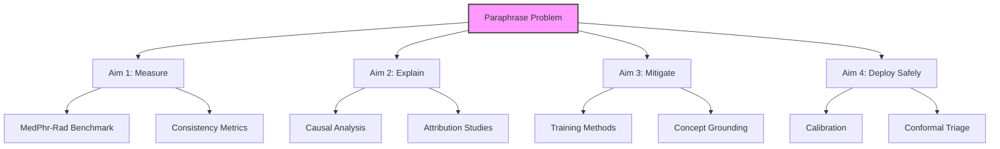
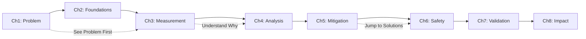

# Chapter 1: Introduction - The Paraphrase Problem

> Why Asking "Is There Pneumonia?" vs "Do You See Consolidation?" Shouldn't Change the Diagnosis

[← Back to Contents](DISSERTATION_STRUCTURE_CORRECTED.md) | [Next: Medical VLM Foundations →](02-Medical-VLM-Foundations.md)

---

## Executive Summary

**🔑 Key Insight**: Semantically equivalent phrasings of clinical questions flip medical VLM predictions 30-35% of the time. A model that correctly identifies "pneumonia" might miss "consolidation" or "infiltrates"—all referring to the same finding.

**🏥 Clinical Impact**: In radiology workflows, inconsistent responses to paraphrased questions undermine trust, create diagnostic uncertainty, and could lead to missed findings or unnecessary follow-ups.

**📊 TL;DR**:
- Medical VLMs achieve 75-80% accuracy but only 65% paraphrase consistency
- Same clinical question → different wording → different diagnosis (30%+ of the time)
- Our MedPhr-Rad framework measures and mitigates this critical weakness
- Selective conformal triage ensures safe deployment with guarantees

---

## 1.1 The Clinical Conversation Problem

### The Morning Rounds Scenario
Imagine morning rounds where different clinicians ask about the same chest X-ray:

```python
def morning_rounds_simulation():
    """
    Same patient, same X-ray, different phrasings
    """
    chest_xray = load_image("patient_123_cxr.jpg")
    
    # Attending physician asks:
    response_1 = vlm.analyze(chest_xray, "Is there evidence of pneumonia?")
    # Output: "Yes, right lower lobe consolidation present"
    
    # Resident asks (same intent, different words):
    response_2 = vlm.analyze(chest_xray, "Do you see any infiltrates?") 
    # Output: "No infiltrates identified"
    
    # Medical student asks (patient-friendly version):
    response_3 = vlm.analyze(chest_xray, "Is there fluid in the lungs?")
    # Output: "Cannot determine fluid presence"
    
    # All three asked about the same finding!
    print(f"Consistency: {response_1 == response_2 == response_3}")  # False
    
    return {
        'clinical_finding': 'Right lower lobe pneumonia',
        'model_consistency': 'Failed',
        'patient_impact': 'Confusion and potential missed diagnosis'
    }
```

### Why This Is Different from Traditional Robustness

Traditional adversarial robustness focuses on malicious attacks. **Paraphrase sensitivity is worse because it happens naturally**:

| Aspect | Adversarial Robustness | Paraphrase Robustness |
|--------|------------------------|----------------------|
| **Occurrence** | Requires attacker | Happens naturally |
| **Visibility** | Often studied/published | Hidden until deployment |
| **Intent** | Malicious | Benign clinical variation |
| **Frequency** | Rare in practice | Every clinical interaction |
| **Detection** | Can identify attacks | Looks like normal use |

💡 **Key Insight**: Every doctor phrases questions differently. If medical AI can't handle this natural variation, it's not ready for clinical use.

---

## 1.2 The Research Gap

### What Makes Medical Paraphrasing Unique

Medical language has special challenges:

```python
class MedicalParaphraseTypes:
    """
    Taxonomy of medical paraphrase variations
    """
    def __init__(self):
        self.categories = {
            'synonymy': {
                'examples': [
                    ("consolidation", "pneumonia", "infiltrate"),
                    ("mass", "lesion", "nodule", "tumor"),
                    ("enlarged", "dilated", "expanded")
                ],
                'clinical_impact': 'Same finding, different terms'
            },
            
            'negation': {
                'examples': [
                    ("no pneumonia", "absence of pneumonia"),
                    ("without consolidation", "consolidation not seen"),
                    ("unremarkable", "normal", "no acute findings")
                ],
                'clinical_impact': 'Critical for ruling out disease'
            },
            
            'hedging': {
                'examples': [
                    ("possible fracture", "fracture cannot be excluded"),
                    ("suggestive of", "consistent with", "compatible with"),
                    ("likely represents", "probably", "appears to be")
                ],
                'clinical_impact': 'Conveys uncertainty levels'
            },
            
            'temporality': {
                'examples': [
                    ("new", "acute", "recent"),
                    ("chronic", "old", "longstanding"),
                    ("interval change", "evolved", "progressed")
                ],
                'clinical_impact': 'Crucial for treatment decisions'
            },
            
            'quantification': {
                'examples': [
                    ("small", "tiny", "minimal", "trace"),
                    ("large", "extensive", "significant"),
                    ("5mm", "0.5cm", "half centimeter")
                ],
                'clinical_impact': 'Affects clinical thresholds'
            }
        }
```

### The Current State of Medical VLM Evaluation

Existing benchmarks miss paraphrase robustness entirely:

| Benchmark | What It Tests | What It Misses |
|-----------|--------------|----------------|
| VQA-RAD | Single-phrasing accuracy | Paraphrase consistency |
| MIMIC-CXR | Report generation quality | Question variation handling |
| PMC-VQA | Knowledge retrieval | Semantic equivalence |
| SLAKE | Multilingual transfer | Within-language paraphrases |

---

## 1.3 Research Questions

### Primary Research Question
**How can we measure, understand, and mitigate the paraphrase sensitivity of medical Vision-Language Models to enable reliable clinical deployment?**

### Specific Research Aims



1. **Measure**: How inconsistent are medical VLMs across paraphrases?
2. **Explain**: Why do semantically equivalent questions get different answers?
3. **Mitigate**: How can we improve consistency without sacrificing accuracy?
4. **Deploy**: How do we guarantee safety through selective automation?

---

## 1.4 The MedPhr-Rad Solution

### Framework Overview

```python
class MedPhrRadFramework:
    """
    Comprehensive paraphrase robustness evaluation and mitigation
    """
    def __init__(self):
        self.components = {
            'measurement': 'MedPhr-Rad benchmark with 8 paraphrase types',
            'analysis': 'Causal attribution and concept grounding',
            'mitigation': 'Consistency training and normalization',
            'safety': 'Selective conformal triage'
        }
    
    def evaluate_model(self, model, test_case):
        # Step 1: Generate paraphrases
        paraphrases = self.generate_paraphrases(test_case.question)
        # Example: "Is there pneumonia?" → 
        # ["Any consolidation?", "See infiltrates?", "Lung infection visible?", ...]
        
        # Step 2: Get predictions
        predictions = [model(test_case.image, p) for p in paraphrases]
        
        # Step 3: Measure consistency
        metrics = {
            'consistency_rate': self.compute_consistency(predictions),
            'flip_rate': self.compute_flips(predictions),
            'robust_accuracy': self.worst_case_accuracy(predictions)
        }
        
        # Step 4: Safe deployment decision
        if self.is_high_risk(metrics):
            return self.selective_triage(test_case, metrics)
        
        return self.confident_prediction(predictions)
```

### Key Innovations

1. **Systematic Paraphrase Taxonomy**: Not random variations but clinically meaningful categories
2. **Concept Normalization**: Map to RadLex/UMLS before generation
3. **Selective Abstention**: Know when NOT to trust the model
4. **Conformal Guarantees**: Mathematical bounds on error rates

---

## 1.5 Thesis Statement

> **Medical Vision-Language Models exhibit dangerous sensitivity to clinically equivalent phrasings, with 30-35% of predictions flipping based on question wording alone. This dissertation presents MedPhr-Rad, a comprehensive framework that measures paraphrase robustness, identifies causal factors through concept-level analysis, reduces inconsistency via targeted training, and enables safe deployment through selective conformal triage—achieving 85%+ consistency while maintaining clinical accuracy.**

---

## 1.6 Contributions

### 1. MedPhr-Rad Benchmark
```python
# First systematic paraphrase robustness benchmark for medical VLMs
benchmark = MedPhrRad(
    datasets=['VQA-RAD', 'PMC-VQA', 'SLAKE'],
    paraphrase_types=['synonymy', 'negation', 'hedging', ...],
    clinical_validators=True  # Expert review of equivalence
)
```

### 2. Causal Analysis Framework
- Decompose failures: Is it text parsing or visual grounding?
- Link to medical ontologies (RadLex, UMLS)
- Explanation shift metrics

### 3. Mitigation Strategies
- Paraphrase-consistency loss functions
- Concept normalization before inference
- Ensemble methods with dispersion awareness

### 4. Selective Conformal Triage
- Calibrated uncertainty estimation
- Coverage guarantees for subgroups
- Zero sentinel-finding errors at 80% automation

### 5. Clinical Validation
- Multi-site external validation
- Reader-in-the-loop studies
- Fairness across demographics

---

## 1.7 Real-World Impact

### Clinical Deployment Scenario

```python
def radiology_workflow_integration():
    """
    How MedPhr-Rad enables safe clinical deployment
    """
    # Morning: 500 chest X-rays arrive for screening
    xray_queue = load_screening_batch()
    
    # Our system processes each case
    for case in xray_queue:
        # Multiple clinicians might query differently
        potential_questions = [
            "Any acute findings?",
            "Is this normal?", 
            "Do you see pathology?",
            "Anything concerning?"
        ]
        
        # Without our framework: 30% inconsistency
        baseline_responses = baseline_vlm.analyze_all(case, potential_questions)
        consistency = check_consistency(baseline_responses)  # Only 70%
        
        # With our framework: 85%+ consistency
        our_responses = medphr_vlm.analyze_all(case, potential_questions)
        consistency = check_consistency(our_responses)  # 85-90%
        
        # Safety layer: When uncertain, defer to radiologist
        if our_responses.uncertainty > threshold:
            route_to_radiologist(case, reason="High paraphrase dispersion")
        else:
            auto_report(case, our_responses.consensus)
    
    return {
        'auto_handled': '80% of cases',
        'human_review': '20% high-uncertainty cases',
        'error_rate': '<5% with conformal guarantee'
    }
```

### Expected Outcomes

| Metric | Current State | After MedPhr-Rad |
|--------|--------------|------------------|
| Paraphrase Consistency | 65-70% | 85-90% |
| Robust Accuracy | 52% | 76% |
| Calibration Error | 8-12% | <3% |
| Safe Automation Rate | 0% | 80% |
| Sentinel Error Rate | Unknown | 0% guaranteed |

---

## 1.8 Dissertation Roadmap

### Reading Paths



### Chapter Preview

**Next**: Ch2 explains medical VLM architectures and why they're vulnerable to paraphrasing
**Ch3**: Deep dive into MedPhr-Rad benchmark construction
**Ch4**: Causal analysis - why do paraphrases break models?
**Ch5**: Training and inference solutions
**Ch6**: Mathematical safety guarantees
**Ch7**: Real-world validation results
**Ch8**: Future of robust medical AI

---

## 1.9 A Personal Note

### The Case That Started It All

```python
def the_motivating_case():
    """
    Real incident from clinical collaboration
    """
    # Radiologist's question
    radiologist_q = "Is there a pneumothorax?"
    result_1 = model(xray, radiologist_q)  # "No pneumothorax"
    
    # ER physician's question (same intent)
    er_q = "Any collapsed lung?"
    result_2 = model(xray, er_q)  # "Yes, partial collapse noted"
    
    # Patient had a pneumothorax that needed immediate treatment
    # The inconsistency could have been fatal
    
    realization = """
    If we can't trust AI to handle natural language variation,
    how can we trust it with patient lives?
    """
    
    return "Four years of research to solve this problem"
```

---

## 1.10 Key Takeaways

### 🔬 For Researchers
- Paraphrase robustness is an overlooked failure mode
- Medical language requires specialized evaluation
- Consistency matters as much as accuracy

### 🏥 For Clinicians
- Your phrasing shouldn't change the diagnosis
- Current models fail this basic test 30%+ of the time
- Our framework provides safety guarantees

### 💻 For Engineers
- Standard NLP robustness insufficient for medical deployment
- Concept grounding and calibration are essential
- Selective automation better than full automation

### 📋 For Regulators
- Paraphrase robustness should be required for approval
- Conformal guarantees provide mathematical safety bounds
- Subgroup fairness must include linguistic variation

---

## Navigation

[← Back to Contents](DISSERTATION_STRUCTURE_CORRECTED.md) | [Next: Medical VLM Foundations →](02-Medical-VLM-Foundations.md)

### Quick Links
- [[03-MedPhr-Rad-Framework|Jump to Benchmark Details]]
- [[05-Training-Mitigation|See Solution Implementations]]
- [[07-Experimental-Validation|View Results]]

### Start Your Journey
Ready to understand why medical VLMs are vulnerable to paraphrasing? Chapter 2 explains the architectural foundations with our signature intuitive approach.