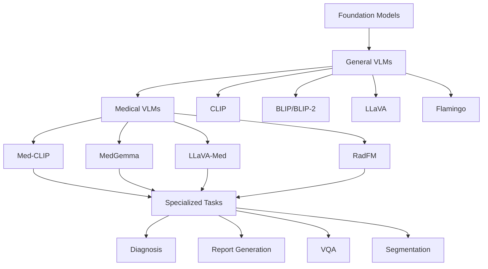

# Chapter 2: Technical Foundations

> From Attention Mechanisms to Medical Vision-Language Models: Building Intuition Before Mathematics

[← Chapter 1: Introduction](01-Introduction-Motivation.md) | [Back to Contents](DISSERTATION_STRUCTURE.md) | [Chapter 3: Adversarial Threats →](03-Adversarial-Threats.md)

---

## Executive Summary

**🔑 Key Insight**: Transformers revolutionized AI by replacing sequential processing with parallel attention—imagine every word in a sentence talking to every other word simultaneously. VLMs extend this to create conversations between images and text.

**🏥 Clinical Relevance**: Medical VLMs can read chest X-rays while understanding clinical history, generating reports that consider both visual findings and patient context—but this multimodal capability introduces new vulnerabilities.

**📊 Chapter Overview**:
- Attention mechanisms: From conference rooms to mathematics
- Transformer architecture: Why parallel beats sequential  
- Vision-Language Models: Making images and text talk
- Medical VLMs: MedGemma, LLaVA-Med, and clinical applications

---

## 2.1 The Transformer Revolution

### 2.1.1 The Conference Room Analogy

Think of processing a sentence like organizing a conference where each word is an attendee:

```python
# Traditional RNN: Sequential conference calls
def rnn_conference(sentence):
    """
    Like a game of telephone - each word whispers to the next
    Problems: Information gets distorted, takes forever
    """
    words = sentence.split()
    memory = None
    
    for word in words:
        # Each word only knows what came before
        memory = process_word(word, previous_memory=memory)
        # By word 50, word 1 is a distant memory!
    
    return memory

# Transformer: Everyone talks at once
def transformer_conference(sentence):
    """
    Like a conference room where everyone can talk to everyone
    Benefits: Direct communication, parallel processing
    """
    words = sentence.split()
    
    # Everyone speaks simultaneously
    conversations = {}
    for word1 in words:
        for word2 in words:
            # Direct conversation between any two words
            conversations[(word1, word2)] = attend(word1, word2)
    
    return aggregate_conversations(conversations)
```

### 2.1.2 Understanding Attention: The Three Questions

Every word in the transformer asks three questions:

```python
def attention_mechanism_intuitive():
    """
    The three fundamental questions of attention
    """
    # At a medical conference about a patient
    participants = ["chest", "X-ray", "shows", "pneumonia", "in", "left", "lobe"]
    
    # Each word asks:
    class WordParticipant:
        def __init__(self, word):
            self.word = word
            # Question 1: What information am I looking for?
            self.query = f"What relates to {word}?"
            
            # Question 2: What information do I have?
            self.key = f"I contain info about {word}"
            
            # Question 3: What's my actual information?
            self.value = f"Here's what I know about {word}"
    
    # Example: "pneumonia" attending to other words
    pneumonia = WordParticipant("pneumonia")
    
    # Strong attention to: "chest", "X-ray", "left", "lobe"  
    # Weak attention to: "in", "shows"
    # This creates contextual understanding!
```

### 2.1.3 The Mathematics of Attention

Now let's formalize our conference room:

```python
import numpy as np

def scaled_dot_product_attention(Q, K, V, mask=None):
    """
    The attention formula that revolutionized AI
    
    Q: Queries - What am I looking for? [seq_len, d_k]
    K: Keys - What do I have? [seq_len, d_k]
    V: Values - My actual information [seq_len, d_v]
    """
    # Step 1: Calculate attention scores (who should talk to whom)
    # Q @ K.T gives similarity between all query-key pairs
    scores = np.matmul(Q, K.transpose(-2, -1))
    
    # Step 2: Scale (prevent extreme values)
    # Without this, softmax becomes too peaked
    d_k = K.shape[-1]
    scores = scores / np.sqrt(d_k)
    
    # Step 3: Apply mask (optional - for causal attention)
    if mask is not None:
        scores = scores.masked_fill(mask == 0, -1e9)
    
    # Step 4: Softmax (convert to probabilities)
    attention_weights = softmax(scores, axis=-1)
    
    # Step 5: Weighted sum of values
    output = np.matmul(attention_weights, V)
    
    return output, attention_weights

# Medical example
def medical_attention_example():
    """
    How attention works on medical text
    """
    sentence = "Patient presents with severe chest pain radiating to left arm"
    
    # Each word becomes Query, Key, and Value vectors
    # "chest" query attends strongly to:
    # - "pain" (symptom association)  
    # - "severe" (severity modifier)
    # - "radiating" (pain characteristic)
    # - "left arm" (cardiac symptom pattern)
    
    # This creates rich, contextual representations!
```

💡 **Implementation Insight**: The scaling factor `1/√d_k` is crucial. Without it, dot products grow large, pushing softmax into saturation where gradients vanish.

### 2.1.4 Multi-Head Attention: Multiple Perspectives

Just like a medical team has specialists with different focuses, multi-head attention looks at text from multiple angles:

```python
class MultiHeadAttention:
    """
    Like having multiple specialists examine the same case
    """
    def __init__(self, d_model=512, num_heads=8):
        self.num_heads = num_heads
        self.d_model = d_model
        self.head_dim = d_model // num_heads
        
        # Different projection matrices for each "specialist"
        self.W_q = [LinearLayer(d_model, self.head_dim) for _ in range(num_heads)]
        self.W_k = [LinearLayer(d_model, self.head_dim) for _ in range(num_heads)]
        self.W_v = [LinearLayer(d_model, self.head_dim) for _ in range(num_heads)]
        
    def forward(self, x):
        """
        Each head focuses on different aspects
        """
        heads_output = []
        
        for i in range(self.num_heads):
            # Each head has its own perspective
            Q = self.W_q[i](x)
            K = self.W_k[i](x)  
            V = self.W_v[i](x)
            
            head_output, _ = scaled_dot_product_attention(Q, K, V)
            heads_output.append(head_output)
        
        # Combine all perspectives
        concat_output = concatenate(heads_output)
        return self.output_projection(concat_output)

# Medical interpretation
def head_specializations():
    """
    Different heads learn different relationships
    """
    text = "42-year-old male with crushing chest pain and shortness of breath"
    
    heads = {
        "Head 1": "Syntactic relations (subject-verb-object)",
        "Head 2": "Medical entities (symptoms, demographics)",
        "Head 3": "Temporal relations (age, symptom onset)",
        "Head 4": "Severity indicators (crushing, severe)",
        "Head 5": "Anatomical locations (chest)",
        "Head 6": "Clinical patterns (MI symptoms)",
        "Head 7": "Demographic risk factors",
        "Head 8": "Urgency indicators"
    }
    
    # Each head contributes its perspective to final understanding
```

---

## 2.2 Vision-Language Models: Making Images Talk to Text

### 2.2.1 The Core Innovation

VLMs extend transformers to understand both images and text simultaneously:

```python
def vlm_intuition():
    """
    How do we make images and text understand each other?
    """
    # Traditional approach: Separate models
    image_features = vision_model(image)  # [2048,]
    text_features = language_model(text)   # [768,]
    # Problem: Different spaces, can't communicate!
    
    # VLM approach: Shared understanding space
    image_tokens = vision_encoder(image)   # [196, 768] - image as 196 patches
    text_tokens = text_encoder(text)       # [20, 768] - text as 20 tokens
    
    # Now they can attend to each other!
    combined = concatenate([image_tokens, text_tokens])
    output = transformer(combined)  # Images and text in conversation
```

### 2.2.2 CLIP: The Foundation

CLIP (Contrastive Language-Image Pre-training) created the breakthrough:

```python
class CLIP:
    """
    Learning to align images and text in shared space
    """
    def __init__(self, vision_encoder, text_encoder, temperature=0.07):
        self.vision_encoder = vision_encoder  # ViT or ResNet
        self.text_encoder = text_encoder      # Transformer
        self.temperature = temperature
        
    def forward(self, images, texts):
        # Encode both modalities
        image_features = self.vision_encoder(images)
        text_features = self.text_encoder(texts)
        
        # Normalize to unit sphere
        image_features = normalize(image_features)
        text_features = normalize(text_features)
        
        # Calculate similarity matrix
        logits = image_features @ text_features.T / self.temperature
        
        # Contrastive loss: matching pairs should be similar
        labels = torch.arange(len(images))
        loss_i2t = cross_entropy(logits, labels)
        loss_t2i = cross_entropy(logits.T, labels)
        
        return (loss_i2t + loss_t2i) / 2

# Medical CLIP in action
def medical_clip_example():
    """
    How CLIP understands medical images
    """
    # A chest X-ray and various text descriptions
    xray = load_image("chest_xray_pneumonia.jpg")
    
    descriptions = [
        "Normal chest X-ray",
        "Consolidation in right lower lobe", 
        "Bilateral pulmonary infiltrates",
        "No acute cardiopulmonary process"
    ]
    
    # CLIP computes similarity
    similarities = clip.compute_similarity(xray, descriptions)
    # Highest similarity → most likely description
```

### 2.2.3 From CLIP to Modern VLMs

Modern VLMs go beyond simple alignment to enable complex reasoning:

```python
class ModernVLM:
    """
    Architecture of current medical VLMs like LLaVA, MedGemma
    """
    def __init__(self):
        # Visual processing
        self.vision_encoder = VisionTransformer()  # Extracts image features
        self.vision_projector = LinearProjection()  # Aligns to text space
        
        # Language model backbone
        self.language_model = LLM()  # GPT, LLaMA, Gemma, etc.
        
    def process_medical_query(self, image, question):
        """
        Example: Analyzing a chest X-ray with clinical question
        """
        # 1. Extract visual features
        image_patches = self.vision_encoder.patchify(image)  # [14x14 patches]
        visual_features = self.vision_encoder(image_patches)  # [196, 768]
        
        # 2. Project to language space  
        visual_tokens = self.vision_projector(visual_features)  # [196, 4096]
        
        # 3. Combine with text query
        text_tokens = self.tokenizer(question)  # "What abnormalities are visible?"
        
        # 4. Interleaved sequence
        combined = interleave(visual_tokens, text_tokens)
        # [IMG1, IMG2, ..., IMG196, "What", "abnormalities", "are", "visible", "?"]
        
        # 5. Generate response
        response = self.language_model.generate(combined)
        
        return response  # "Bilateral infiltrates consistent with pneumonia..."

# Real medical VLM interaction
def clinical_vlm_demo():
    """
    How doctors might use VLMs
    """
    # Load patient data
    cxr = load_image("patient_123_cxr.jpg")
    history = "72yo male, fever x3 days, productive cough"
    
    # Multimodal query
    query = f"Clinical history: {history}\nWhat are the key findings?"
    
    # VLM processes both image and text context
    findings = medical_vlm(cxr, query)
    
    print(findings)
    # "Key findings:
    #  1. Right lower lobe consolidation consistent with pneumonia
    #  2. Small right pleural effusion  
    #  3. No pneumothorax
    #  4. Heart size normal
    #  Impression: Findings consistent with right lower lobe pneumonia
    #  with small parapneumonic effusion. Clinical correlation recommended."
```

---

## 2.3 Medical Vision-Language Models

### 2.3.1 The Medical VLM Landscape



### 2.3.2 MedGemma: A Deep Dive

```python
class MedGemmaArchitecture:
    """
    Google's medical VLM built on Gemma
    """
    def __init__(self):
        # Base components
        self.base_llm = Gemma3_2B()  # Or 9B/27B variants
        self.vision_encoder = SigLIP()  # 400M parameters
        
        # Medical adaptations
        self.medical_vocabulary = MedicalTokenizer()
        self.clinical_embeddings = ClinicalEmbeddings()
        
    def medical_reasoning(self, image, clinical_context):
        """
        Multi-step medical reasoning process
        """
        # Step 1: Extract visual features with medical focus
        visual_features = self.vision_encoder(image)
        
        # Step 2: Enhance with medical knowledge
        enhanced_features = self.apply_medical_priors(visual_features)
        
        # Step 3: Integrate clinical context
        combined = self.fuse_modalities(enhanced_features, clinical_context)
        
        # Step 4: Generate structured output
        output = self.generate_medical_report(combined)
        
        return output

# Training strategy
def medgemma_training():
    """
    How MedGemma learns medical knowledge
    """
    # Stage 1: Pretrain on general medical literature
    medical_texts = load_dataset("PubMed", "medical_textbooks")
    
    # Stage 2: Vision-language alignment on medical images
    medical_pairs = load_dataset("MIMIC-CXR", "CheXpert", "PadChest")
    
    # Stage 3: Instruction tuning for clinical tasks
    clinical_tasks = {
        "diagnosis": "Given this image, what is the most likely diagnosis?",
        "findings": "Describe all abnormal findings in this image",
        "report": "Generate a radiology report for this study",
        "questions": "Answer: Is there evidence of pneumonia? Yes/No"
    }
    
    # Stage 4: Safety alignment
    safety_examples = filter_harmful_outputs(generated_samples)
```

### 2.3.3 Key Architectural Differences

| Model | Base LLM | Vision Encoder | Medical Training | Special Features |
|-------|----------|----------------|------------------|------------------|
| **MedGemma** | Gemma-3 | SigLIP | PubMed + MIMIC | Safety-focused |
| **LLaVA-Med** | Vicuna | CLIP | PMC + VQA-RAD | Instruction-tuned |
| **RadFM** | Custom | Custom | 16M radiology | Multi-organ |
| **Med-CLIP** | - | ViT | CheXpert | Contrastive only |

### 2.3.4 Clinical Applications in Practice

```python
def clinical_vlm_applications():
    """
    Real-world medical VLM use cases
    """
    applications = {
        "screening": {
            "task": "High-throughput abnormality detection",
            "example": "Flag suspicious chest X-rays for radiologist review",
            "model": "Med-CLIP for binary classification"
        },
        
        "diagnosis_assist": {
            "task": "Differential diagnosis generation",
            "example": "Suggest possible diagnoses with confidence scores",
            "model": "MedGemma for reasoning"
        },
        
        "report_generation": {
            "task": "Automated preliminary reports",
            "example": "Draft radiology reports for review",
            "model": "LLaVA-Med for detailed descriptions"
        },
        
        "education": {
            "task": "Medical training and case discussion",
            "example": "Explain findings to medical students",
            "model": "Any VLM with good explanations"
        },
        
        "quality_control": {
            "task": "Ensure nothing missed",
            "example": "Second-read for critical findings",
            "model": "Ensemble of models for robustness"
        }
    }
    
    return applications

# Example: Emergency triage system
def emergency_triage_vlm():
    """
    Using VLMs for rapid triage
    """
    def triage_patient(chest_xray, vitals, symptoms):
        # Rapid assessment
        urgent_findings = [
            "pneumothorax",
            "large_pleural_effusion", 
            "mediastinal_widening",
            "multiple_rib_fractures"
        ]
        
        # VLM analysis
        analysis = medical_vlm.analyze(
            image=chest_xray,
            query=f"Check for: {', '.join(urgent_findings)}. Vitals: {vitals}"
        )
        
        # Priority scoring
        priority = calculate_urgency(analysis, vitals)
        
        return {
            'findings': analysis,
            'priority': priority,
            'recommended_action': get_protocol(priority)
        }
```

---

## 2.4 The Vulnerability Connection

### Why Architecture Matters for Security

```python
def architecture_vulnerability_mapping():
    """
    How architectural choices create attack surfaces
    """
    vulnerabilities = {
        "attention_mechanism": {
            "component": "Self-attention layers",
            "vulnerability": "Attention can be misdirected by adversarial tokens",
            "exploit": "Insert malicious patches that dominate attention"
        },
        
        "vision_encoder": {
            "component": "Patch embedding",
            "vulnerability": "Local perturbations affect global features",
            "exploit": "Adversarial patches in critical regions"
        },
        
        "cross_modal_fusion": {
            "component": "Vision-language alignment",
            "vulnerability": "Misalignment attacks",
            "exploit": "Break image-text correspondence"
        },
        
        "tokenization": {
            "component": "Image patchification", 
            "vulnerability": "Discrete boundaries",
            "exploit": "Edge-case patterns at patch boundaries"
        }
    }
    
    return vulnerabilities

# Concrete example
def attention_hijacking_demo():
    """
    How adversaries exploit attention mechanisms
    """
    # Normal attention distribution
    clean_image = load_image("normal_cxr.jpg")
    attention_maps = vlm.get_attention_maps(clean_image)
    # Attention focused on lungs, heart, relevant anatomy
    
    # Adversarial attention hijacking
    adv_patch = create_adversarial_patch(target="distract")
    patched_image = add_patch(clean_image, adv_patch, position="corner")
    
    hijacked_attention = vlm.get_attention_maps(patched_image)
    # Attention now focused on adversarial patch, missing pathology!
    
    return {
        'clean_focus': 'Anatomical regions',
        'hijacked_focus': 'Adversarial patch',
        'clinical_impact': 'Missed diagnosis'
    }
```

⚠️ **Clinical Alert**: Understanding these architectural vulnerabilities is crucial for developing effective defenses. Each component's design choices directly impact robustness.

---

## 2.5 Key Takeaways

### 🔑 Core Concepts to Remember

1. **Attention is All You Need**: Transformers parallelize what RNNs serialize
2. **Multimodal Understanding**: VLMs create shared spaces for images and text
3. **Medical Specialization**: Domain-specific training crucial for clinical performance
4. **Architecture → Vulnerability**: Design choices create security implications

### 💡 Implementation Insights

```python
# Quick reference: Building blocks
building_blocks = {
    "attention": "Parallel information exchange",
    "multi_head": "Multiple specialized perspectives",
    "vision_encoder": "Images → Token sequences",
    "cross_modal": "Shared representation space",
    "medical_adaptation": "Domain knowledge injection"
}

# The stack
medical_vlm_stack = [
    "Pretrained vision encoder (CLIP/SigLIP)",
    "Pretrained language model (LLaMA/Gemma)",
    "Projection layer (align dimensions)",
    "Medical fine-tuning data",
    "Safety alignment"
]
```

### 🏥 Clinical Relevance Summary

Medical VLMs combine visual analysis with clinical reasoning, enabling:
- Automated screening at scale
- Consistent preliminary assessments
- Educational support tools
- Quality control mechanisms

But their architectural complexity creates vulnerabilities we must address...

---

## 2.6 Practical Exercises

### Exercise 1: Build Your Own Attention
```python
# TODO: Implement scaled dot-product attention
def your_attention_implementation(Q, K, V):
    """
    Implement the attention mechanism
    Hint: Follow the 5 steps from section 2.1.3
    """
    pass

# Test with medical text
medical_sentence = "Patient shows bilateral pneumonia on chest X-ray"
# Your implementation should identify strong attention between:
# "bilateral" ↔ "pneumonia"
# "pneumonia" ↔ "chest X-ray"
```

### Exercise 2: Visualize Cross-Modal Attention
```python
# TODO: Create attention visualization
def visualize_vlm_attention(image, text, model):
    """
    Show how image patches attend to text tokens
    Useful for understanding model focus
    """
    pass

# Try with:
# Image: Chest X-ray with pneumonia
# Text: "Is there consolidation in the right lung?"
# Expected: High attention between right lung patches and "right", "lung"
```

---

## Navigation

[← Chapter 1: Introduction](01-Introduction-Motivation.md) | [Back to Contents](DISSERTATION_STRUCTURE.md) | [Chapter 3: Adversarial Threats →](03-Adversarial-Threats.md)

### Quick Links
- [[Architecture/Foundations/Transformer Architecture|Detailed Transformer Math]]
- [[Architecture/Foundations/VLM Basics|VLM Implementation Guide]]
- [[Healthcare/Medical Vision-Language Models|Medical VLM Survey]]

### Next Chapter Preview
Now that we understand how medical VLMs work, Chapter 3 reveals their vulnerabilities. We'll implement real attacks, see how imperceptible changes cause misdiagnosis, and understand why medical AI faces unique security challenges.