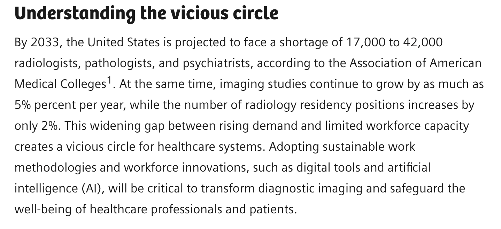
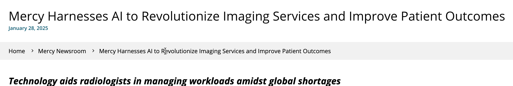
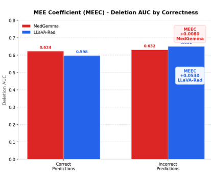
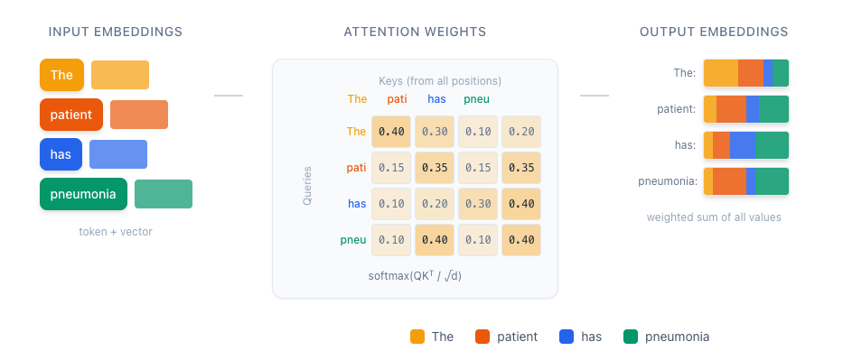
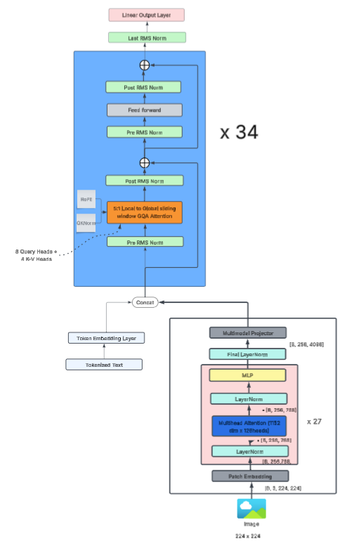
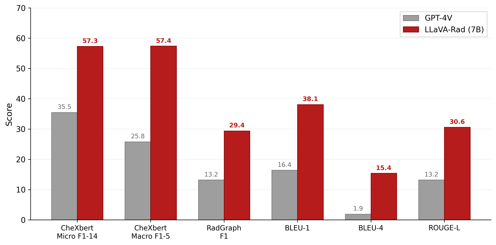
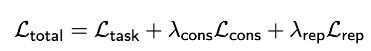
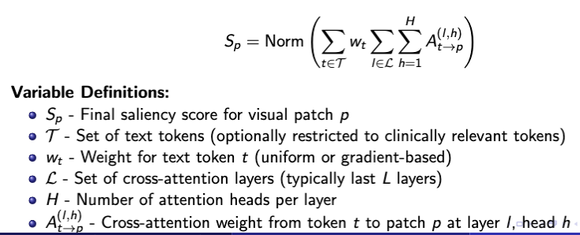
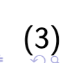

# Clinically Robust Vision-Language Models for Diagnostic Applications

Source slide deck: `latex_notes/Clinical Robust Vision Language Models.pptx`.

This page is autogenerated from slide text + speaker notes; slide visuals are embedded when present.

## Slide 01 — Clinically Robust Vision-Language Models for Diagnostic Applications

Slide images

- Advisor:
- Vahid Behzadan, Ph.D. Associate Professor vbehzadan@newhaven.edu
- Presenter:
- Binesh Sadanandan Ph.D. Candidate bsada1@unh.newhaven.edu
- Ph.D. Proposal Defense

## Slide 02 — Ethics Statement

Slide images

Before I go into the technical content, I would like to briefly state the ethical framing of this work. The research is conducted solely for scientific and safety purposes. We focus on vulnerabilities of medical VLMs – in particular, how small phrasing changes can lead to contradictory diagnoses. The goal is not to enable misuse of these systems, but the opposite: to help developers and regulators recognize critical safety issues and design better protections. All experiments are performed on publicly available datasets under established ethical guidelines for AI safety research. We believe that proactively discovering and reporting such vulnerabilities is part of the responsibility of the research community, especially in high‑stakes domains like healthcare where model errors can directly influence patient outcomes.

Slide text

- This work is intended solely for the research purposes. In our study, we present vulnerability in Vision-Language Models (VLM) that demonstrates significant safety concerns for medical AI systems. The identified vulnerability shows how phrasing variations can cause models to generate contradictory diagnoses, which poses serious risks in clinical settings.
- The purpose of exposing this vulnerability is not for promoting harm, but for enabling the research community and model developers to address these critical safety issues. By identifying how these failures occur, we can work toward eliminating them, which ultimately contributes to development of more robust and reliable medical AI systems.
- Our research demonstrates that current safety mechanisms may be insufficient for clinical deployment. The results obtained from our experiments provide important evidences that can guide future researches in making these systems safer. We believe that proactive identification of such vulnerabilities is essential responsibility of the research community, particularly in high-stakes domains like healthcare where incorrect outputs can directly impact the patient safety.
- Although we acknowledge potential risks associated with disclosing such vulnerabilities, we believe that transparent reporting of these findings leads to greater benefit for the field. This approach allows developers to perform necessary safety improvements and enables clinical institutions to make informed decisions about AI deployment. By conducting this research, we aim at advancing collective understanding of VLM safety and contributing to development of medical AI systems that can be trusted in real clinical environments.
- All experiments were conducted on publicly available datasets following established ethical guidelines for the AI safety research.

## Slide 03 — Promise of AI in Healthcare

Slide images

Good afternoon. Let me begin with the clinical motivation for this research.

Healthcare is currently facing structural workforce crisis. By 2033, the Association of American Medical Colleges projects a shortage of around 17,000 to 42,000 diagnostic specialists, including radiologists and pathologists. At the same time, imaging volumes are growing roughly 5 percent per year, while residency positions increase only around 2 percent. This mismatch creates what the Siemens report on the top shows as a ‘vicious circle’: more studies per clinician lead to burnout; burnout leads to attrition; and that again increases workload for those who remain. In this context, AI is promoted as promising solution. Commercial tools claim to identify thoracic pathologies within seconds, and potentially reduce reporting burden and turnaround time

Slide text

- https://www.siemens-healthineers.com/en-us/radiologys-workforce-crisis
- https://cloud.google.com/customers/gleamer
- https://www.mercy.net/newsroom/2025-01-29/mercy-harnesses-ai-to-revolutionize-imaging-services-and-improve/

## Slide 04 — Promise of AI in Healthcare

Slide images

This slide shows how that promise looks in practice. Here you see Gleamer’s ChestView, an FDA‑cleared AI system already deployed in clinical environments. It offers automated detection for nodules, consolidation, pneumothorax, and mediastinal mass, and the interface has the typical ‘without AI / with AI’ visualization. Tools like this demonstrate that AI in radiology is no longer theoretical – it is already influencing decisions. But seeing such a polished commercial system also motivates my question: when these AI tools provide diagnostic suggestions, how robust are they? Do they behave consistently when radiologists ask similar questions with slightly different phrasing?

Slide text

- https://www.gleamer.ai/copilot/chestview

## Slide 05 — When AI Radiologist Gets Confused

Slide images

Here we come to the core problem we study. We have the same chest X‑ray, and two questions that are clinically equivalent. The first asks about lung ‘volumes’, the second replaces this with ‘capacity’. In standard clinical usage, these are essentially synonyms in this context. With the original question, the model provides a very good answer: it detects a large left pleural effusion obscuring the lung and mentions possible atelectasis. But when I only change ‘volumes’ to ‘capacity’, the model suddenly describes hazy lungs and suggests pneumonia or heart failure. The main pleural effusion is not reported. So the image did not change, the clinical intent did not change, but the AI gives completely different diagnoses. I call this phenomenon Phrasing‑Sensitive Failure. For a clinician who might rely on such system, this inconsistency can pose serious patient‑safety risk.

Slide text

- https://sail-lab.org/vlm-fragility-medical-imaging/

## Slide 06 — When AI Radiologist Gets Confused

Slide images

This slide shows a second example on the same image. Here the change is even more subtle: the baseline question uses the word ‘inferred’ and the modified version uses ‘determined’. Again, from the clinical perspective, this is a minimal phrasing change. For the original question, the model correctly identifies a significant left pleural effusion, possibly with associated atelectasis. But for the modified phrasing, the response becomes vague – it talks about post‑surgical state or possible cardiac issues and no longer highlights the dominant effusion finding. This demonstrates that the issue is not an isolated anecdote; it represents systematic pattern across different types of paraphrases.

Slide text

- https://sail-lab.org/vlm-fragility-medical-imaging/

## Slide 07 — When AI Radiologist Gets Confused

Slide images

The problem is also not limited to specialized medical models. In this example, I use GPT‑4.1 with vision capabilities. We again hold the same chest X‑ray fixed, but ask two different – yet related – questions. One query is about ‘pulmonary vascular dilation’, the other about ‘cardiac vascular congestion’. For the first phrasing, the model says there is no clear evidence of vascular dilation. But for the second phrasing, it reports mild to moderate vascular congestion, even mentioning cardiomegaly and cephalization. Clinically, these findings are tightly related; a model should not claim ‘no evidence’ for one formulation and ‘moderate evidence’ for the other on the same image. This suggests that phrasing‑sensitive failures are pervasive across model families, including general‑purpose frontier models

Slide text

- https://sail-lab.org/vlm-fragility-medical-imaging/

## Slide 08 — Where does the model focus on?

Slide images

Now I want to show something quite surprising that motivated the mechanistic part of my proposal. On this slide, I computed attention maps for the token ‘abnormalities’ for two semantically equivalent questions: ‘Is there evidence of any abnormalities in this image?’ and ‘Are any abnormalities seen in this image?’. The correlation between the two attention maps is 0.999, essentially identical. Visually, both heatmaps focus on the same lung regions and thoracic structures. However, the outputs are completely different. One response reports pleural effusion, pneumothorax, and fractures. The other talks about masses and nodules and even says that the thoracic structure is intact. So the model is looking at the right place, but still producing contradictory interpretations.

Slide text

- Lung Finding
- Q1 : Pleural Effusion, Pneumothorax
- Q2: Masses, Nodules
- Thoracic Str
- Q1: Fractures, Degenerative changes
- Q2: Structure Intact
- Kibria, M. R., Lafond, S., & Arslan, J. (2025). Decoding the Multimodal Maze: A Systematic Review on the Adoption of Explainability in Multimodal Attention-based Models

## Slide 09 — Where does the model focus on?

Slide images

Idea: if an attribution map is faithful, then removing important regions should quickly damage the prediction; adding them back should quickly recover it.

Slide text

- Deletion
- --
- --
- Remove high-attribution pixels first
- An explanation is faithful if the highlighted parts really reflect how the model makes its prediction. Changing these parts should change the output in a consistent way (Potyka et. al,2022)
- Deletion AUC
- Gradually remove pixels or features from most attributed to leas
- At each step, track how much the model score decreases when highlighted regions are masked
- We aggregate these decreases into a deletion AUC that is proportional to 1 minus the usual deletion area-under-curve

## Slide 10 — Framing the Failure Modes

Slide images

From these examples, we formalize two coupled failure modes. First, Phrasing‑Sensitive Failure (PSF): semantically equivalent clinical questions yield contradictory answers, even though the visual attention remains stable. Second, Misleading Explanation Effect (MEE): the model generates explanations – text and attention maps – that look anatomically correct and highly faithful, even when the underlying diagnosis is wrong. Together, PSF and MEE create false confidence. A user might trust the system because explanations look reasonable, while in fact the model is contradicting itself across small phrasing changes

Slide text

- Phrasing-Sensitive Failure (PSF)
- Medical VLMs exhibit two coupled failure modes that we identified that affects clinical deployment
- Semantically equivalent questions yield contradictory answers despite stable visual attention
- Misleading Explanation Effect (MEE)
- Contradictory answers generates explanations that appear highly faithful and anatomically correct

## Slide 11 — The Coupled Failure Modes

Slide images

This diagram illustrates why PSF and MEE are particularly dangerous when they appear together. On the left, we have phrasing‑sensitive failure: clinically equivalent questions, but contradictory answers. On the right, misleading explanation effect: standard faithfulness metrics – for example attention overlap – still rate these explanations as highly faithful. In the middle, the red bar summarizes the danger: a model can produce a wrong answer while keeping stable attention on the correct anatomical region, and existing metrics will still say the explanation is good. So the system gives strong appearance of reliability exactly when clinicians should be most skeptical. This is the core safety problem that motivates the rest of my proposa

Slide text

- Phrasing-Sensitive Failure
- Clinically equivalent questions → contradictory answers
- Misleading Explanation Effect
- Faithfulness metrics induce false confidence
- DANGEROUS INTERACTION
- A model can produce wrong answers with stable attention on correct regions, and standard metrics will rate these failures as highly faithful - creating false assurance exactly when vigilance is needed the most.

## Slide 12 — CENTRAL RESEARCH QUESTION

This leads to my central research question. How can we make medical vision‑language models reliable across natural linguistic variation, while ensuring that their explanations faithfully reflect the evidence used for decisions? My central hypothesis is that PSF and MEE arise from specific interactions between language, vision, and fusion components of medical VLMs. If we can identify these interactions through causal analysis, then we can apply targeted interventions – such as parameter‑efficient fine‑tuning – to reduce failures without degrading diagnostic accuracy. The rest of the talk will show how I plan to test this hypothesis through four integrated thrusts.

Slide text

- How can we make medical vision-language models reliable across natural linguistic variation while ensuring their explanations faithfully reflect the evidence used for decisions?
- PSF and MEE arise from specific interactions between language, vision, and integration components of medical VLMs, and targeted interventions guided by causal analysis can reduce these failures without degrading accuracy
- CENTRAL HYPOTHESIS

## Slide 13 — Research Approach: Four Integrated Thrusts

Slide images

The research is organized into four thrusts. Thrust 1 develops the VSF‑Med benchmark with 18,000 question‑image pairs to systematically measure PSF and MEE, using metrics like paraphrase flip rate and attention stability. Thrust 2 performs causal analysis – mainly activation patching and representation analysis – to localize where in the architecture these failures originate. Thrust 3 designs robustness interventions using parameter‑efficient fine‑tuning with LoRA, guided by the insights from Thrust 2. Finally, Thrust 4 builds a clinical safety framework that integrates the improved models into selective‑prediction, human‑in‑the‑loop workflows. The key principle is that each thrust builds on the previous one: measurement informs analysis; analysis guides intervention; and interventions enable safe deployment

Slide text

- THRUST 1
- Measuring PSF & MEE
- VSF-Med benchmark with 18K question-image pairs, paraphrase flip rates, attention stability metrics
- THRUST 2
- Causal Analysis
- Activation patching, representation analysis, localize failures to specific layers and heads
- THRUST 3
- Robustness Interventions
- Parameter-efficient fine-tuning with LoRA, consistency losses, targeted at sensitive components
- THRUST 4
- Clinical Safety Framework
- Deployment architecture, selective prediction, human-in-the-loop workflows
- KEY PRINCIPLE:
- Each thrust builds on insights from the previous - measurement informs analysis, analysis guides intervention, intervention enables safe deployment
- This dissertation proposal aims to develop measurement frameworks, causal analysis tools, and mitigation strategies to address these failures

## Slide 14 — Background - CXR

Slide images

Before going into methodology, let me briefly justify the focus on chest X‑rays. Worldwide, more than 2 billion chest radiographs are performed each year, making this arguably the most common imaging modality. They are central for triage and for many diagnostic decisions in emergency and inpatient care. Recent work shows that VLMs like MedGemma and LLaVA‑Rad can reach clinician‑level performance on standardized benchmarks for chest X‑ray interpretation. However, clinical environments require very strict safety and reliability. A small unexpected failure can already have significant consequences for a patient. So even though current models appear strong on benchmarks, we still need to understand their robustness properties before using them at scale in practice.

Slide text

- 2B +
- Chest X-rays annually
- Clinician-level
- Accuracy achieved on standardized benchmarks
- Real-time
- Triage, reporting, and decision support
- Medical imaging is central for many diagnostic and triage decisions
- Vision-Language Models (VLMs) like MedGemma and LLaVA-Rad demonstrate impressive performance on the chest radiograph interpretation tasks
- Clinical environment has very strict requirements on safety and reliability
- Small unexpected failures can have large impact on patient outcomes
- Akhter Y, Singh R, Vatsa M. AI-based radiodiagnosis using chest X-rays: A review. Front Big Data. 2023 Apr 6;6:1120989. doi: 10.3389/fdata.2023.1120989. PMID: 37091458; PMCID: PMC10116151.

## Slide 15 — Background – Attention Mechanism

Slide images

This slide reviews the typical VLM architecture I am working with. We start with an image encoder, usually a CNN or Vision Transformer, which converts the chest X‑ray into a set of visual tokens or patch embeddings. A text encoder converts the clinical question or prompt into word embeddings. Then we have a merged attention or cross‑attention module, where the model fuses visual and textual information into a unified representation. These models are often pre‑trained with contrastive objectives such as CLIP or SigLIP, and then fine‑tuned on tasks like VQA, captioning, and retrieval. For this dissertation, the fusion layers – the red block in the diagram – are most important, because the preliminary experiments suggest that phrasing sensitivity originates there rather than in the pure visual encoder.

Slide text

- Introduced in 2017 by Vaswani et al. ("Attention is All You Need") - foundation of Transformer architecture
- Allows each position to directly attend to all other positions in a sequence Powered initial GPT models (Radford et al., 2018) for language understanding
- Contrastive learning (CLIP, Radford et al., 2021) extended attention to vision-language alignment

## Slide 16 — Background – Attention Mechanism

Slide images

This slide reviews the typical VLM architecture I am working with. We start with an image encoder, usually a CNN or Vision Transformer, which converts the chest X‑ray into a set of visual tokens or patch embeddings. A text encoder converts the clinical question or prompt into word embeddings. Then we have a merged attention or cross‑attention module, where the model fuses visual and textual information into a unified representation. These models are often pre‑trained with contrastive objectives such as CLIP or SigLIP, and then fine‑tuned on tasks like VQA, captioning, and retrieval. For this dissertation, the fusion layers – the red block in the diagram – are most important, because the preliminary experiments suggest that phrasing sensitivity originates there rather than in the pure visual encoder.

Slide text

- Image encoder extracts visual features via CNN/ViT patch embeddings
- Text encoder converts clinical descriptions to word embeddings
- Merged attention fuses both modalities into unified representation
- Pre-training: masked modeling, contrastive learning (CLIP SigLIP)
- Fine-tuning: VQA, captioning, retrieval tasks

## Slide 17 — Background – Domain Adaptation for Medical Tasks

Slide images

General‑domain VLMs tend to degrade on medical data due to distribution shift in both visual patterns and text semantics. To address this, the literature proposes several domain adaptation strategies. These include continued pre‑training on medical corpora, modified pre‑training losses tailored to radiology, instruction fine‑tuning where a language model is aligned with a medical visual encoder, and fully domain‑specific pretraining from scratch. The models I focus on – MedGemma and LLaVA‑Rad – belong to the instruction finetuning category. They retain much of the base model’s general linguistic behavior and are adapted to radiology via medical datasets. This is relevant because they may also inherit paraphrase‑sensitivity and other linguistic quirks from their base LLMs

Slide text

- General-domain VLMs exhibit performance degradation on medical data due to distribution shift in both visual features (radiographic patterns vs. natural images) and textual semantics (clinical terminology vs. natural language captions)
- Approach
- Method
- Examples
- Continued Pre-training
- Initialize from CLIP/SigLIIP weights, train on medical corpora with contrastive objectives
- PubMedCLIP, BioMedCLIP, MedGemma
- Modified Pre-training
- Loss modification for medical data characteristics
- MedCLIP
- Instruction Finetuning
- Align Frozen/LoRA adapter LLM with Medical Visual Encoder
- LLaVA-Med, LLaVA-Rad, MedGemma
- Domain-specific Pretraining
- Train from scratch on largescale medical multimodal data
- RadFM

## Slide 18 — Background – Domain Adaptation for Medical Tasks

Slide images

Here I summarize the two target models. LLaVA‑Rad has about 7 billion parameters, built on Vicuna with a domain‑specific BiomedCLIP‑CXR visual encoder. MedGemma‑4B‑it has 4 billion parameters, based on Gemma 3 with a SigLIP encoder trained on medical images. The training strategies also differ. LLaVA‑Rad uses a projector alignment phase followed by LoRA fine‑tuning on 697,000 radiology image‑text pairs from MIMIC‑CXR. MedGemma uses continued pre‑training and instruction tuning on a mixture of MIMIC‑CXR, SLAKE, PMC‑OA, Chest ImaGenome, plus proprietary data. By analyzing both models, which differ in architecture, size, and training, I can test whether PSF is architecture‑specific or a more general phenomenon in medical VLM

Slide text

- Aspect
- LLaVA-Rad
- MedGemma-4B-it
- Base Architecture
- LLaVA v1.5 + Vicuna-7B
- Gemma 3 + SigLIP encoder
- Visual Encoder
- BiomedCLIP-CXR (domain-specific)
- SigLIP pre-trained on medical images
- Parameters
- 7B
- 4B
- Training Strategy
- Projector alignment → LoRA fine-tuning
- Continued pre-training + instruction tuning
- Training Data
- 697K radiology image-text pairs (MIMIC-CXR)
- MIMIC-CXR, SLAKE, PMC-OA, ChestImaGenome + proprietary datasets

## Slide 19 — Background – Domain Adaptation for Medical Tasks

Slide images

These bar charts show that both models achieve strong performance on standard benchmarks. MedGemma reaches around 89% F1 on MIMIC‑CXR and competitive scores on VQA datasets like SLAKE. LLaVA‑Rad significantly outperforms GPT‑4V on radiology‑specific tasks, including CheXbert F1 and ROUGE‑L for report generation. So we are not dealing with weak systems; these are state‑of‑the‑art medical VLMs. However, these benchmarks only tell us how often the model is correct for a fixed wording. They do not tell us whether the model remains correct when a clinician rephrases the question.

Slide text

- Medical VLMs report strong performance on standard benchmarks; These benchmarks tell us how often the model is correct, but not whether it remains correct when we ask the same question differently
- Sellergren, Andrew, Sahar Kazemzadeh, Tiam Jaroensri, Atilla Kiraly, Madeleine Traverse, Timo Kohlberger, Shawn Xu et al. "Medgemma technical report." arXiv preprint arXiv:2507.05201 (2025).
- Chaves, Juan Manuel Zambrano, Shih-Cheng Huang, Yanbo Xu, Hanwen Xu, Naoto Usuyama, Sheng Zhang, Fei Wang et al. "Towards a clinically accessible radiology foundation model: open-access and lightweight, with automated evaluation." arXiv preprint arXiv:2403.08002 (2024).

## Slide 20 — Literature Survey – Robustness Challenges in Large Language Models

Slide images

Turning to related work, many studies document fundamental brittleness in large language models. For instance, simple perturbations like reversing the order of candidate answers can flip nearly 48% of evaluation verdicts on some benchmarks. Paraphrasing the questions in MMLU‑Pro can produce up to 10% accuracy fluctuation. Some mitigation strategies, such as latent adversarial paraphrasing, improve worst‑case performance by a few percentage points, but so far they are mostly evaluated in general‑domain text‑only settings

Slide text

- Fundamental Brittleness
- The recent studies expose that models exhibit inconsistent outputs under input perturbations(Yang et al., 2024). Attack success rate varies significantly across architectures.
- Paraphrasing Vulnerability
- Performance declines substantially when benchmark questions are paraphrased(Nalbandyan, 2025). SCORE framework reveals accuracy fluctuations up to 10% on MMLU-Pro.
- Key Finding
- 48.4% (Anghel et al., 2025) of evaluation verdicts reverse under mirrored response order, indicating the strong sensitivity to surface-level perturbations
- Mitigation Approaches
- Latent Adversarial Paraphrasing (Fu and Barez, 2025) achieves 0.5-4% improvements on worst-case performance. However, these strategies remain underexplored for medical VLMs.
- Sources: Yang et al., 2024; Lunardi et al., 2025; Nalbandyan, 2025; Wang et al., 2024

## Slide 21 — Literature Survey – Robustness in Medical Vision-Language Models

Slide images

On the medical VLM literature, robustness has been studied mainly along two dimensions. On the visual side, work on corruption and distribution shift shows that accuracy on clean chest X‑rays, which may be in the 70–80% range, can drop to around 40–60% under severe corruption. Few‑shot LoRA fine‑tuning recovers only a part of this loss. A striking result from the SURE‑VQA benchmark is that a language‑only baseline achieves about 65% accuracy, while the full multimodal systems reach only around 68%. This suggests that some models may not meaningfully use the visual information. On the linguistic side, SEQA fine‑tuning improves consistency but still achieves only around 67% consistency, compared with human performance above 90%. Negation tests like NegBench show large drops, for example from 78% to 52% accuracy when simply asking ‘Is there no pneumothorax?’ instead of ‘Is there pneumothorax?’. These results motivate my focus on linguistic variation and on understanding how visual information is actually integrated.

Slide text

- Sources: Imam et al., 2025; Kahl et al., 2024; Ma et al., 2025; Alhamoud et al., 2025
- Visual Corruption and Distribution Shift
- Clean chest X-ray accuracy of 72-84% dropped to 43-61% under severe corruption. Models did not generalize corruption robustness across modalities (Imam et al., 2025 )
- Few-shot LoRA fine-tuning recovered only 30-40% of performance gaps (Imam et al., 2025 )
- Critical Finding (SURE-VQA)
- Language-only baseline achieved 65% while full multimodal systems reached only 68% - suggesting models may not integrate the visual information meaningfully (Kahl et al., 2024)
- "Is there pneumothorax?" → 78% accuracy
- "Is there no pneumothorax?" → 52% accuracy
- Linguistic Variation and Semantic Consistency
- SEQA fine-tuning improved accuracy by 19.35% and consistency by 11.61%. Yet models achieved only 67% consistency on paraphrase sets compared to human performance exceeding 90% (Ma et al., 2025)
- Consistency with negation and hedging language dropped below 40% (Ma et al., 2025)
- NegBench (Alhamoud et al., 2025)

## Slide 22 — Literature Survey –Explainability and Faithfulness in VLMs

Slide images

Another important thread is explainability. Several studies show that the correlation between attention weights and actual feature importance – for example measured by leave‑one‑out tests – is quite weak, with Spearman ρ between 0.20 and 0.45. This means that attention maps can look very reasonable and yet do not really represent what the model uses for its decision. This observation is directly connected to my Misleading Explanation Effect: attention can be anatomically correct while the underlying reasoning is wrong. Therefore, in my work I do not rely solely on attention for explanations; instead I combine it with causal methods like activation patching and faithfulness metrics based on deletion and insertion.

Slide text

- Attention as Explanation
- Weak correlations (Spearman 0.20-0.45) observed between attention weights and leave-one-out importance metrics (Jain and Wallace, 2019)
- Sources: Yang et al., 2024; Lunardi et al., 2025; Nalbandyan, 2025; Wang et al., 2024
- Seeing but Not Believing
- VLMs frequently attend to correct visual evidence in deep layers yet still produce incorrect answers; layer-wise analysis reveals shallow layers focus on text while deeper layers concentrate on localized evidence region (Liu et al., 2025)
- Chain-of-Thought Unfaithfulness
- Chain-of-thought explanations in medical VLMs can be unfaithful to the actual decision process; prompt phrasing may influence responses as much as or more than the image itself, and post-hoc rationalizations can fabricate diagnostic steps that mislead clinicians (Balasubramanian et al., 2025; Barez et al., 2025)

## Slide 23 — Literature Survey –Training Strategies

Slide images

Various training strategies have been proposed to improve robustness. Paraphrase‑aware training uses contrastive losses to encourage similar representations for paraphrase pairs and to penalize divergent predictions. Region‑aware debiasing, such as RaVL, down‑weights spurious visual correlations and can improve out‑of‑distribution performance by around 8–12%. Adversarial training can also increase robustness, but typically at 3–5× computational cost and sometimes with 2–4% accuracy drop on in‑distribution data. A key gap is that few approaches optimize robustness and faithfulness simultaneously, especially in the medical VLM setting. This is where my causally guided PEFT interventions aim to contribute

Slide text

- Sources: Yang et al., 2024; Lunardi et al., 2025; Nalbandyan, 2025; Wang et al., 2024
- Robustness Training Approaches
- Gap: A very few approaches optimize both robustness and faithfulness simultaneously
- Paraphrase-aware training: Contrastive losses encouraging similar representations for paraphrase pairs, consistency-preserving losses penalizing divergent predictions (Kant et al., 2020)
- Region-aware debiasing (RaVL): Down-weights spurious visual correlations, achieving 8-12% improvement on out-of-distribution performance (Varma et al., 2024)
- Adversarial training: Improves robustness but increases computational cost by 3-5X and may reduce in-distribution accuracy by 2-4% (Dong et al., 2024)

## Slide 24 — Evaluation and Quality Assurance

Slide images

On the evaluation side, several frameworks exist for medical imaging AI. CheXbench defines eight standardized chest‑X tasks with common metrics. MediMeta‑C focuses on robustness to visual corruption. SURE‑VQA concentrates on distribution shift across datasets, and CARES proposes a broader trustworthiness benchmark. There is also work on multi‑stage paraphrase filtering to clean benchmark questions and to reduce contamination, which brought error rates from about 25% to less than 3% when constructing new test suites. However, these frameworks still omit two key aspects that I focus on: systematic robustness to paraphrase variations and quantitative measurement of explanation faithfulness conditioned on correctness. VSF‑Med is designed exactly to fill this gap

Slide text

- Sources: Kant et al., 2020; Ma et al., 2025; Varma et al., 2024; Chen et al., 2024
- Literature Survey – Med VLM Evaluation Frameworks
- Existing Evaluation Frameworks
  - CheXbench: 8 tasks with standardized metrics (Chen et al., 2024)
  - MediMeta-C: Visual corruption robustness (Imam et al., 2025)
  - SURE-VQA: Distribution shift evaluation (Kahl et al., 2024)
  - CARES: Comprehensive medical AI trustworthiness benchmark (Xia, Peng, et al)
- Gap: Benchmarks omit linguistic robustness through paraphrase variations and explanation faithfulness for Med VLMs

## Slide 25 — Literature Summary

Slide images

To summarize the literature review: First, LLMs can show up to 10% performance fluctuation under prompt variations. Second, medical VLMs are vulnerable to visual corruption, distribution shift, and linguistic variation. Third, attention‑based explanations correlate poorly with actual causal importance, so attention alone does not guarantee trustworthy explanations. Fourth, existing training strategies often address only one failure dimension at a time. Finally, recent FDA guidance adopts a total product life cycle perspective for AI/ML devices, but does not yet mandate specific robustness tests for issues like phrasing sensitivity. This combination of gaps motivates the specific contributions of my proposal

Slide text

- Critical Research Gaps
- FDA Guidance: Reddy et al., 2025
- LLMs exhibit performance fluctuations up to 10% under prompt variations
- Medical VLMs vulnerable to visual corruption, distribution shifts, linguistic variation
- Attention-based explanations correlate poorly with causal importance
- Training strategies address individual dimensions but rarely multiple failure modes jointly
- Literature Survey –Summary
- FDA Context: Recent guidance emphasizes Total Product Life Cycle (TPLC) approach but does not mandate specific robustness protocol

## Slide 26 — Literature Summary

Slide images

From this survey, I identify four critical gaps. To our knowledge, there is no systematic investigation of Phrasing‑Sensitive Failure for medical VLMs. The Misleading Explanation Effect has not been quantified with correctness‑aware metrics. The coupling between PSF and MEE is undocumented. And finally, there are almost no causal analyses that localize these failures to specific layers or heads in medical VLMs. These gaps are exactly what my four thrusts address.

Slide text

- Critical Research Gaps
- To our knowledge, no prior work systematically investigates
  - investigated PSF
  - MEE has not been quantified
  - Coupling between PSF and MEE undocumented
  - Causal analyses localizing failures are scarce
- Literature Survey – Critical Research Gaps

## Slide 27 — IDENTIFIED GAPS

Slide images

This slide maps each gap to a concrete contribution. The absence of a paraphrase robustness benchmark is addressed by VSF‑Med, with around 18,000 paraphrased question‑image pairs. The lack of correctness‑stratified faithfulness measures is addressed by the MEE Coefficient, which compares explanation faithfulness for correct versus incorrect predictions. The lack of causal analysis is addressed by a Causal Atlas that provides layer‑wise attribution of failures. And the lack of parameter‑efficient robustness interventions is addressed by a PEFT framework using LoRA adapters targeted at failure‑causing components. These four contributions together form the backbone of my dissertation.

Slide text

- No benchmark for paraphrase robustness in medical VQA
- OUR CONTRIBUTIONS
- VSF-Med: 16,000 paraphrased question-image pairs
- Gap Analysis & Expected Contributions
- No correctness-stratified faithfulness metrics
- MEE Coefficient: Correctness-aware faithfulness - In Progress
- No causal analysis of Medical VLM phrasing sensitivity
- Causal Atlas: Layer-wise attribution of failures – In Progress
- Lack of parameter-efficient robustness interventions of Medical VLMs
- PEFT Framework: LoRA adapters for robustness

## Slide 28 — THRUST 1

This brings me to Thrust 1 - measuring Phrasing-Sensitive Failure and Misleading Explanation Effect. I am developing the VSF-Med benchmark consisting of 2,000 base questions expanded to 16,000 question-image pairs through 8 to 10 paraphrases per question.

Slide text

- Measuring PSF and MEE
- Developing the VSF-Med benchmark to systematically quantify phrasing-sensitive failures and misleading explanations
- 2,000
- Base questions
- 16,000
- Question-image pairs
- Paraphrases per question

## Slide 29 — THRUST 1

Slide images

Thrust 1 addresses four research questions. RQ1.1: How sensitive are medical VLMs to semantically equivalent paraphrases, and which linguistic phenomena – such as negation, voice changes, or synonym substitution – trigger most failures? RQ1.2: How does explanation quality differ between correct and incorrect predictions? In other words, when do we see the Misleading Explanation Effect in practice? RQ1.3: How stable is visual attention when answers flip? Do high attention‑stability values combined with answer disagreement indicate what I call visual‑linguistic decoupling? RQ1.4: Do standard faithfulness metrics like deletion and insertion AUC differ systematically between correct and incorrect predictions? And does MEE create any negative or unexpected correlation? The answers to these questions will inform the causal analysis in Thrust 2

Slide text

- RQ1.1: Sensitivity to Paraphrasing
- How sensitive are medical VLMs to semantically equivalent paraphrases of clinical questions? Which linguistic phenomena trigger most failures?
- RQ1.2: Explanation vs. Correctness
- How does explanation quality differ between correct and incorrect predictions? When do we observe the Misleading Explanation Effect?
- RQ1.3: Attention Stability
- How stable is visual attention when answers flip? Do high attention similarity values coupled with answer disagreement indicate visual-linguistic decoupling?
- RQ1.4: Faithfulness Metrics
- Do deletion AUC scores systematically differ between correct and incorrect predictions?
- THRUST 1 : Research Questions

## Slide 30 — THRUST 1

Slide images

The The VSF‑Med benchmark is constructed from two main data sources. MIMIC‑CXR provides over 377,000 chest X‑ray images with associated radiology reports. Chest ImaGenome contributes expert bounding boxes for 29 anatomical structures with high IoU. The design follows three principles:

Paraphrases must preserve exact clinical meaning;

They should reflect real clinical phrasing, not artificial perturbations;

Each paraphrase is explicitly annotated with the linguistic phenomenon it represents – for example negation, passive voice, scope ambiguity, synonym use, or question form. Question types include binary detection (presence/absence of pathology), localization questions, and severity grading (mild, moderate, severe).

Slide text

- DESIGN PRINCIPLES
- 1. Paraphrases preserve exact clinical meaning
- 2. Reflect natural clinical variation
- 3. Linguistic phenomena explicitly annotated
- QUESTION CATEGORIES
- Binary detection : presence/absence
- Localization : anatomical position
- Severity : mild/moderate/severe
- DATA SOURCES
- MIMIC-CXR
- 377,110 images from 227,827 studies
- Chest ImaGenome
- Expert bounding boxes for 29 anatomical structures, IoU > 0.85
- LINGUISTIC PHENOMENA
- Negation, passive voice, scope ambiguity, synonyms, question forms
- THRUST 1 : VSF-Med Benchmark Design

## Slide 31 — THRUST 1

Slide images

araphrases are generated with a three‑stage pipeline. We start from a base question, such as ‘Is there cardiomegaly?’. Using GPT‑5, we generate around six candidate paraphrases for each base question. These candidates then pass through a multi‑stage filtering pipeline: automated grammaticality scoring, semantic similarity threshold above 0.9, and medical terminology validation to ensure correct use of terms. Finally, a clinical expert reviews the paraphrases, and we perform contamination checks using n‑gram overlap and embedding similarity to avoid near‑duplicates of training questions. This process ensures that VSF‑Med includes high‑quality, meaning‑preserving paraphrases.

Slide text

- Base Question
- "Is there cardiomegaly?"
- GPT-4 Generation
- 6 paraphrases
- Multi-Stage Filtering
- Grammaticality + semantic + expert
- QUALITY ASSURANCE PIPELINE
- Automated Checks
- Grammaticality scoring
- Semantic similarity > 0.9
- Medical terminology validation
- THRUST 1 : Paraphrase Generation Pipeline
- https://github.com/UNHSAILLab/VSF-Med
- https://huggingface.co/datasets/saillab/medical-vqa-robustness-analysis

## Slide 32 — THRUST 1

Slide images

Thrust 1 uses three main metrics. The first is Paraphrase Flip Rate (PFR). For a given image and its set of 𝑘paraphrases, we consider all 𝑘𝑘−12pairs of questions. PFR is the proportion of these pairs where the model gives clinically inconsistent answers. An answer is considered clinically inconsistent if at least one diagnosis or key label would change, not just superficial wording. We compute PFR per pathology, such as pneumothorax or pleural effusion, and per linguistic phenomenon, such as negation or voice change. High PFR indicates strong phrasing sensitivity and low reliability for that condition. In addition, Thrust 1 defines the Attention Stability Index and the MEE Coefficient, which I will explain on the next slides.

Thrust 1 uses three main metrics. The first is Paraphrase Flip Rate (PFR). For a given image and its set of 𝑘paraphrases, we consider all 𝑘(𝑘−1)/2pairs of questions. PFR is the proportion of these pairs where the model gives clinically inconsistent answers. An answer is considered clinically inconsistent if at least one diagnosis or key label would change, not just superficial wording. We compute PFR per pathology, such as pneumothorax or pleural effusion, and per linguistic phenomenon, such as negation or voice change. High PFR indicates strong phrasing sensitivity and low reliability for that condition. In addition, Thrust 1 defines the Attention Stability Index and the MEE Coefficient, which I will explain on the next slides.

Slide text

- For an image and a paraphrase set, PFR is the proportion of question pairs where the model gives clinically inconsistent answer across paraphrases
- Attention Stability Index (ASI)
- Cosine similarity between visual attention distributions for paraphrase pairs
- ASI = cos(attn_i, attn_j)
- MEE Coefficient (MEEC)
- Deletion AUC difference between incorrect and correct predictions
- MEEC = E[DelAUC|wrong] - E[DelAUC|correct]
- THRUST 1 : Evaluation Metrics
- Paraphrase Flip Rate (PFR)
- Clinically inconsistent means that at least one answer would change
- We measure PFR per finding type and per linguistic phenomenon.
- https://github.com/UNHSAILLab/lvlm-interpret-medgemma
- (Eq:1)

## Slide 33 — THRUST 1

Slide images

The second metric is Attention Stability Index, or ASI. ASI measures how consistently the model attends to the same image regions across different paraphrases of the same question. Formally, for two paraphrases 𝑞𝑖and 𝑞𝑗over the same image, we compute vectors of attention weights over visual tokens and take their cosine similarity. This value ranges between −1 and +1, but in practice attention weights are non‑negative, so we operate mostly between 0 and 1. We define attention as stable when ASI exceeds 0.80. This is important because high ASI together with answer disagreement indicates visual‑linguistic decoupling – the model keeps looking at correct regions but produces different diagnoses depending on wording.

The second metric is Attention Stability Index, or ASI. ASI measures how consistently the model attends to the same image regions across different paraphrases of the same question. Formally, for two paraphrases 𝑞_𝑖and 𝑞_𝑗over the same image, we compute vectors of attention weights over visual tokens and take their cosine similarity. This value ranges between −1 and +1, but in practice attention weights are non‑negative, so we operate mostly between 0 and 1. We define attention as stable when ASI exceeds 0.80. This is important because high ASI together with answer disagreement indicates visual‑linguistic decoupling – the model keeps looking at correct regions but produces different diagnoses depending on wording.

Slide text

- Paraphrase Flip Rate (PFR)
- ASI quantifies the consistency of visual attention across semantically equivalent questions and is computed as cosine similarity between attention weight distributions over the visual tokens for a paraphrase pair
- THRUST 1 : Evaluation Metrics
- Attention Stability Index (ASI)
- (Eq:2)

## Slide 34 — THRUST 1

Slide images

The third metric is the MEE Coefficient, or MEEC, which quantifies the Misleading Explanation Effect. We take a faithfulness metric 𝐹𝑥𝑞, such as deletion AUC or insertion AUC, and compute its average over all incorrect predictions and over all correct predictions. MEEC is defined as the mean faithfulness for wrong cases minus the mean faithfulness for correct cases. If MEEC is negative, explanations tend to be less faithful when the model is wrong – which is what we actually prefer. If MEEC is around zero or positive, it means explanations for wrong predictions are about as faithful or even more faithful than for correct ones. This indicates strong Misleading Explanation Effect and potential for over‑trust by clinicians.

The third metric is the MEE Coefficient, or MEEC, which quantifies the Misleading Explanation Effect. We take a faithfulness metric 𝐹(𝑥ⓜ,𝑞), such as deletion AUC or insertion AUC, and compute its average over all incorrect predictions and over all correct predictions. MEEC is defined as the mean faithfulness for wrong cases minus the mean faithfulness for correct cases. If MEEC is negative, explanations tend to be less faithful when the model is wrong – which is what we actually prefer. If MEEC is around zero or positive, it means explanations for wrong predictions are about as faithful or even more faithful than for correct ones. This indicates strong Misleading Explanation Effect and potential for over‑trust by clinicians.

Slide text

- Paraphrase Flip Rate (PFR)
- MEEC stratifies existing faithfulness metrics (deletion AUC) by prediction correctness and computes the difference between mean scores for incorrect versus correct predictions.
- Attention Stability Index (ASI)
- ASI = cos(attn_i, attn_j)
- MEE Coefficient (MEEC)
- Deletion AUC difference between incorrect and correct predictions
- MEEC = E[DelAUC|wrong] - E[DelAUC|correct]
- MEEC > 0 indicates MEE is present
- THRUST 1 : Evaluation Metrics
- MEE Coefficient (MEEC)
- https://github.com/UNHSAILLab/lvlm-interpret-medgemma
- (Eq:4)

## Slide 35 — THRUST 1 : Expected Results Based on Pilot

Slide images

This comprehensive view shows all pilot metrics. The top right confirms attention stability - all ASI values exceed the 0.80 threshold, meaning visual attention remains stable even when answers flip. Critically, 100% of flips occur with stable attention, confirming visual-linguistic decoupling.

The bottom left shows MEEC results. Both models have positive values - MedGemma at +0.008 and LLaVA-Rad at +0.053 - meaning explanations for incorrect predictions are as faithful or more faithful than correct ones. This confirms the Misleading Explanation Effect is present in both models.

These results validate our research problem and motivate the causal analysis in Thrust 2.

Slide text

- Pilot run(1600 samples) shows flip rate up to 17%, in a complete full run we expect it to be in the range of 15%
- https://wandb.ai/bineshkumar-saillab-unh/med-vlm-robustness

## Slide 36 — THRUST 1 : Expected Results Based on Pilot (Cont)

Slide images

This comprehensive view shows all pilot metrics. The top right confirms attention stability - all ASI values exceed the 0.80 threshold, meaning visual attention remains stable even when answers flip. Critically, 100% of flips occur with stable attention, confirming visual-linguistic decoupling.

The bottom left shows MEEC results. Both models have positive values - MedGemma at +0.008 and LLaVA-Rad at +0.053 - meaning explanations for incorrect predictions are as faithful or more faithful than correct ones. This confirms the Misleading Explanation Effect is present in both models.

These results validate our research problem and motivate the causal analysis in Thrust 2.

Slide text

- https://wandb.ai/bineshkumar-saillab-unh/med-vlm-robustness

## Slide 37 — [Attention Heatmap Comparison]

Slide images

- Paraphrase A vs B
- ASI = 0.936
- High spatial correlation despite answer flip
- EXPECTED FINDINGS
- ASI ≥ 0.80
- In majority of flip cases in Pilot
- This confirms visual-linguistic decoupling: models maintain stable visual focus while linguistic interpretation fails.
- THRUST 1 : Attention Stability Analysis
- IMPLICATION
- The problem is not in the vision encoder - interventions should target language processing and cross-modal fusion components.
- https://wandb.ai/bineshkumar-saillab-unh/med-vlm-robustness

## Slide 38 — THRUST 1

Slide images

- VSF-Med Benchmark
- 2,000 base questions, 16,000 question-image pairs with expert-validated paraphrases and region annotations
- Establish Metrics
- PFR, ASI, and MEEC metrics jointly characterizing answer consistency, attention stability, and faithfulness alignment
- Empirical Characterization
- Comprehensive documentation of prevalence and patterns across models and phenomena
- Vulnerability Profiles
- Phenomenon-specific analysis identifying high-risk linguistic constructions for each model
- Open-Source Infrastructure
- Evaluation scripts, metric implementations, and baseline results for community use
- TIMELINE
- November 2025 - March 2026
- THRUST 1 : Deliverables

## Slide 39 — THRUST 2

Thrust 2 focuses on causal analysis - tracing failures to specific model components through mechanistic interpretability. I will use three methods: activation patching for layer-wise intervention, causal mediation for effect decomposition, and develop an Attribution Atlas mapping failure-causing components

Slide text

- Causal Analysis
- Tracing failures to specific model components through mechanistic interpretability
- Activation Patching
- Layer-wise intervention
- Causal Mediation
- Effect decomposition
- Attribution Atlas
- Component mapping

## Slide 40 — THRUST 2

Slide images

"Thrust 2 is guided by two research questions. First, which architectural components are causally responsible for phrasing sensitivity - can we identify specific layers and attention heads? Second, how do direct versus indirect effects contribute to failures, and does visual grounding amplify or mitigate phrasing sensitivity?

The goal is to move beyond correlational observations to establish causal links, which will enable targeted interventions in Thrust 3

Slide text

- RQ2.1: Architectural Localization
- Which architectural components or token pathways are causally responsible for phrasing sensitivity in VLMs? Can we identify specific layers and attention heads?
- RQ2.2: Effect Decomposition
- How do natural direct effects versus natural indirect effects contribute to prediction flips with stable visual focus? Does visual grounding amplify or mitigate phrasing sensitivity?
- GOAL
- Move beyond correlational observations to establish causal links between architectural components and failure modes, enabling targeted interventions in Thrust 3.
- THRUST 2 : Research Questions

## Slide 41 — THRUST 2

Slide images

This structural causal model formalizes my analysis framework. The question flows through the text encoder to fusion, where it combines with visual features to produce the answer. The vision encoder is labeled stable based on Thrust 1 findings.

I decompose the total effect of phrasing changes into natural direct effects through language only, and natural indirect effects through fusion. My hypothesis is that indirect effects through fusion account for majority of phrasing sensitivity, while the vision encoder remains stable. This will identify exactly where interventions should target.

Slide text

- Q
- Question
- T
- Text Enc
- F
- Integration
- Y
- Answer
- V
- Vision Encoder (stable)
- CAUSAL ESTIMANDS
- Total Effect: Q → Y overall impact
- Natural Direct: Q → T → Y (language only)
- Natural Indirect: Q → F → Y (via fusion)
- HYPOTHESIS
- Our working hypothesis is that natural indirect effects through fusion will account for the majority of phrasing sensitivity
- THRUST 2 : Structural Causal Model

## Slide 42 — THRUST 2

Slide images

I will employ four complementary intervention methods. Activation patching replaces activations between paraphrases at specific layers to reveal which layers cause output divergence. Token ablation systematically removes tokens to identify high-impact linguistic elements. Region-constrained evaluation uses Chest ImaGenome annotations to test whether correct visual grounding is necessary for predictions. And attention analysis decomposes patterns at head-level granularity to map specialization.

Together these methods will provide comprehensive mechanistic understanding of where failures originate.

Slide text

- ACTIVATION PATCHING
- Replace activations from one paraphrase with another at specific layers
- Reveals which layers cause output divergence
- THRUST 2 : Intervention Methods & Our Expectation
- TOKEN ABLATION
- Systematically remove tokens to measure contribution to answer
- Identifies high-impact linguistic tokens
- REGION-CONSTRAINED
- Evaluate with masked image regions using Chest ImaGenome annotations
- Tests visual grounding necessity
- ATTENTION ANALYSIS
- Decompose attention patterns at head-level granularity
- Maps head specialization patterns

## Slide 43 — THRUST 2

Slide images

Based on architectural understanding, I expect PSF to concentrate in middle-to-late layers where cross-modal fusion occurs - approximately layers 8 through 16. I also expect to find head specialization, with different heads handling negation versus scope phenomena.

For effect decomposition, I hypothesize that Natural Indirect Effects through fusion will dominate, and that visual grounding may actually amplify rather than mitigate phrasing sensitivity.

Deliverables include the Causal Attribution Atlas with layer and head-level sensitivity maps, effect decomposition tables breaking down NDE and NIE per phenomenon, and open-source tools for the community. This work is scheduled from January to June 2026.

Slide text

- EXPECTED FINDINGS
- Layer-wise Attribution
- PSF concentrates in layers
- Head Specialization
- Specific heads specialize in negation scope handling
- Effect Decomposition
- Natural Indirect Effects and visual grounding amplifies or mitigates phrasing sensitivity
- DELIVERABLES
- Causal Attribution Atlas
- Layer and head-level sensitivity maps for both models
- Effect Decomposition Tables
- NDE/NIE breakdown per phenomenon
- Open-Source Tools
- PyTorch hooks, mediation estimators, validation protocols
- Timeline: January - June 2026
- THRUST 2 : Expected Findings & Deliverables

## Slide 44 — THRUST 3

Thrust 3 develops robustness interventions using parameter-efficient fine-tuning. I will apply LoRA adapters - training only 0.24% of model parameters - with targeted placement guided by the causal analysis from Thrust 2. This enables efficient intervention while preserving diagnostic accuracy.

Slide text

- Robustness Interventions
- Parameter-efficient fine-tuning to reduce phrasing sensitivity while preserving accuracy
- LoRA
- Low-Rank Adaptation
- < 1%
- Trainable parameters
- Targeted
- Causal-guided placement

## Slide 45 — THRUST 3

Slide images

Thrust 3 addresses two research questions. First, can parameter-efficient fine-tuning reduce phrasing sensitivity while preserving accuracy, and what is the optimal trade-off? Second, how effective are different training strategies - consistency losses, contrastive alignment, and paraphrase augmentation - and which combinations work best?

The key principle is that all interventions are guided by Thrust 2's causal analysis. We target specific layers and heads identified as responsible for phrasing sensitivity, rather than applying techniques uniformly across the model.

Slide text

- RQ3.1: Parameter-Efficient Interventions
- Can parameter-efficient fine-tuning reduce phrasing sensitivity while preserving diagnostic accuracy? What is the optimal trade-off between robustness improvement and parameter count?
- RQ3.2: Intervention Effectiveness
- How effective are consistency losses, contrastive alignment, and paraphrase augmentation for improving linguistic robustness? Which combinations yield best results?
- KEY PRINCIPLE
- Interventions are guided by Thrust 2's causal analysis - we target specific layers and heads identified as responsible for phrasing sensitivity, rather than applying techniques uniformly.
- THRUST 3 : Research Questions

## Slide 46 — THRUST 3

Slide images

For the intervention architecture, we freeze both vision encoder and language model backbone. LoRA adapters are applied only to language attention projections - the Q, K, V, and O matrices - and to the image-text projector.

Critically, this placement is informed directly by Thrust 2's causal analysis. Our pilot work suggests paraphrase sensitivity concentrates in layers 12 to 16 for MedGemma and layers 8 to 12 for LLaVA-Rad. We intervene precisely where linguistic variation causes divergence, rather than applying adapters uniformly across the model.

Slide text

- THRUST 3 : LoRA Architecture & Targeted Placement
- We freeze both vision encoder and language model backbone
- Applying LoRA adapters only to language attention projections (Q, K, V, O matrices) and to the image-text projector
- This placement will be informed directly by causal analysis from Thrust 2
- Causal analysis in pilot shows sensitivity in layers 12-16 (MedGemma) and 8-12 (LLaVA-Rad) We intervene precisely where linguistic variation causes divergence.

## Slide 47 — THRUST 3 : Loss Function Design

Slide images

The training objective combines three loss components. Task loss is standard cross-entropy averaged over all paraphrases, ensuring the model learns correct predictions regardless of phrasing. Consistency loss uses symmetric KL divergence to penalize distributional disagreement between paraphrase pairs - if two semantically equivalent questions should have the same answer, their output distributions should match.

The third component, representation loss, enforces alignment in embedding space and will be detailed next. Hyperparameters lambda control the balance between accuracy and consistency.

Slide text

- Task Loss: Standard cross-entropy averaged over all paraphrases; ensures correct predictions regardless of phrasing
- Consistency Loss: Penalizes different answer distributions for semantically equivalent questions; if model is 80% confident for one phrasing, it should be similar for others
- Representation Loss: Encourages similar internal embeddings for paraphrase pairs at the projector output; addresses root cause of instability
- Combined Objective: Weighted sum of all three losses; weights tuned on validation set to balance accuracy with robustness

## Slide 48 — THRUST 3

Slide images

Thrust 3 delivers six outputs. The theoretical framework documents the full mitigation design space. Trained LoRA adapters for both models will be released with reproducibility documentation. Ablation studies will characterize parameter-performance trade-offs.

Results tables will report flip rate and MEE reduction with confidence intervals. Finally, deployment guidelines will provide safe thresholds for abstention and faithfulness checks. This work is scheduled from March to August 2026

Slide text

- Theoretical Framework
- Complete documentation of mitigation design space: losses, ROI regularizers, ensembling strategies
- Trained Adapters
- LoRA weights and configs for MedGemma-4b-it and LLaVA-Rad with reproducibility documentation
- Ablation Studies
- Parameter-performance trade-offs across adapter configurations, placements, and loss weights
- Results Tables
- Flip rate reduction, PSF index reduction, MEE reduction with confidence intervals and effect sizes
- Deployment Guidelines
- Safe thresholds for abstention, faithfulness checks for clinical deployment decisions
- TIMELINE
- March - August 2026
- THRUST 3 : Deliverables

## Slide 49 — THRUST 4

Thrust 4 develops the clinical safety framework for integrating adapted models into deployment workflows with human oversight. This includes selective prediction to know when to abstain, human-in-the-loop escalation pathways, and coverage-risk trade-off optimization

Slide text

- Clinical Safety Framework
- Integrating adapted models into deployment workflows with human oversight
- Selective Prediction
- Know when to abstain
- Human-in-Loop
- Escalation pathways
- Coverage-Risk
- Trade-off optimization

## Slide 50 — RQ4.1: Cross-Modality Transfer

Slide images

Thrust 4 addresses two research questions. First, will safety fine-tuning transfer across imaging modalities - can robustness learned on chest X-rays generalize to CT or MRI? Second, what residual risks remain under adaptive attacks, and how should evaluation frameworks capture these for safe deployment

Slide text

- Will safety fine-tuning and guard rails transfer from one imaging modality to another? How do we ensure robustness generalizes beyond chest radiography?
- RQ4.2: Residual Risks
- What residual risks remain under adaptive paraphrase-based benchmarking? How should evaluation frameworks capture these risks for safe deployment?
- PHILOSOPHY
- The goal is effective human-AI collaboration, not full automation. Models should know when to defer to human expertise.
- THRUST 4 : Research Questions

## Slide 51 — THRUST 4 : Clinical Safety Framework

Slide images

This slide summarizes Thrust 4's role in the dissertation. It translates the measurement framework from Thrust 1, causal understanding from Thrust 2, and mitigation techniques from Thrust 3 into practical deployment architecture that places patient safety above all other considerations.

Specifically, I will formalize coverage-risk targets for different deployment scenarios, construct a safety layer that fuses multiple uncertainty signals, integrate human-in-the-loop workflows, and validate through focused evaluation within academic resource constraints

Slide text

- This thrust translates the measurement framework from Thrust 1, causal understanding from Thrust 2, and mitigation techniques from Thrust 3 into practical deployment architecture that places patient safety above all other considerations
- Formalize coverage-risk targets appropriate for distinct radiology deployment scenarios (rule-out triage, rule-in alerting, assistive reporting)
- Construct safety layer that fuses multiple uncertainty signals into unified abstention decisions
- Integrate human-in-the-loop workflows recognizing that goal is effective collaboration rather than full automation
- Validate through focused evaluation within academic resource constraints

## Slide 52 — UNCERTAINTY SIGNALS

Slide images

The safety architecture combines multiple uncertainty signals - probabilistic confidence, paraphrase agreement rate, and faithfulness diagnostics - into a unified abstention decision with calibrated thresholds. Every output includes not just the prediction, but also confidence and an explicit defer flag.

The thresholds are calibrated for different deployment scenarios. Rule-out triage prioritizes high sensitivity, accepting false positives to avoid missing cases. Rule-in alerting prioritizes high specificity to minimize false alarms. Assistive reporting provides balanced output with human verification for all predictions.

Slide text

- Probabilistic confidence
- Paraphrase agreement rate
- Faithfulness diagnostics
- FUSION & DECISION
- Multiple signals combined into unified abstention decision with calibrated thresholds
- OUTPUT
- Prediction + Confidence + Defer flag
- DEPLOYMENT SCENARIOS
- Rule-out Triage
- High sensitivity, accept false positives
- Rule-in Alerting
- High specificity, minimize false alarms
- Assistive Reporting
- Balanced, with human verification
- THRUST 4 : Safety Architecture

## Slide 53 — WORKFLOW COMPONENTS

Slide images

- Escalation
- Evidence
- Feedback
- Uncertain cases route to radiologist review with attention overlays and confidence scores displayed.
- CONTINUOUS IMPROVEMENT
- Radiologist feedback enables model refinement and threshold calibration over time.
- SELECTIVE PREDICTION
- Model predicts only when confidence exceeds threshold; otherwise defers to human.
- Coverage-Risk Trade-off:
- Higher threshold → Lower coverage, Lower risk
- VALIDATION APPROACH
- Focused evaluation with radiologist collaboration; document cases where model should defer.
- THRUST 4 : Human in the Loop
- This thrust translates the measurement framework from Thrust 1, causal understanding from Thrust 2, and mitigation techniques from Thrust 3 into practical deployment architecture that places patient safety above all other considerations.

## Slide 54 — Safety Layer Implementation

Slide images

Thrust 4 delivers six outputs. The safety layer implementation provides multi-signal uncertainty fusion with calibrated thresholds. Coverage-risk analysis produces empirical trade-off curves for each deployment scenario. Clinical interface mockups demonstrate evidence presentation supporting appropriate trust calibration.

Deployment guidelines document when models should defer and include monitoring protocols. Radiologist validation provides focused clinical evaluation of critical failure modes. This work is scheduled from May to October 2026

Slide text

- Multi-signal uncertainty fusion with calibrated abstention thresholds for deployment scenarios
- Coverage-Risk Analysis
- Empirical trade-off curves for rule-out, rule-in, and assistive reporting scenarios
- Clinical Interface Mockups
- Evidence presentation designs supporting appropriate trust calibration
- Deployment Guidelines
- Documentation of when models should defer, threshold recommendations, monitoring protocols
- Radiologist Validation
- Focused evaluation with clinical collaborators on critical failure modes
- TIMELINE
- May - October 2026
- THRUST 4 : Deliverables

## Slide 55 — Literature & Dataset

Slide images

This Gantt chart shows the 12-month research timeline. Literature review and dataset preparation are already underway. Thrust 1 runs through April, with Thrust 2 beginning in January and overlapping to maximize efficiency. Thrust 3 starts in April as causal findings emerge, and Thrust 4 begins in July.

Human audit and quality assurance run parallel to the intervention work, while writing and submissions continue throughout. Key milestones include the proposal defense this month, VSF-Med benchmark release in February, and final dissertation defense targeted for August 2026.

Slide text

- Thrust 1: Measuring
- Thrust 2: Analysis
- Thrust 3: Mitigation
- Thrust 4: Safety
- Human Audit & QA
- Writing & Submissions
- Nov 25
- Jan 26
- Apr 26
- Jul 26
- Oct 26
- Key Milestones: Proposal Defense (Dec 2025) → VSF-Med Release (Feb 2026) → Final Defense ( Oct 2026)
- Research Timeline

## Slide 56 — COMPUTE

Slide images

This slide confirms that all essential resources are secured. Compute resources include 8 A100 GPUs on a shared cluster with sufficient storage and RAM. Required software is installed, including PyTorch, HuggingFace, and experiment tracking tools.

Critically, I have obtained access to MIMIC-CXR through PhysioNet and downloaded the target models. Human resources including 20 hours of radiologist validation time and technical mentorship are committed.

The only additional needs are approximately $3,000 for OpenAI API access for paraphrase generation and supplementary cloud credits.

Slide text

- 8× NVIDIA A100 80GB (shared cluster)
- 2TB fast SSD storage
- 256GB RAM for preprocessing
- ✓ Available
- DATASETS & MODELS
- MIMIC-CXR (PhysioNet access)
- Chest ImaGenome annotations
- MedGemma-4b-it, LLaVA-Rad
- ✓ Obtained/Downloaded
- SOFTWARE
- PyTorch 2.0+, HuggingFace
- Weights & Biases (Edu license)
- Medical imaging tools
- ✓ Installed
- HUMAN RESOURCES
- Radiologist validation (20 hrs)
- Technical mentorship
- ✓ Committed
- ADDITIONAL NEEDS
- OpenAI API (~$2,500), Cloud credits (~$500)
- Research Needs

## Slide 57 — ISBI 2026

Slide images

The publication plan targets 6 venues across machine learning, medical imaging, and clinical AI domains. Early work on measuring paraphrase flip rate will be submitted to ISBI as a 1-page abstract. The VSF-Med benchmark paper targets NeurIPS, while intervention methodology targets ICML. MICCAI and CHIL are appropriate venues for the clinical safety aspects.

The realistic target is 3 to 4 peer-reviewed publications from this dissertation work, establishing contributions across multiple research communities.

Slide text

- Measuring paraphrase flip rate
- 1-page abstract • Jan 2026
- ICML 2026
- Paraphrase-consistent fine-tuning
- Full paper • Feb 2026
- MICCAI 2026
- Human-in-the-loop robustness
- Full paper • Mar 2026
- ECCV 2026
- Projector-centric PEFT analysis
- Full paper • Mar 2026
- NeurIPS 2026
- VSF-Med benchmark paper
- Full paper • May 2026
- CHIL 2026
- Clinically aware robustness
- Full paper • Spring 2026
- Target: 3-4 peer-reviewed publications across ML, medical imaging, and clinical AI venues
- Publication Plan

## Slide 58 — BENCHMARK & METRICS

Slide images

- VSF-Med: First paraphrase robustness benchmark for medical VQA
- Novel metrics: PFR, ASI, MEEC for joint characterization
- MECHANISTIC UNDERSTANDING
- Causal attribution atlas localizing failure origins
- Effect decomposition distinguishing language vs. fusion contributions
- PRACTICAL INTERVENTIONS
- Parameter-efficient robustness framework
- Causal-guided LoRA placement strategy
- CLINICAL DEPLOYMENT
- Safety layer architecture with multi-signal fusion
- Human-in-the-loop workflow guidelines
- All code, datasets, and evaluation tools will be released open-source for community use
- Expected Contribution

## Slide 59 — RISK: Over-regularization

Slide images

I have identified four key risks and planned mitigations. Over-regularization, where excessive consistency loss harms accuracy, will be addressed through dev-set early stopping on a composite objective. Causal analysis complexity is mitigated by a 6-month analysis window with iterative refinement.

Limited generalization beyond chest X-rays is acknowledged as a scope limitation, with methods designed for future extension to other modalities. Finally, radiologist availability constraints are addressed through focused evaluation on critical failure modes, with 20 hours of expert time already committed.

Slide text

- Excessive consistency loss harms accuracy
- MITIGATION
- Dev-set early stopping on composite objective balancing accuracy and robustness
- RISK: Causal analysis complexity
- Unexpected interactions in VLM components
- MITIGATION
- 6-month analysis window with iterative refinement; start while Thrust 1 continues
- RISK: Limited generalization
- Chest X-ray focus may not transfer
- MITIGATION
- Document limitations clearly; design methods for generalizability; future work on other modalities
- RISK: Radiologist availability
- Limited expert time for validation
- MITIGATION
- Focused evaluation on critical failure modes; 20 hours already committed
- Risks Identified & Planned Mitigation

## Slide 60 — THE PROBLEM

Slide images

To summarize: the problem is that medical VLMs exhibit Phrasing-Sensitive Failure and Misleading Explanation Effect - coupled failures that threaten safe clinical deployment.

My approach integrates four thrusts: Measure failures with the VSF-Med benchmark, Analyze causes through mechanistic interpretability, Mitigate with parameter-efficient fine-tuning, and Deploy safely with human-in-the-loop workflows.

The expected outcome is principled understanding of these failures, practical mitigation methods, and a safety framework for clinical deployment - all achievable with modest computational resources.

Slide text

- Medical VLMs exhibit Phrasing-Sensitive Failure (contradictory answers to equivalent questions) and Misleading Explanation Effect (faithfulness metrics favor wrong predictions). These coupled failures threaten safe clinical deployment.
- OUR APPROACH
- Four integrated thrusts: Measure failures with VSF-Med benchmark → Analyze causes through mechanistic interpretability → Mitigate with parameter-efficient fine-tuning → Deploy safely with human-in-the-loop workflows.
- EXPECTED OUTCOME
- A principled understanding of phrasing-sensitive failures, practical methods to mitigate them, and a safety framework connecting model behavior to real clinical decision-making - all achievable with modest computational resources.
- Summary

## Slide 61 — Thank You

- Questions?
- Binesh Sadanandan
- Ph.D. Candidate, University of New Haven
- Advisor: Dr. Vahid Behzadan
- DISSERTATION TITLE
- Clinically Robust Vision-Language Models for Diagnostic Reasoning

## Slide 62 — THRUST 1

Slide images

To compute ASI, I first extract Token Attribution Maps from the model's cross-attention layers. For each image patch, I aggregate attention weights across attention heads and the final layers, optionally restricting to clinically relevant tokens.

I use two extraction methods. Method A uses the final generated token's attention at the last layer - this is simpler and captures the decision point. Method B combines attention with gradient-based attribution for more faithful importance estimates. The TAMs from different paraphrases are then compared using cosine similarity to compute ASI.

Slide text

- Paraphrase Flip Rate (PFR)
- 2D attribution map derived from text-image cross-attention. For text token t and visual patch p, we aggregate cross-attention weights across heads and layers:
- Attention Stability Index (ASI)
- MEE Coefficient (MEEC)
- MEEC = E[DelAUC|wrong] - E[DelAUC|correct]
- MEEC > 0 indicates MEE is present
- THRUST 1 : Token Attribution Map and ASI Extraction
- Token Attribution Map (TAM)
- (Eq:3)

## Slide 63 — THRUST 3 : Loss Function Design

Slide images

The training objective combines three loss components. Task loss is standard cross-entropy averaged over all paraphrases, ensuring the model learns correct predictions regardless of phrasing. Consistency loss uses symmetric KL divergence to penalize distributional disagreement between paraphrase pairs - if two semantically equivalent questions should have the same answer, their output distributions should match.

The third component, representation loss, enforces alignment in embedding space and will be detailed next. Hyperparameters lambda control the balance between accuracy and consistency.

## Slide 64 — THRUST 3 : Loss Function Design (cont...d)

Slide images

The third component is representation loss, which uses cosine distance to encourage the image-text projector to produce similar embeddings for semantically equivalent questions. While consistency loss operates on output distributions, representation loss operates on internal representations at the fusion point. Together they enforce consistency at multiple levels of the model.

## Slide 65 — THRUST 4 : Safety Architecture Components

Slide images

The safety layer combines multiple complementary uncertainty signals because no single indicator reliably predicts all failure modes. These signals include probabilistic confidence, paraphrase agreement rates, out-of-distribution detection, and MEEC-style faithfulness checks.

Protective mechanisms include input guardrails for low-quality inputs, automatic abstention when paraphrase instability is detected, and faithfulness-aware veto when attention peaks fall outside annotated regions of interest.

The system operates under selective prediction - model outputs are provided only when confidence exceeds calibrated thresholds; otherwise the case is deferred to human review.

Slide text

- The safety layer combines multiple complementary uncertainty signals because no single indicator reliably predicts all failure modes
- The safety layer fuses multiple uncertainty signals including probabilistic confidence, paraphrase agreement rates, out-of-distribution detection, and MEEC-style faithfulness checks.
- Protective mechanisms include input guardrails for low-quality inputs, automatic abstention when paraphrase instability is detected, and faithfulness-aware veto when attention peaks fall outside annotated ROIs.
- The system operates under selective prediction principle where model outputs are provided only when confidence exceeds calibrated threshold; otherwise the case is deferred to human review

## Slide 66 — THRUST 4 : Validation & Expected Outcomes

Slide images

We validate the safety architecture through three approaches: offline evaluation on the VSF-Med benchmark, radiologist review focusing on trust calibration, and retrospective simulations using temporally ordered data to monitor distribution drift.

Human-in-the-loop workflows include escalation pathways where radiologists receive attention overlays and confidence scores, with their feedback enabling continuous model refinement and threshold calibration.

Through PEFT-adapted models integrated with this safety architecture, we expect flip rate reduction of 4 to 6 percentage points, PSF index decrease of 15 percent, and MEEC reduction of 0.08 to 0.12

Slide text

- We validate the safety architecture through offline evaluation on VSF-Med benchmark, radiologist review focusing on trust calibration, and retrospective simulations using temporally ordered data to monitor distribution drift
- Human-in-the-loop workflows include escalation pathways with attention overlays and confidence scores, where radiologist feedback enables continuous model refinement and threshold calibration
- Through PEFT-adapted models integrated with this safety architecture, we expect flip rate reduction of 4-6 percentage points, PSF index decrease of 15%, and MEEC reduction of 0.08-0.12.

## Slide 67 — CLINICAL IMPACT

Slide images

- Safer AI-assisted radiology with models that know when to defer to human expertise.
- Reduced risk of diagnostic errors from phrasing variations in clinical queries.
- RESEARCH IMPACT
- New evaluation paradigm beyond single-question accuracy to robustness under variation.
- Generalizable methods applicable to other high-stakes VLM domains.
- ACCESSIBILITY
- Parameter-efficient methods make robustness improvements feasible for resource-constrained medical institutions worldwide.
- RESPONSIBLE AI
- Framework for evaluating and mitigating failures before deployment, contributing to trustworthy medical AI development.
- Broader Impact

## Slide 68 — Summary

Slide images

- We Propose To:
- THRUST 1
- Discover & Quantify
- Build VSF-Med benchmark and safety-relevant metrics
- THRUST 2
- Understand
- Create causal attribution atlas of robustness vs fragility
- THRUST 3
- Reduce
- Target fragility with parameter-efficient interventions
- THRUST 4
- Deploy
- Uncertainty-aware, human-in-the-loop safety layer
- Safety-Aligned Metrics
- PFR (Paraphrase Flip Rate) - How often diagnosis changes under equivalent paraphrases
- ASI / MEEC - Stability and faithfulness of attention/explanations

## Slide 69 — Limitations

Slide images

- Activation patching assumes clean replacement of component outputs without affecting other computations
  - Layer normalization and numerical precision may introduce artifacts
  - Control experiments are employed to bound these errors
- Causal mediation relies on no unmeasured confounding of mediator-outcome relationships
  - Sensitivity analyses verify NDE + NIE ≈ Total Effect
- Analysis limited to two models (MedGemma, LLaVA-Rad) on chest radiographs
  - Different architectures or modalities may show different patterns
  - Cannot claim universal findings
- Region-constrained evaluation depends on Chest ImaGenome annotation accuracy
  - Incomplete coverage may affect visual grounding assessments

## Slide 70 — Activation Patching

Slide images

- Mechanistic interpretability technique for localizing paraphrase effects
- Procedure:
  - Run two forward passes: base question 𝑝0and paraphrase 𝑝1
  - Cache all intermediate activations at each layer
  - Construct hybrid passes replacing activations selectively
  - Changes in output indicate causal importance of that component
- Control experiments:
  - Random patching: unrelated pairs → should produce near-zero effect
  - Identity patching: same values → should leave answer unchanged

## Slide 71 — Region constrained Evaluation

Slide images

- Tests visual-linguistic decoupling hypothesis directly
- Procedure:
  - Use Chest ImaGenome bounding boxes for ground-truth regions
  - Create masked image 𝑥ROIretaining only relevant pixels
  - Evaluate if flip rate persists under masking
- Interpretation:
  - If flipROI≈flip→ sensitivity is linguistic, not visual
  - Confirms flips result from language processing independent of visual grounding

## Slide 72 — Attention Analysis

Slide images

- Decomposes attention patterns at head-level granularity
- Decomposed Attention (D-Attn) framework:
  - Separates cross-attention to visual tokens vs. self-attention to textual tokens
  - Computes weighting coefficient 𝛼𝑉for visual pathway importance
- Computed metrics:
  - Layer-wise alpha profiles across decoder layers
  - Flip-conditioned alpha divergence stratified by outcome
  - Phenomenon-specific signatures (negation, lexical substitution, scope)
- Reveals how model balances visual vs. textual information during failures

## Slide 73 — Token Ablation

Slide images

- Tests which linguistic features drive paraphrase sensitivity
- Procedure:
  - Identify differing tokens between paraphrase pair 𝑝0𝑝1
  - Remove each token one at time from 𝑝1
  - Token is necessary if removal restores base answer 𝑦0
- Aggregation reveals high-impact linguistic elements:
  - Negation words ("no", "without")
  - Scope markers
  - Lexical substitutions between synonyms
