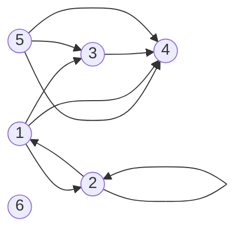
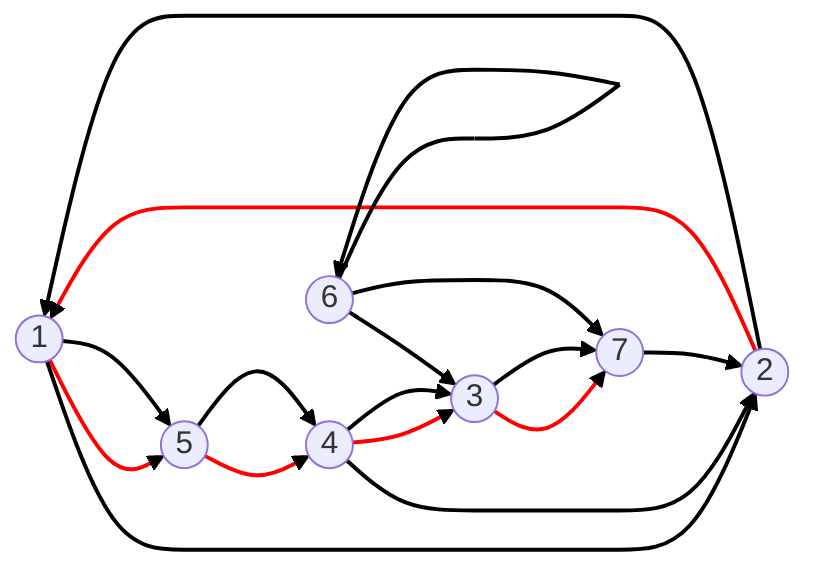

⇒ modélisation de problèmes à partir de graphes

> [!question] Problème des 7 ponts (1736, Euler)
> 
> 
> Le **problème des sept ponts de Königsberg** cherche à déterminer s'il existe un chemin permettant de revenir à son point de départ en empruntant une seule fois chaque pont de la ville ↪ *modélisation par un graphe*
> 
> 
> 
> C'est en fait **impossible** ⇒ à chacun des sommets il doit y avoir un **nombre pair** d'arrêtes

**Utilité des graphes** :
- création de réseaux (informatiques, eau...)
- trouver des chemins
- structures de données en informatique
- fonctionnement d'une cellule

# Graphes orientés

> [!info] Graphe orienté
> Un graphe orienté est une paire $(S,A)$ composée d'un ensemble de **sommets** $S$ et d'une **famille d'arcs** $A$
> 
> **L'ordre** du graphe est le nombre de sommets $[S]$
> 
> L'ensemble des prédecesseurs de $a$ est noté $\Gamma^{-}(a)$ et l'ensemble des successeurs est noté $\Gamma^{+}(a)$ donc l'ensemble des voisins est : $\Gamma(a)=\Gamma^{+}(a)\cup\Gamma^{-}(a)$


> [!faq] Famille
> Ensemble dans lequel un élément peut apparaître plusieurs fois


> [!example] Exemple
> $G_{1}=(S_{1},A_{1})$ avec $S_{1}=\{1,2,3,4,5,6\}$ et $A_{1}=\{(1,2),(5,4),(1,4),(1,3),(2,1),(2,2),(3,4),(5,3),(5,4)\}$
> 
> ```mermaid
>    graph LR;
>     1((1))-->2((2));
>     5((5))-->4((4));
>     1-->4;
>     1-->3((3));
> 	 2-->1;
> 	 2-->2;
> 	 3-->4;
> 	 5-->3;
> 	 5-->4;
> 	 6((6));
> ```
> 
> Pour le sommet $1$, l'ensemble des successeurs est : $\Gamma^{+}(1)= \{2,3,4\}$ et $\Gamma^{-}(1)=\{2\}$


> [!info] $p$-graphe
> Graphe dans lequel un arc ne peut pas apparaître plus de $p$ fois


# Graphes non orientés

> [!info] Définiton
> Graphe tel que $G_{1}=(S_{1},A_{1})$ où $S$ sont les sommets et $A$ les **arrêtes** ⇒ une arrête ne peut apparaître **qu'une seule fois** ($\neq$ aux arc dans les graphes orientés)
> 
> L'ensemble des **voisins** de $a$ est noté $\Gamma(a)$


> [!example] Exemple
> $S_{1}=\{1,2,3,4,5\}$ et $A_{1}=\{(1,2),(3,2),(1,4),(4,5)\}$
> 
> L'arrête $(1,2)$ est la même que l'arrête $(2,1)$. Cette arrête est **incidente** au sommet $1$ et $2$.
> 
> $\Gamma(1)=\{2,4\}$
> 
> ```mermaid
>    graph LR;
>     1((1))---2((2));
>     3((3))---2;
>     1---4((4));
>     4---5((5));
> ```

# Degrés
## Graphe orienté

Le **demi-degré entrant** d'un sommet $a$ est le nombre d'arcs de la forme $(.,a)$ *(combien d'arrêtes arrivent à a)* ⇒ noté $d^{-}(a)$

Le **demi-degré sortant** d'un sommet $a$ est le nombre d'arcs de la forme $(a,.)$ *(combien d'arrêtes partent de a)* ⇒ noté $d^{+}(a)$

Le **degré** de $a$ est $d=d^{-}(a)+d^{+}(a)$

> [!caution] Cas d'une boucle
> Une boucle compte dans les deux catégories ⇒ demi-degré **entrant et sortant** (donc compte "double")

Un sommet $a$ est :
- **isolé** si $d(a) = 0$ ⇒ rien n'arrive ou ne part de $a$ *(sommet 6)*
- **un puits** si $d^{+}(a)=0$ ⇒ rien n'arrive à $a$  *(sommet 4 et 6)*
- **une source** si $d^{-}(a)=0$ ⇒ rien ne part de $a$  *(sommet 5 et 6)*



## Graphe non orienté

Le **degré** d'un sommet $a$ est le nombre d'arrêtes contenant $a$.

De même, si $d(a)=0$ alors $a$ est un sommet **isolé**.

# Chemins, circuits et cycles



- $(2,1)(1,5)(5,4)(4,3)(3,7)$ ⇒ chemin **simple et non fermé** : <mark style="background: #FF5582A6;">toutes les arrêtes apparaissent une seule fois</mark>
- $(1,2)(2,1)(1,2)$ ⇒ chemin **non simple et non fermé**
- $(1,2)(2,1)(1,2)(2,1)$ ⇒ chemin **non simple et non fermé**

**Circuit** = chemin simple fermé


> [!info] Hamiltonien ou eulérien
> - **Hamiltonien :** passe exactement une fois par chaque sommet du graphe
> - **Eulérien :** passe exactement une fois par chaque arrête ou arc du graphe
> 
> le problème EULÉRIEN de savoir si un graphe est eulérien est dans la [classe P](https://www.wikiwand.com/fr/Classe_de_complexit%C3%A9 "Classe de complexité"). Le problème HAMILTONIEN est a priori plus compliqué à résoudre algorithmiquement : c'est un problème [NP-complet](https://www.wikiwand.com/fr/NP-complet "NP-complet"), avec des applications importantes.


# Graphes partiels, sous-graphes, sous-graphes partiels

|  | Sous-graphe | Graphe partiel | Sous-graphe partiel |
| ---- | ---- | ---- | ---- |
| *Sommets* | **Suppression** | Conservés | **Suppression** |
| *Arrêtes/arcs* | **Suppressions de ceux incidents des sommets** | **Suppression** de certains | **Suppression** des incidents + des autres |

# Isomorphisme des graphes

⇒ veut dire que 2 graphes ont la même forme

En suivant la définition d'un graphe, ils peuvent être différents mais en fait ils ont la même forme.

> [!example]
> $G_{1}=\{\{1,2,3\},(1,2)(2,3)\}$ et $G_{2}=\{\{a,b,c\},(b,c)(c,a)\}$
> ```mermaid
> graph LR
> 1((1))
> 2((2))
> 3((3))
> a((a))
> b((b))
> c((c))
> 1-->2
> 2-->3
> b-->c
> c-->a
> ```
> 
> On voit que si l'on renomme les sommets, les graphes sont égaux

Une manière de définir l'isomorphisme est de définir une fonction de "renommage" des sommets ⇒ c'est une **bijection**

> [!info] Définition : isomorphisme
> $G_{1}=(S_{1},A_{1})$ et $G_{2}=(S_{2},A_{2})$ sont isomorphes s'il existe une bijection $f$ de $S_{1}\rightarrow S_{2}$ telle que :
> $$(x,y)\in A_{1}\iff (f(x),f(y))\in A_{2}$$


