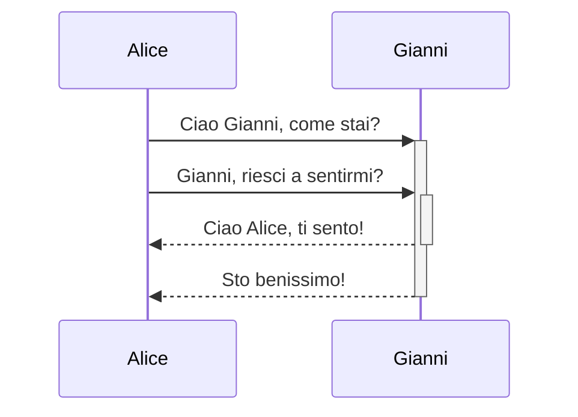

back::[[Cheat Sheet]]
# [[Learning Obsidian]] 🦑
```md
*Questo testo sarà in corsivo*
_Anche questo testo sarà in corsivo_
```

*Questo testo sarà in corsivo*
_Anche questo testo sarà in corsivo_

```md
**Questo testo sarà in grassetto**
__Anche questo testo sarà in grassetto__
```

**Questo testo sarà in grassetto**
__Anche questo testo sarà in grassetto__

```md
_Si possono **combinare** insieme_
```

_Si possono **combinare** insieme_

---

### Elenchi

```md
- Elemento 1
- Elemento 2
  - Elemento 2a
  - Elemento 2b

1. Elemento 1
1. Elemento 2
1. Elemento 3
   1. Elemento 3a
   1. Elemento 3b
```

- Elemento 1
- Elemento 2
  - Elemento 2a
  - Elemento 2b

1. Elemento 1
1. Elemento 2
1. Elemento 3
   1. Elemento 3a
   1. Elemento 3b

--- 

### Immagini

```md

```


#### Ridimensionamento immagini

La stessa immagine di sopra ridimensionata a 100 pixel di larghezza:

```md

```


---

### Collegamenti

```md
http://obsidian.md - automatico!
[Obsidian](http://obsidian.md)
```

#### Video
```html
<iframe src="INSERT YOUR URL HERE"></iframe>
```
http://obsidian.md - automatico!
[Obsidian](http://obsidian.md)

I collegamenti Markdown possono essere utilizzati per puntare a oggetti esterni, come pagine web, oppure per riferirsi a pagine interne o immagini. Se ci sono spazi nell'indirizzo, si può usare una sequenza di escape come `%20` al posto dello spazio, per esempio come in [Opzioni di esportazione](Pasted%20Image.png), o racchiudendo il testo in `<>`, come [Dimostrazione Diapositive](<Dimostrazione Diapositive>).

---

### Blocchi di citazioni

```md
> Gli esseri umani affrontano problemi sempre più complessi e urgenti e la loro efficacia nell'affrontare questi problemi è una questione fondamentale per la stabilità e il progresso continuo della società.

\- Doug Engelbart, 1961
```

> Gli esseri umani affrontano problemi sempre più complessi e urgenti e la loro efficacia nell'affrontare questi problemi è una questione fondamentale per la stabilità e il progresso continuo della società.

\- Doug Engelbart, 1961

---

### Codice in linea

```md
Il testo racchiuso tra `backtick` (accenti gravi) viene formattato come codice.
```

Il testo racchiuso tra `backtick` (accenti gravi) viene formattato come codice. 


---

### Blocchi di codice

L'evidenziazione della sintassi è supportata per il linguaggio specificato subito dopo la prima serie di backtick. Per evidenziare la sintassi viene utilizzato Prismjs. Un elenco dei linguaggi supportati è disponibile [sul loro sito web](https://prismjs.com/[[supported-languages]]).

```js
function fancyAlert(arg) {
  if(arg) {
    $.facebox({div:'[[foo]]'})
  }
}
```

```js
function fancyAlert(arg) {
  if(arg) {
    $.facebox({div:'[[foo]]'})
  }
}
```
    
	
```md
    Il testo indentato usando la tabulazione (o quattro spazi) viene formattato in questo modo, e verrà mostrato come un blocco di codice nell'anteprima.
```

    Il testo indentato usando la tabulazione (o quattro spazi) viene formattato in questo modo, e verrà mostrato come un blocco di codice nell'anteprima.
    
---

### Elenco delle attività

```md
- [x] supporta [[tag]], [collegamenti](), e **formattazione**
- [x] necessita della sintassi degli elenchi (supporta elenchi puntati e numerati)
- [x] questa attività è stata completata
- [ ] questa attività non è stata completata
- [ ] in modalità Anteprima è possibile spuntare le voci con il mouse
```

- [x] supporta [[tag]], [collegamenti](), e **formattazione**
- [x] necessita della sintassi degli elenchi (supporta elenchi puntati e numerati)
- [x] questa attività è stata completata
- [ ] questa attività non è stata completata
- [ ] in modalità Anteprima è possibile spuntare le voci con il mouse

---

### Tabelle

Le tabelle possono essere create assemblando una lista di parole e dividendole con i trattini `-` (per la prima linea); poi, separando ogni colonna con una barra verticale `|`:

```md
Primo titolo | Secondo titolo
------------ | ------------
Contenuto della cella 1 | Contenuto della cella 2
Contenuto nella prima colonna | Contenuto nella seconda colonna
```

Primo titolo | Secondo titolo
------------ | ------------
Contenuto della cella 1 | Contenuto della cella 2
Contenuto nella prima colonna | Contenuto nella seconda colonna

---

```md
Le tabelle si giustificano con i due punti | Altro esempio con titolo lungo
:----------------|-------------:
a causa dei `:` | queste saranno giustificate

I collegamenti possono essere inseriti nelle tabelle, ma se si utilizzano collegamenti con barre verticali, queste devono essere accompagnate da un carattere di escape per evitare che vengano lette come elementi della tabella.
```

Le tabelle si giustificano con i due punti | Altro esempio con titolo lungo
:----------------|-------------:
a causa dei `:` | queste saranno giustificate

I collegamenti possono essere inseriti nelle tabelle, ma se si utilizzano collegamenti con le barre verticali, queste devono essere precedute da un carattere di escape per evitare che vengano lette come elementi della tabella.

```md
Primo titolo | Secondo titolo
------------ | ------------
[[Formatta le tue note\|Formatta]]	|  [[Tasti rapidi\|scorciatoie]]
```

Primo titolo | Secondo titolo
------------ | ------------
[[Formatta le tue note\|Formatta]]	|  [[Tasti rapidi\|scorciatoie]]

---

### Testo barrato

```md
Ogni parola che viene racchiusa tra due tilde (come ~~questa~~) apparirà barrata.
```

Ogni parola che viene racchiusa tra due tilde (come ~~questa~~) apparirà barrata.

---

### Testo evidenziato

```md
Racchiudere le parole tra due simboli di uguale ==per evidenziare il testo==.
```

Racchiudere le parole tra due simboli di uguale ==per evidenziare il testo==.

---

### Note a piè di pagina

```md
Questa è una nota a piè di pagina,[^1] questa è un'altra nota più lunga.[^bignote]

[^1]: davvero significativa!

[^bignote]: Eccone una con paragrafi multipli e un blocco di codice.

    Indenta i paragrafi per includerli nella nota a piè di pagina.

    `{ il mio codice }`

    Puoi aggiungere tutti i paragrafi che desideri.
```

Questa è una nota a piè di pagina,[^1] questa è un'altra nota più lunga.[^bignote]

[^1]: davvero significativa!

[^bignote]: Eccone una con paragrafi multipli e un blocco di codice.

    Indenta i paragrafi per includerli nella nota a piè di pagina.

    `{ il mio codice }`

    Puoi aggiungere tutti i paragrafi che desideri.
	
```md
È possibile utilizzare le note a piè di pagina anche in linea. ^[in questo caso il circonflesso è posto al di fuori delle parentesi quadre.]
```

È possibile utilizzare le note a piè di pagina anche in linea. ^[in questo caso il circonflesso è posto al di fuori delle parentesi quadre.]

### Matematica

```md
$$\begin{vmatrix}a & b\\
c & d
\end{vmatrix}=ad-bc$$
```

$$\begin{vmatrix}a & b\\
c & d
\end{vmatrix}=ad-bc$$

È anche possibile inserire espressioni matematiche in linea come $e^{2i\pi} = 1$ .

### Diagrammi

Obsidian usa [Mermaid](https://mermaid-js.github.io/) per gestire diagrammi e grafici. Mermaid ha [un utile editor live](https://mermaid-js.github.io/mermaid-live-editor).

<pre><code>```mermaid
sequenceDiagram
    Alice->>+Gianni: Ciao Gianni, come stai?
    Alice->>+Gianni: Gianni, riesci a sentirmi?
    Gianni-->>-Alice: Ciao Alice, ti sento!
    Gianni-->>-Alice: Sto benissimo!
```</code></pre>




## Note degli sviluppatori

CI sforziamo di fornire il massimo delle funzionalità senza interrompere la compatibilità di alcun formato esistente, per questo utilizziamo una combinazione un poco meno ortodossa di sintassi Markdown. Per la maggior parte si tratta di CommonMark, con l'aggiunta di alcune funzionalità da GitHub Flavored Markdown (GFM), il supporto a LaTeX e una sintassi d'incorporamento personalizzata. Ulteriori informazioni su [[Formati di file accettati]].