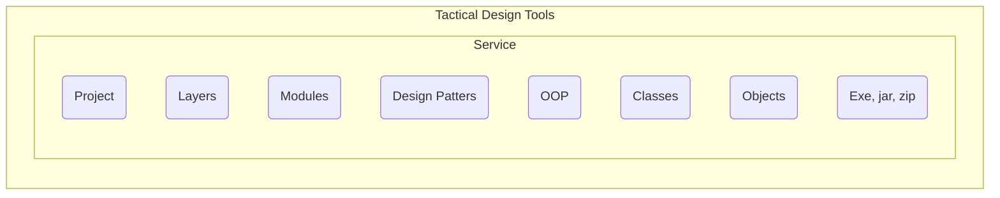
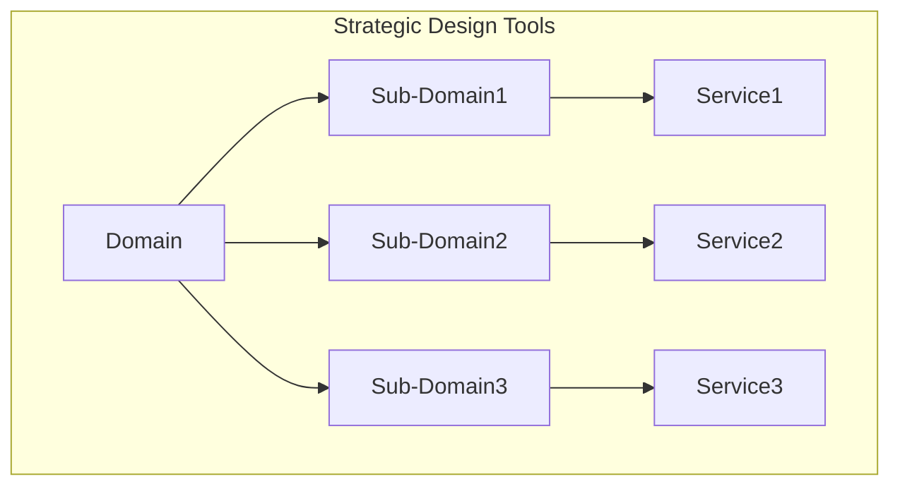

#review 
# Domain Driven Design

>A method of designing software by designing models of the domain and creating software which conforms to those models

Ubiquitous language -> The language a team agrees on to describe ideas in the problem domain
- This laguage becomes more and more refined as it is used
- This reduces misunderstandings

Diagram:

