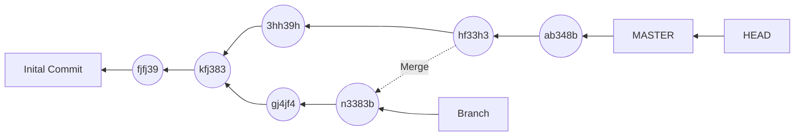
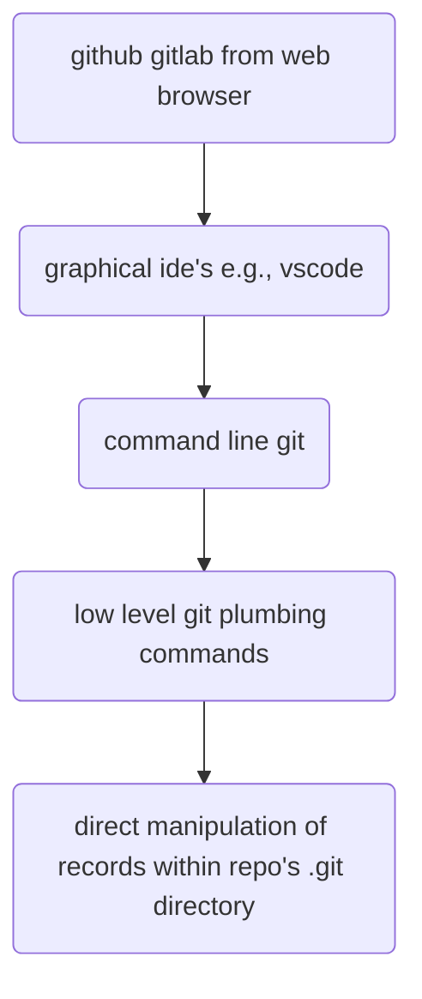

tags: #review

---
# Git
Git is a tool to track changes to sets of files
It is the most used [[Version Control Systems|VCS]

## Team git protocols
you can develop a team protocol for Git use

e.g.,
- agree to commit often
- know what branches are being used and why
- consider pair programming / live sharing
- try not to touch lots of files without signalling why
- agree who's going to edit files that maight not auto merge

## web based repo access control
owner of repo chooses who can push to project
- maintainer -> cant remove data
- developer -> cant manage team
- reporter -> cant change codebase
- guest -> can view

### open source collaboration
you want contributions from everyone
but you dont want to manage user-level control

-> pull/merge requests
unknown users can fork then add a feature/bug then do a merge request which can be reviewed

## git repos
[Repositories](content/notes/git-cheat-sheet.md#^3b3a5d) maintain code history
can be conceptualised as a graph

```mermaid
	gitGraph:
	checkout master
	commit
	commit
	branch newbranch
	checkout newbranch
	commit
	commit
	checkout master
	commit
	merge newbranch
	commit
	commit
```


- nodes are commits -> immutable snapshots of the tracked files
- edges record how nodes emerged over time
	- arrows can be read as "is derived from"

git is a [Decentralised and Centralised VCS](content/notes/version-control-systems.md#^98d838)
- every team members has their own local copy of the repo
- git repos are often syned with a server: github, gitlab,etc

## levels of complexity/Abstraction


## Limitations/pain points
not designed for broad usability
- bottom up design stems from its implementaion,
- rather than top down design from user interface
- thus, command naming and syntax can be unintuitive

git is not suited to handling large data files
- git scans whole files to generate hash codes
- can use git lfs (large file support) to get around this

flexibility of git can lead to high cognitive load
- e.g., many ways to get others' commits to your repo

binary files e.g., JPEG images are treated as whole
- no differencing, no content merging

some text files may not have stable line structure
- e.g., XML data can be reordered wihout changing so:
	- git can auto merge when this is destructive
	- git may get confused and force you to merge
- e.g., node package-lock.json
- you can turn of auto-merge if you are working with files that may be problematic

## advantages
git repos' data structures are well designed
- clear in structure yet flexible and efficient

few dependencies
- widely available
- free and open source

community support around use of git is great
- eforts to get researches to use version control;
- github helped open source software flourish by making it easy for citizens to contribute to projects


