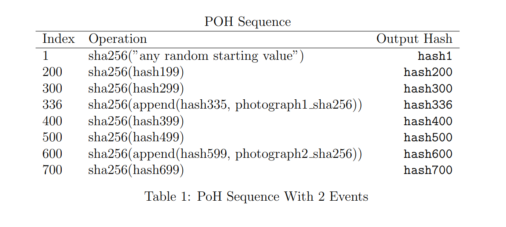

## Intro
Solana is a blockchain network that differentiates itself by making the bet that hardware will scale with demand. The result of this is very high hardware requirements if you want to participate, but (if the bet pays off) cheap and fast transactions for end users. 

## Hardware requirements
They are high, and they will continue to be high. Check them out on [3] below. It is recommended to have a 10Gbps networking connection which alone removes the vast majority of people able to participate, especially as the remaining requirements make cloud computing a non-cost efficient option (as per noted also in [3]). 

## Networking

## Consensus

### Proof of History
The tl;dr of this is that a chain of hashes is done. When something of note happens (a txn, for instance), a hash of that something is combined with the previous hash output so it can be replicated. This gives a verifiable chain of events and a guarantee that time has passed as it's a sequential process that takes verifiable time. 

This process can be done in parallel (separate computing threads) and then mixed such that individual threads can stamp the output of other threads in a way that ties them together in a deterministic way. I expect this is the core of the "hardware can scale the demand" claim. 

> [!QUESTION] I see this as similar to what Kadena did with PoW chains. I'd be curious if the Solana implementation took note from the graph theory optimizations that Kadena did with their PoW chain implementation

### Proof of Stake protocol
A given slot leader (TBD later) does the PoH process and then publishees it to be validated by others in the network. 

> [!QUESTION] Funny enough, the whitepaper says the following:
>
> > This would put the economic cost of an attack at $\frac{1}{3}$rd of the market cap of the coin
>
>I'm quite sure they mean the staked amount of coin across all validators, not the market cap, as unstaked SOL has no bearing on the consensus process (AFAIK).

Finality section of the whitepaper (5.12) says max finality is 500 ms but shorter with "network conditions" but it isn't clear exactly on what that means. I'd like to know how many votes to a given leader proposal are appropriate for considering something final. 

Ostsensibly, a verifier is required to recompute the hash-chain and additions of PoH to confirm that the final hash is the same, but this, by design, takes time. I don't understand how a deluge of txns get verified in a small amount of time. 

### Proof of Replication protocol

## Data Structure
One of the key differentiators of Solana is that it does not merkelize the data like most chains. 

## Application

## Useful links
- [1]: [Technical Whitepaper](https://solana.com/solana-whitepaper.pdf)
- [2]: [Solana Official Website](https://solana.com/)
- [3]: [Validator Resource Requirements](https://docs.solana.com/running-validator/validator-reqs)
