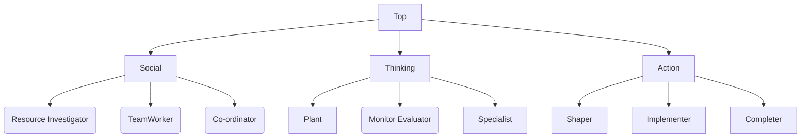

tags: #review

---
# Teamwork
- Good teamwork -> achieve more
- Separation of concerns of expertise e.g., font end / back end
- Solo devs do exist -> indie games / microcontroller swd / due to cost issues

#### Building teams
- consider strengths of team members
	- areas of specialisation
	- ways in which members complement each other
- This should be discussed to avoid misunderstandings due to incorrect assmptions
- Communication is key
	- team arrangements may need adjustment
	- changes should be made by a consensu

#### Belbin's nine team roles
- most pople have characteristics of multiple roles
- methodologies exist to determine your role affinities

- social
	- resource investigator
		- discovers new ideas; keen; optimistic
		- may rapidly lose interest; too optimistic
	- teamworker
		- values team; helps remove friction
		- conflict avoidant; prefers not making decisions
	- co-ordinator
		- keeps goals clear; can manage team
		- may appear to delegate rather than doing work
- thinking
	- Plant
		- thinks outside the box; tackles hard problems
		- may lack grounding (only thinks outside the box)
	- Monitor evaluator
		- good judge of best alternatives
		- may be too critiical of possible plans
	- specialist
		- detailed knowledge in one area
		- only focused on one area
- action/task
	- Shaper
		- good at working
		- may not be considerate of team members
	- Implementer
		- can turn planning into efficient action
		- may be rigid in terms of approach to action
	- Completer finisher
		- completes tasks; provides quality control
		- worries about quality; doesn't delegate work

#### Conflict resolution
- There will be conflicts
	- voice concerns early
	- agree on a resolution
- Be self aware

#### Diversity
- studies show that more diverse teams are better
- there is a lack  of diversity in cs