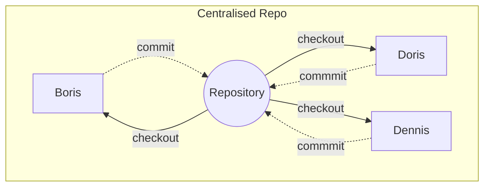

# version-control-system

VCSs (version control systems) Are systems to keep track of changes to a set of files
E.g., [[git]]

## 1 Goals
- allow collaboration
- track changes
- restoring previous versions
- finding out origins of issues
- backups
- not restrict workflow

## 2 Terms
[[notes/git-cheat-sheet]]

## 3 Discipline
- Pull/Push Regularly
- Use topic/features branches to keep main clean
- Dont use -f

## 4 Types
### 4.1 Centralised VCS
- Data is stored in one single central location
- Access is remote
- Checkout can block other devs

### 4.2 Distributed VCS

- Data is stored on every access point
- Good
	- more robust -> each dev has a backup
	- Don't need internet
- Bad
	- Hard to keep track of "main" files

### 4.3 Distributed + Centralised
- Main files are stored on central repo
- Each user also has their own copy locally

## 5 Sensitive information
- Passwords and other credentials among other things
- Data should be stored as encrypted blobs
	- [BlackBox](https://github.com/StackExchange/blackbox)

## 6 Forking
- Cloning into a new remote repo in your account
- Allows community to contribute to projects without giving them write access to the original repo
- Process
	- Create a fork of a project
	- Make Changes
	- Pull request to merge fork back into project
	- Admins of project can acccept modify or reject pull request
	
## 7 software dev needs file wrangling
many copies of a project's source code files needed:

- facilitating different developers private code experiments
- working on fixing bugs in code
- developing new features
- reviewing code changes
- managing releases of sofware products
	- using [[git]]
