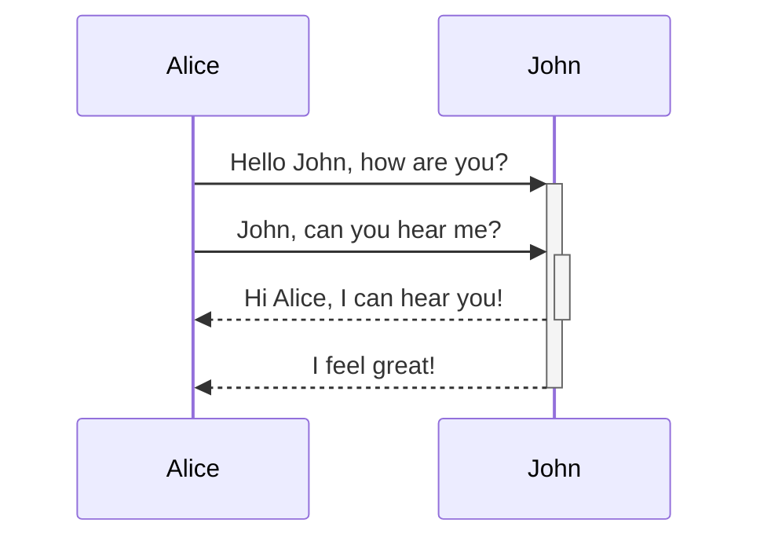

Want to see what Quartz can do? Here are some cool community gardens :)

- [Quartz Documentation (this site!)](https://quartz.jzhao.xyz/)
- [Jacky Zhao's Garden](https://jzhao.xyz/)
- [Brandon Boswell's Garden](https://brandonkboswell.com)
- [Scaling Synthesis - A hypertext research notebook](https://scalingsynthesis.com/)
- [AWAGMI Intern Notes](https://notes.awagmi.xyz/)
- [Course notes for Information Technology Advanced Theory](https://a2itnotes.github.io/quartz/)
- [Data Dictionary 🧠](https://glossary.airbyte.com/)
- [sspaeti.com's Second Brain](https://brain.sspaeti.com/)
- [oldwinterの数字花园](https://garden.oldwinter.top/)
- [Abhijeet's Math Wiki](https://abhmul.github.io/quartz/Math-Wiki/)
- [Mike's AI Garden 🤖🪴](https://mwalton.me/)

If you want to see your own on here, submit a [Pull Request adding yourself to this file](https://github.com/jackyzha0/quartz/blob/v4-alpha/content/showcase.md)!

Left-aligned text | Center-aligned text | Right-aligned text
:-- | :--: | --:
Content | Content | Content

