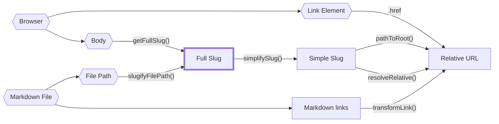

路径很难推理，因为特别是对于静态站点生成器来说，它们可能来自很多地方。

一段内容的完整文件路径？也是一条路径。用slug代表一段内容怎么样？还有另一条路。

把这些都键入`string` 并称之为一天是愚蠢的，因为不小心把一种类型的路径误认为另一种类型是很常见的。不幸的是，TypeScript对于类型别名没有[nominal types](https://en.wikipedia.org/wiki/Nominal_type_system) ，这意味着即使您自定义了服务器端slug或客户端slug的类型，您仍然可以意外地将其中一个分配给另一个，而TypeScript不会捕捉到它。

幸运的是，我们可以使用[brands](https://www.typescriptlang.org/play#example/nominal-typing)模拟 `nominal typing `。

```typescript
// instead of
type FullSlug = string

// we do
type FullSlug = string & { __brand: "full" }

// that way, the following will fail typechecking
const slug: FullSlug = "some random string"
```

虽然这可以防止在我们的`nominal typing`系统中出现大多数输入错误（例如，将服务器slug误认为客户端slug），但这并不能防止我们在强制转换字符串时将字符串误认为客户端的slug。

因此，当从在“entrypoints”中将字符串转换为这些`nominal types`之一时，我们仍然需要小心，如下图中的六边形所示。

下图绘制了所有路径源、`nominal path types`之间的关系，以及`quartz/path.ts` 中它们之间转换的函数。



以下是slugs的主要类型，并对每种类型的路径进行了粗略描述：

- `FilePath`: 磁盘上文件的真实文件路径。不能是相对的，并且必须具有文件扩展名。
- `FullSlug`: 不能是相对的，并且不能有前导斜杠或尾随斜杠。它可以有`index`作为它的最后一个段。尽可能使用这个，因为这是对slug最“一般”的解释。
- `SimpleSlug`：不能是相对的，并且不应将`/index` 作为结尾或文件扩展名。但是，它可以有一个尾部斜线来指示文件夹路径。
- `RelativeURL`: 必须以`.`开头或表示它是一个相对URL。不应该以`/index`作为结尾或文件扩展名，但可以包含尾部斜杠。

为了更清楚地了解它们之间的关系，请查看`quartz/path.test.ts`中的路径测试。
