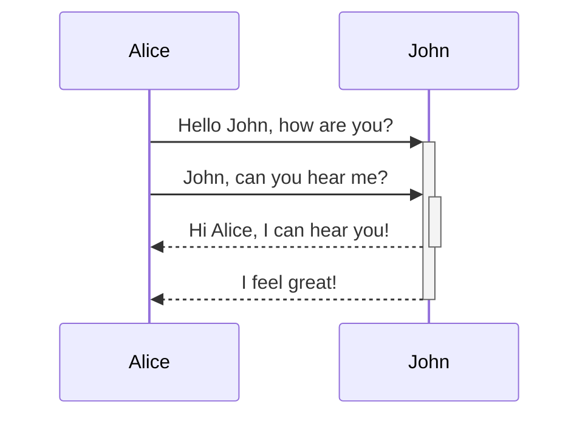

Quartz支持Mermaid，它允许您在笔记中添加图表。Mermaid支持一系列图表，如[流程图](https://mermaid.js.org/syntax/flowchart.html)，[序列图](https://mermaid.js.org/syntax/sequenceDiagram.html)，和[时间表](https://mermaid.js.org/syntax/timeline.html). 这是作为[[Obsidian compatibility]]的一部分启用的，可以从该插件进行配置和启用/禁用。

默认情况下，Quartz将渲染图表以匹配网站主题。

> [!warning]
> 想知道为什么即使启用了Mermaid，它们也可能不会显示？您可能需要对插件进行重新排序，使[[ObsidianFlavoredMarkdown]]在[[SyntaxHighlighting]]之后。

## 语法

要添加Mermaid，请创建一个Mermaid代码块。

````

````


