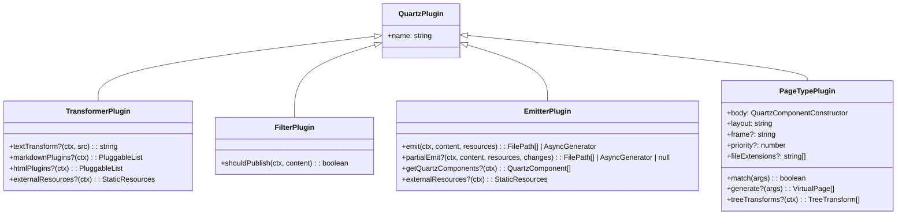

# Quartz Plugin Authoring Guide

> **Hard-science plugin development** — understanding the contract boundaries, lifecycle hooks, and data flow.

---

## 🎯 Plugin Taxonomy



---

## 🔧 Transformer Plugins

### The Three-Stage Pipeline

```typescript
// MyTransformer.ts
export const MyTransformer: QuartzTransformerPlugin = () => ({
  name: "MyTransformer",

  // Stage 1: Raw text → Raw text (BEFORE parsing)
  textTransform(ctx, src) {
    // Example: Inject frontmatter, rewrite links, preprocess
    return src.replace(
      /\[\[([^\]]+)\]\]/g,
      (_, target) => `[${target}](#${target.toLowerCase().replace(/\s+/g, "-")})`,
    )
  },

  // Stage 2: MdAST → MdAST (remark plugins)
  markdownPlugins(ctx) {
    return [
      () => (tree, file) => {
        // Visit all nodes, transform
        visit(tree, "heading", (node) => {
          node.data = { ...node.data, hProperties: { id: slugify(node) } }
        })
      },
    ]
  },

  // Stage 3: HAST → HAST (rehype plugins)
  htmlPlugins(ctx) {
    return [
      () => (tree, file) => {
        visit(tree, "element", (node) => {
          if (node.tagName === "a" && node.properties.href?.startsWith("#")) {
            node.properties.class = [...(node.properties.class || []), "internal-link"]
          }
        })
      },
    ]
  },

  // Optional: Declare CSS/JS this transformer needs
  externalResources(ctx) {
    return {
      css: [{ content: ".my-class { color: red }", inline: true }],
      js: [{ script: 'console.log("loaded")', contentType: "inline", loadTime: "afterDOMReady" }],
    }
  },
})
```

### Unified AST Visitor Pattern

```typescript
import { visit } from "unist-util-visit"

// MdAST node types (remark)
type MdNode =
  | { type: "root"; children: MdNode[] }
  | { type: "heading"; depth: number; children: MdNode[] }
  | { type: "paragraph"; children: MdNode[] }
  | { type: "text"; value: string }
  | { type: "link"; url: string; children: MdNode[] }
// ... 50+ types

// HAST node types (rehype)
type HastNode =
  | { type: "root"; children: HastNode[] }
  | { type: "element"; tagName: string; properties: Record<string, any>; children: HastNode[] }
  | { type: "text"; value: string }
```

---

## 🚫 Filter Plugins

### Boolean Gate Logic

```typescript
// MyFilter.ts
export const MyFilter: QuartzFilterPlugin = () => ({
  name: "MyFilter",

  shouldPublish(ctx, content) {
    const [, file] = content
    const fm = file.data.frontmatter

    // Hard exclude
    if (fm?.private === true) return false
    if (fm?.draft === true) return false

    // Conditional logic
    if (ctx.argv.serve && fm?.devOnly === true) return true

    return true
  },
})
```

**Execution context**: Runs AFTER all transformers, BEFORE any emitters.

---

## 📤 Emitter Plugins

### Full Emit vs Partial Emit

```typescript
// MyEmitter.ts
export const MyEmitter: QuartzEmitterPlugin = () => ({
  name: "MyEmitter",

  // FULL EMIT: Called on initial build + full rebuild
  async *emit(ctx, content, resources) {
    // content = ALL published ProcessedContent[]
    // resources = StaticResources (CSS, JS, additionalHead)

    // Example: Generate search index
    const index = content.map(([, file]) => ({
      slug: file.data.slug,
      title: file.data.frontmatter?.title,
      content: file.data.htmlAst ? hastToString(file.data.htmlAst) : "",
    }))

    yield write({
      ctx,
      slug: "static/search-index" as FullSlug,
      ext: ".json",
      content: JSON.stringify(index),
    })
  },

  // PARTIAL EMIT: Called on incremental rebuild
  // Receives ONLY change events — must handle add/change/delete
  async *partialEmit(ctx, content, resources, changeEvents) {
    // changeEvents = [{ type: 'add'|'change'|'delete', path, file? }]

    for (const change of changeEvents) {
      if (change.type === "delete") {
        // Remove from index
        yield write({ ctx, slug: "static/search-index", ext: ".json", content: updatedIndex })
      } else if (change.type === "add" || change.type === "change") {
        // Update index
        yield write({ ctx, slug: "static/search-index", ext: ".json", content: updatedIndex })
      }
    }
  },

  // Declare components this emitter uses (for CSS/JS bundling)
  getQuartzComponents(ctx) {
    return [MyComponent()]
  },
})
```

### Write Helper (`quartz/plugins/emitters/helpers.ts`)

```typescript
import { write } from "./emitters/helpers"

yield write({
  ctx,
  slug: "my-output" as FullSlug,
  ext: ".html",
  content: "<html>...</html>",
})

// Or binary
yield write({
  ctx,
  slug: "assets/image" as FullSlug,
  ext: ".png",
  content: Buffer.from(pngData),
})
```

---

## 🏷️ Page Type Plugins

### The Virtual Page Factory

```typescript
// MyPageType.ts
import { QuartzPageTypePlugin } from "../types"
import { QuartzComponent } from "../../components/types"

export const MyPageType: QuartzPageTypePlugin = () => ({
  name: "MyPageType",
  priority: 100,  // Higher = runs first
  layout: "myLayout",  // Matches layout key in quartz.config.yaml
  frame: "default",    // Or "full-width", "minimal"

  // Which files match this page type?
  match({ slug, fileData, cfg }) {
    return fileData.frontmatter?.type === 'my-special-type'
  },

  // Generate virtual pages (tag pages, folder pages, etc.)
  generate({ content, cfg, ctx }) {
    const pages: VirtualPage[] = []

    // Aggregate data from all content
    const tags = new Set<string>()
    for (const [, file] of content) {
      const fmTags = file.data.frontmatter?.tags
      if (Array.isArray(fmTags)) fmTags.forEach(t => tags.add(t))
    }

    for (const tag of tags) {
      pages.push({
        slug: `tags/${slugify(tag)}`,
        title: `Tag: ${tag}`,
        data: { tag, tagCount: countTag(content, tag) }
      })
    }

    return pages
  },

  // The Body component for this page type
  body: () => MyPageBodyComponent(),

  // Optional: Transform HAST at render time (after transclusion)
  treeTransforms(ctx) {
    return [
      (root, slug, componentData) => {
        // Modify the HTML tree per-page
        visit(root, 'element', (node) => {
          if (node.tagName === 'h1') {
            node.properties['data-page-type'] = 'my-page-type'
          }
        })
      }
    ]
  }
})

// Component for the page body
function MyPageBodyComponent(): QuartzComponent {
  return ({ ctx, fileData, children }) => (
    <div class="my-page-type">
      <h1>{fileData.frontmatter?.title}</h1>
      {children}
    </div>
  )
}
```

### Registering Layout Overrides

In `quartz.config.yaml`:

```yaml
layout:
  myLayout:
    left:
      - ComponentA
      - ComponentB
    right: []
    beforeBody: []
    afterBody: []
  byPageType:
    myLayout:
      exclude: ["ComponentB"]
      positions:
        left: []
      template: "full-width"
```

---

## 🧩 Component Plugins

### Component Definition

```typescript
// MyComponent.tsx
import { QuartzComponent, QuartzComponentConstructor, QuartzComponentProps } from "../../components/types"

export const MyComponent: QuartzComponentConstructor<{ title?: string }> = (opts) => {
  const Component: QuartzComponent = ({ ctx, fileData, cfg, children, ...props }) => {
    return (
      <div class="my-component" {...props}>
        <h2>{opts?.title ?? fileData.frontmatter?.title ?? "Default"}</h2>
        {children}
      </div>
    )
  }

  Component.displayName = "MyComponent"
  Component.css = `.my-component { border: 1px solid var(--border); padding: 1rem; }`
  Component.afterDOMLoaded = `
    console.log("MyComponent mounted")
    // DOM manipulation here
  `

  return Component
}
```

### Component Registration

```typescript
// In plugin index.ts or manifest
import { componentRegistry } from "../../components/registry"

componentRegistry.register("MyComponent", MyComponent, {
  defaultPosition: "left",
  defaultPriority: 50,
})
```

### Layout Integration

```yaml
# quartz.config.yaml
plugins:
  - source: ./my-plugin
    layout:
      myComponent:
        position: left
        priority: 10
        display: all # or mobile-only, desktop-only
```

---

## 📦 Plugin Manifest (`package.json`)

```json
{
  "name": "quartz-plugin-my-plugin",
  "version": "1.0.0",
  "quartz": {
    "name": "MyPlugin",
    "displayName": "My Awesome Plugin",
    "description": "Does amazing things",
    "category": ["transformer", "component"],
    "defaultOrder": 50,
    "defaultEnabled": true,
    "defaultOptions": {
      "option1": "default"
    },
    "configSchema": {
      "type": "object",
      "properties": {
        "option1": { "type": "string" }
      }
    },
    "components": {
      "MyComponent": { "defaultPosition": "left", "defaultPriority": 50 }
    },
    "frames": {
      "my-frame": { "description": "Custom frame" }
    }
  }
}
```

---

## 🔄 Lifecycle Summary

| Phase              | Transformers                        | Filters         | Emitters                  | PageTypes            |
| ------------------ | ----------------------------------- | --------------- | ------------------------- | -------------------- |
| **Config Load**    | `externalResources()`               | —               | `getQuartzComponents()`   | —                    |
| **Parse**          | `textTransform` → `markdownPlugins` | —               | —                         | —                    |
| **HTML Transform** | `htmlPlugins`                       | —               | —                         | —                    |
| **Filter**         | —                                   | `shouldPublish` | —                         | —                    |
| **Emit Phase 0**   | —                                   | —               | `ComponentResources.emit` | —                    |
| **Emit Phase 1**   | —                                   | —               | `PageTypeDispatcher.emit` | `match` → `generate` |
| **Emit Phase 2**   | —                                   | —               | Other `emit`              | `treeTransforms`     |
| **Incremental**    | Re-parse changed                    | Re-filter       | `partialEmit`             | Regenerate affected  |

---

## 🧪 Testing Plugins

```typescript
// MyTransformer.test.ts
import { parseMarkdown } from "../../processors/parse"
import { BuildCtx } from "../../util/ctx"
import { MyTransformer } from "./MyTransformer"

const ctx = createTestCtx({ plugins: { transformers: [MyTransformer()] } })
const result = await parseMarkdown(ctx, ["test.md"])
// Assert on result[0][0] (HtmlRoot) and result[0][1] (VFile)
```

---

## 📐 Best Practices

1. **Single responsibility**: One plugin = one concern
2. **Pure functions**: `textTransform`, `shouldPublish`, `match` should be deterministic
3. **Minimal context**: Only read what you need from `ctx`
4. **Async generators**: Use `async *emit` for streaming large outputs
5. **Content hashing**: Let `ComponentResources` handle CSS/JS — don't write your own
6. **Transclusion safety**: Use `treeTransforms` for post-transclusion modifications
7. **Type safety**: Export types from `quartz/plugins/types`

---

_See [[architecture/quartz-architecture-deep-dive]] for full pipeline context_
