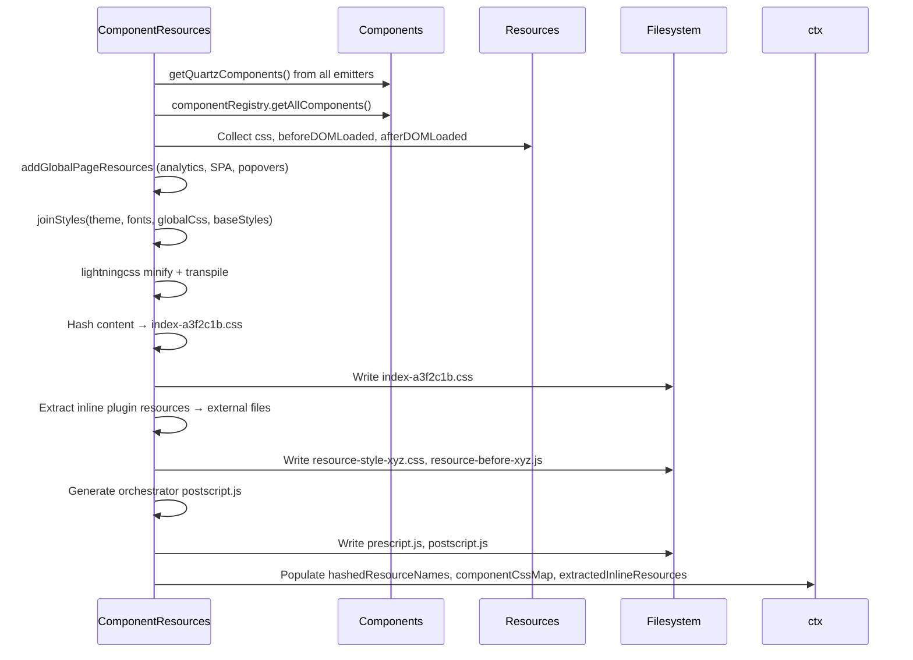
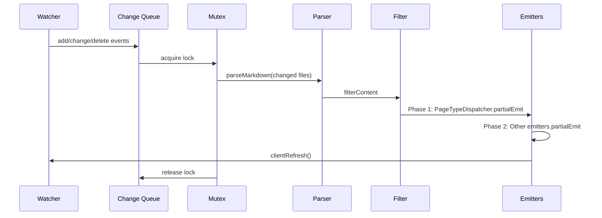

# Quartz Architecture: Layer-by-Layer Deep Dive

> **A hard-science, systems-level decomposition of the Quartz v5 static site generator**
>
> This document follows a **trickling data** model: each layer consumes the output of the layer below, transforms it, and passes enriched data upward. Think of it as a **compiler pipeline** where markdown files are the source code and HTML files are the executable binary.

---

## ⚡ Executive Summary: The Data Flow Graph

```mermaid
flowchart TD
    subgraph L0["Layer 0: Input & Configuration"]
        A[quartz.config.yaml] --> B[Plugin Discovery & Loading]
        B --> C[BuildCtx Initialization]
    end

    subgraph L1["Layer 1: File Discovery & Ingestion"]
        C --> D[Glob Filesystem]
        D --> E[Worker Pool Spawn]
        E --> F[Text → Markdown AST]
    end

    subgraph L2["Layer 2: Transformation Pipeline"]
        F --> G[Text Transforms]
        G --> H[Markdown Plugins]
        H --> I[MD AST → HTML AST]
        I --> J[HTML Plugins]
    end

    subgraph L3["Layer 3: Filtering & Selection"]
        J --> K[Filter Pipeline]
        K --> L[Published Content Set]
    end

    subgraph L4["Layer 4: Resource Compilation"]
        L --> M[ComponentResources Emitter]
        M --> N[CSS/JS Bundling & Hashing]
        N --> O[Static Asset Copy]
    end

    subgraph L5["Layer 5: Page Dispatch & Virtual Pages"]
        L --> P[PageTypeDispatcher]
        P --> Q[Page Matching]
        Q --> R[Virtual Page Generation]
        R --> S[Layout Resolution]
    end

    subgraph L6["Layer 6: Rendering & Emission"]
        S --> T[Transclusion Resolution]
        T --> U[Tree Transforms]
        U --> V[Frame Composition]
        V --> W[HTML String Generation]
        W --> X[File Write]
    end

    subgraph L7["Layer 7: Incremental Rebuild Loop"]
        X --> Y[Chokidar Watcher]
        Y --> Z[Change Event Queue]
        Z --> P
    end

    style L0 fill:#1a1a2e,stroke:#e94560
    style L1 fill:#16213e,stroke:#0f3460
    style L2 fill:#0f3460,stroke:#e94560
    style L3 fill:#16213e,stroke:#0f3460
    style L4 fill:#1a1a2e,stroke:#e94560
    style L5 fill:#0f3460,stroke:#0f3460
    style L6 fill:#16213e,stroke:#e94560
    style L7 fill:#1a1a2e,stroke:#0f3460
```



---

## 📐 Layer 0: Configuration & Plugin Topology

### 0.1 Configuration Schema (`quartz/cfg.ts`)

```typescript
// The single source of truth for global configuration
interface GlobalConfiguration {
  pageTitle: string // Site title
  pageTitleSuffix?: string // Appended to every <title>
  enableSPA: boolean // Single-page app navigation
  enablePopovers: boolean // Wikipedia-style link previews
  analytics: Analytics | null // Plausible, Google, Umami, etc.
  ignorePatterns: string[] // Glob patterns to exclude
  baseUrl?: string // Absolute URL for sitemaps/RSS
  theme: Theme // Typography, colors, fonts
  locale: ValidLocale // BCP 47 language tag (en-US)
}

interface QuartzConfig {
  configuration: GlobalConfiguration
  plugins: PluginTypes // { transformers, filters, emitters, pageTypes }
  externalPlugins?: PluginSpecifier[]
}
```

### 0.2 Plugin Manifest & Dependency Graph (`quartz/plugins/loader/config-loader.ts`)

Quartz builds a **directed acyclic graph (DAG)** of plugins from `quartz.config.yaml`:

```mermaid
graph TD
    subgraph Config["quartz.config.yaml"]
        P1[Plugin A: order 10]
        P2[Plugin B: order 20]
        P3[Plugin C: order 30]
    end

    subgraph Resolution["Dependency Resolution"]
        P1 -->|depends on| P2
        P2 -->|depends on| P3
    end

    subgraph TopoSort["Topological Sort by `order`"]
        T1[Plugin C] --> T2[Plugin B] --> T3[Plugin A]
    end

    style P1 fill:#1a1a2e,stroke:#e94560
    style P2 fill:#16213e,stroke:#0f3460
    style P3 fill:#0f3460,stroke:#e94560
```



**Validation Rules:**

- **Cycle detection**: DFS with recursion stack tracking
- **Order enforcement**: `pluginOrder < depOrder` → error
- **Enabled dependency**: warn if dependency is disabled

### 0.3 Plugin Categories & Interfaces (`quartz/plugins/types.ts`)

| Category        | Interface                                               | Purpose                   | Execution Order          |
| --------------- | ------------------------------------------------------- | ------------------------- | ------------------------ |
| **Transformer** | `textTransform`, `markdownPlugins`, `htmlPlugins`       | AST mutation pipeline     | By `order` ascending     |
| **Filter**      | `shouldPublish(ctx, content)`                           | Inclusion/exclusion logic | By `order` ascending     |
| **Emitter**     | `emit`, `partialEmit`, `getQuartzComponents`            | Output generation         | Phased (see Layer 4)     |
| **PageType**    | `match`, `generate`, `body`, `layout`, `treeTransforms` | Virtual page creation     | By `priority` descending |

---

## 📂 Layer 1: File Discovery & Ingestion

### 1.1 Filesystem Scanning (`quartz/build.ts:82-87`)

```typescript
const allFiles = await glob("**/*.*", argv.directory, cfg.configuration.ignorePatterns)
const markdownPaths = allFiles.filter((fp) => fp.endsWith(".md")).sort()
```

- **Concurrency heuristic**: `clamp(files / 128, 1, 4)` threads
- **Worker pool**: `workerpool` with `thread` type for true parallelism
- **Chunking**: 128 files per worker batch (V8 JIT optimization threshold)

### 1.2 Worker Serialization (`quartz/processors/parse.ts:174-181`)

```typescript
const serializableCtx: WorkerSerializableBuildCtx = {
  buildId: ctx.buildId,
  argv: ctx.argv,
  allSlugs: ctx.allSlugs,
  allFiles: ctx.allFiles,
  incremental: ctx.incremental,
  virtualPages: [], // Workers don't need virtual pages
}
```

**Key insight**: Workers receive a _stripped_ context — no `cfg` (plugins), no `trie` (file hierarchy). They only parse.

### 1.3 Two-Phase Parsing Pipeline

```
┌─────────────────────────────────────────────────────────────────┐
│                    PHASE 1: Text → Markdown AST                 │
├─────────────────────────────────────────────────────────────────┤
│  1. Read file (to-vfile)                                        │
│  2. textTransform plugins (string → string)                     │
│  3. remarkParse: string → MdAST (mdast)                         │
│  4. markdownPlugins: MdAST → MdAST (unified)                    │
└─────────────────────────────────────────────────────────────────┘
                              ↓
┌─────────────────────────────────────────────────────────────────┐
│                    PHASE 2: Markdown AST → HTML AST             │
├─────────────────────────────────────────────────────────────────┤
│  1. remarkRehype: MdAST → HAST (hast)                           │
│  2. htmlPlugins: HAST → HAST (unified)                          │
└─────────────────────────────────────────────────────────────────┘
```

**Output type**: `ProcessedContent = [HtmlRoot, VFile]`

---

## 🔄 Layer 2: Transformation Pipeline

### 2.1 Transformer Plugin Architecture

Each transformer can hook into **three distinct stages**:

```typescript
interface QuartzTransformerPluginInstance {
  name: string
  textTransform?: (ctx: BuildCtx, src: string) => string // Pre-parse
  markdownPlugins?: (ctx: BuildCtx) => PluggableList // MdAST → MdAST
  htmlPlugins?: (ctx: BuildCtx) => PluggableList // HAST → HAST
  externalResources?: (ctx: BuildCtx) => Partial<StaticResources>
}
```

### 2.2 Unified Processor Composition (`quartz/processors/parse.ts:21-45`)

```typescript
// Markdown processor chain
unified()
  .use(remarkParse) // string → MdAST
  .use(transformers.flatMap((p) => p.markdownPlugins?.(ctx) ?? []))

// HTML processor chain
unified()
  .use(remarkRehype, { allowDangerousHtml: true }) // MdAST → HAST
  .use(transformers.flatMap((p) => p.htmlPlugins?.(ctx) ?? []))
```

**Execution semantics**: Plugins run in `order` sequence. Each `use()` call appends to the pipeline.

### 2.3 Built-in Transformers (from ecosystem)

| Plugin                     | Stage           | Function                          |
| -------------------------- | --------------- | --------------------------------- |
| `ObsidianFlavoredMarkdown` | markdown        | WikiLinks, callouts, embeds       |
| `GitHubFlavoredMarkdown`   | markdown        | Tables, task lists, strikethrough |
| `Latex`                    | markdown + html | KaTeX math rendering              |
| `SyntaxHighlighting`       | html            | Shiki/Prism code blocks           |
| `Citations`                | html            | Bibliography generation           |
| `CrawlLinks`               | html            | Link validation & rewriting       |

---

## 🚫 Layer 3: Filtering & Selection

### 3.1 Filter Pipeline (`quartz/processors/filter.ts`)

```typescript
export function filterContent(ctx: BuildCtx, content: ProcessedContent[]): ProcessedContent[] {
  for (const plugin of cfg.plugins.filters) {
    content = content.filter((item) => plugin.shouldPublish(ctx, item))
  }
  return content
}
```

**Short-circuit semantics**: Each filter receives the _surviving_ set from the previous filter.

### 3.2 Built-in Filters

| Filter            | Logic                                   |
| ----------------- | --------------------------------------- |
| `RemoveDrafts`    | `frontmatter.draft !== true`            |
| `ExplicitPublish` | `frontmatter.publish === true` (opt-in) |
| `PrivatePages`    | `frontmatter.private !== true`          |

---

## 📦 Layer 4: Resource Compilation (The "Asset Pipeline")

### 4.1 ComponentResources Emitter — The Critical Path

This emitter runs **FIRST** (Phase 0) because it produces **content-hashed filenames** that pages reference.



### 4.2 CSS Architecture: Cascade Layers

```css
/* Generated index.css structure */
@layer quartz-base {
  /* Theme variables, typography, layout, component CSS */
}

/* User custom.scss appended OUTSIDE layer */
@layer quartz-base { ... }
/* custom.scss here — highest specificity */
```

### 4.3 JS Architecture: Load-Time Phasing

```mermaid
graph LR
    subgraph BeforeDOM["beforeDOMReady (blocking)"]
        B1[prescript.js]
        B2[Analytics init]
        B3[SPA router shim]
    end

    subgraph AfterDOM["afterDOMReady (deferred)"]
        A1[Component scripts]
        A2[Analytics page_view]
        A3[SPA router (last)]
    end

    style BeforeDOM fill:#1a1a2e,stroke:#e94560
    style AfterDOM fill:#16213e,stroke:#0f3460
```

### 4.4 Static & Assets Emitters

| Emitter              | Purpose                                 | Incremental Support |
| -------------------- | --------------------------------------- | ------------------- |
| `Static`             | Copy `static/` folder                   | ✅ full             |
| `Assets`             | Copy non-markdown, non-page-type files  | ✅ full             |
| `ComponentResources` | CSS/JS bundling                         | ❌ (full rebuild)   |
| `ContentIndex`       | `contentIndex.json` for search/explorer | ✅ full             |
| `Sitemap`            | `sitemap.xml`                           | ✅ full             |
| `RSS`                | `feed.xml`                              | ✅ full             |

---

## 🏷️ Layer 5: Page Dispatch & Virtual Pages

### 5.1 PageTypeDispatcher — The Central Router

```mermaid
flowchart TD
    subgraph Phase1["Phase 1: Generate Virtual Pages"]
        PT[PageType Plugins] -->|match()| M{Match?}
        M -->|yes| G[generate()]
        G --> VP[VirtualPage[]]
    end

    subgraph Phase2["Phase 2: Render Regular Pages"]
        C[Content] --> M2{match()}
        M2 -->|yes| L[resolveLayout]
        L --> EP[emitPage]
    end

    subgraph Phase3["Phase 3: Render Virtual Pages"]
        VP --> L2[resolveLayout]
        L2 --> EP2[emitPage]
    end
```

### 5.2 Page Matching & Priority (`quartz/plugins/pageTypes/dispatcher.ts:163`)

```typescript
const pageTypes = [...getPageTypes(ctx)].sort((a, b) => (b.priority ?? 0) - (a.priority ?? 0))
```

**Higher priority wins** — first match stops the chain.

### 5.3 Built-in Page Types

| Page Type      | Match Condition       | Generates             |
| -------------- | --------------------- | --------------------- |
| `ContentPage`  | All markdown files    | Regular content pages |
| `TagPage`      | `tags` in frontmatter | `/tags/tagname/`      |
| `FolderPage`   | Directory structure   | `/folder/subfolder/`  |
| `BasesPage`    | `base` in frontmatter | Query-based views     |
| `CanvasPage`   | `.canvas` extension   | Infinite canvas       |
| `NotFoundPage` | Fallback              | `404.html`            |

### 5.4 Layout Resolution (`quartz/plugins/pageTypes/dispatcher.ts:19-38`)

```typescript
function resolveLayout(pageType, sharedDefaults, byPageType) {
  const overrides = byPageType[pageType.layout] ?? {}
  return {
    head: overrides.head ?? sharedDefaults.head!,
    header: overrides.header ?? sharedDefaults.header ?? [],
    beforeBody: overrides.beforeBody ?? sharedDefaults.beforeBody ?? [],
    pageBody: pageType.body(undefined), // The Content component
    afterBody: overrides.afterBody ?? sharedDefaults.afterBody ?? [],
    left: overrides.left ?? sharedDefaults.left ?? [],
    right: overrides.right ?? sharedDefaults.right ?? [],
    footer: overrides.footer ?? sharedDefaults.footer ?? [],
    frame: overrides.frame ?? pageType.frame ?? "default",
  }
}
```

**Layout slots**: `head`, `header`, `beforeBody`, `pageBody`, `afterBody`, `left`, `right`, `footer`, `frame`

---

## 🎨 Layer 6: Rendering & Emission

### 6.1 renderPage — The HTML Generator (`quartz/components/renderPage.tsx`)

```mermaid
flowchart LR
    subgraph Input["Input"]
        I1[HtmlRoot tree]
        I2[QuartzComponentProps]
        I3[RenderComponents layout]
        I4[StaticResources]
        I5[TreeTransform[]]
    end

    subgraph Process["Processing"]
        P1[clone tree]
        P2[renderTranscludes]
        P3[treeTransforms]
        P4[pageResources baseDir]
        P5[resolveFrame]
        P6[Body + Frame composition]
    end

    subgraph Output["Output"]
        O1[<!DOCTYPE html> + HTML string]
    end

    I1 --> P1 --> P2 --> P3 --> P4 --> P5 --> P6 --> O1
```

### 6.2 Transclusion Resolution (`quartz/components/renderPage.tsx:113-298`)

**Three transclusion modes**:

```mermaid
graph TD
    T[Transclude Node] -->|data-block="#^blockid"| B[Block Transclude]
    T -->|data-block="#headerid"| H[Header Transclude]
    T -->|no block ref| P[Page Transclude]

    B --> BL[Extract block from page.blocks]
    H --> HL[Slice page.htmlAst by header depth]
    P --> PL[Wrap full page.htmlAst with title]
```

**Cycle detection**: `visited: Set<FullSlug>` tracks ancestry chain.

### 6.3 Frame System (`quartz/components/frames/`)

Frames are **layout templates** that wrap the page structure:

```typescript
interface PageFrame {
  name: string
  render: (props: PageFrameProps) => JSX.Element
  css?: string
}
```

**Built-in frames**:

- `default` — Three-column (left, center, right)
- `full-width` — Single column, no sidebars
- `minimal` — Content only, no chrome

### 6.4 Component Composition (`quartz/components/Body.tsx`)

```tsx
const Body: QuartzComponent = ({ children }) => {
  return <div id="quartz-body">{children}</div>
}
```

The `Body` component is the **stable SPA anchor** — it persists across navigations.

---

## 🔁 Layer 7: Incremental Rebuild Loop

### 7.1 Watcher Architecture (`quartz/build.ts:160-200`)

```typescript
const watcher = chokidar.watch(".", {
  awaitWriteFinish: { stabilityThreshold: 250 },
  persistent: true,
  cwd: argv.directory,
  ignoreInitial: true,
})

watcher
  .on("add", (fp) => changes.push({ path: fp, type: "add" }))
  .on("change", (fp) => changes.push({ path: fp, type: "change" }))
  .on("unlink", (fp) => changes.push({ path: fp, type: "delete" }))
```

**Debouncing**: 100ms coalescing window (`scheduleRebuild`)

### 7.2 Partial Rebuild Data Flow (`quartz/build.ts:203-361`)



### 7.3 Partial Emit Contract

```typescript
partialEmit?: (
  ctx: BuildCtx,
  content: ProcessedContent[],
  resources: StaticResources,
  changeEvents: ChangeEvent[]  // ← Key: emitters receive change metadata
) => Promise<FilePath[]> | AsyncGenerator<FilePath> | null
```

**Emitter responsibilities**:

- `Assets`: Copy new/changed files, delete removed files
- `ContentIndex`: Rebuild index with updated content
- `PageTypeDispatcher`: Regenerate affected virtual pages
- `ComponentResources`: **No partial emit** (full rebuild required)

---

## 🧠 Advanced Topics

### A.1 SPA Navigation Mechanics

```
┌────────────────────────────────────────────────────────────┐
│                    SPA NAVIGATION FLOW                      │
├────────────────────────────────────────────────────────────┤
│  1. User clicks <a href="/page2">                          │
│  2. spaRouterScript intercepts (preventDefault)            │
│  3. fetch("/page2") → HTML string                          │
│  4. parse HTML → extract #quartz-body content              │
│  5. morphdom diff & patch #quartz-body                     │
│  6. dispatch CustomEvent("nav", { detail: { url } })      │
│  7. Analytics listeners fire page_view                     │
│  8. Update browser history (pushState)                     │
└────────────────────────────────────────────────────────────┘
```

### A.2 Content Index & Search (`ContentIndex` emitter)

```json
// static/contentIndex.json structure
{
  "version": 2,
  "pages": [
    {
      "slug": "note-title",
      "title": "Note Title",
      "tags": ["tag1", "tag2"],
      "folders": ["folder", "subfolder"],
      "content": "Full text content for search...",
      "headings": [
        { "depth": 1, "text": "Heading 1", "slug": "heading-1" },
        { "depth": 2, "text": "Heading 2", "slug": "heading-2" }
      ]
    }
  ]
}
```

Used by: `Explorer` (sidebar), `Search` (client-side), `Graph` (link graph)

### A.3 File Trie & Hierarchy (`quartz/util/fileTrie.ts`)

```typescript
// Trie node for folder hierarchy
class FileTrieNode<T> {
  children: Map<string, FileTrieNode<T>>
  data: T[]

  add(item: T, pathParts: string[])
  get(pathParts: string[]): T[]
  getAll(): T[]
}
```

**Use cases**:

- `FolderContent` component: render directory tree
- `Breadcrumbs`: compute parent chain
- `Graph`: node adjacency

### A.4 Internationalization (`quartz/i18n/`)

```typescript
// Locale definition
interface LocaleDefinition {
  locale: string
  direction: "ltr" | "rtl"
  components: {
    transcludes: { linkToOriginal: string; transcludeOf: (args) => string }
    explorer: { title: string; filterPlaceholder: string }
    // ... 50+ UI strings
  }
}
```

**32 locales** shipped, extensible via plugin.

---

## 📊 Performance Characteristics

| Metric                  | Value               | Notes                       |
| ----------------------- | ------------------- | --------------------------- |
| **Parse throughput**    | ~500 files/sec      | Worker pool, 128 chunk size |
| **CSS minification**    | lightningcss (Rust) | Parallel per-component      |
| **JS bundling**         | esbuild (Go)        | IIFE wrapping, minify       |
| **Incremental rebuild** | <500ms typical      | Debounced, mutex-protected  |
| **Memory (10k files)**  | ~200MB peak         | VFile caches, AST retention |

---

## 🔌 Extension Points Summary

| Extension Point     | Method                        | Use Case                             |
| ------------------- | ----------------------------- | ------------------------------------ |
| **Text transform**  | `textTransform(ctx, src)`     | Frontmatter injection, preprocessing |
| **MdAST transform** | `markdownPlugins(ctx)`        | Custom remark plugins                |
| **HAST transform**  | `htmlPlugins(ctx)`            | Custom rehype plugins                |
| **Filter**          | `shouldPublish(ctx, content)` | Draft logic, access control          |
| **Emitter**         | `emit/partialEmit`            | Custom outputs (JSON, PDF, etc.)     |
| **Page Type**       | `match`, `generate`, `body`   | Tag pages, indexes, special views    |
| **Component**       | React/Preact component        | UI elements (sidebar, header, etc.)  |
| **Frame**           | `PageFrame`                   | Alternative page layouts             |
| **Condition**       | `getCondition(name)`          | Conditional rendering logic          |

---

## 🎯 Mental Model: The "Trickle" Invariant

```
Raw Files → [Parse] → Markdown AST → [Transform] → HTML AST
                                              ↓
                                    [Filter] → Published Set
                                              ↓
                              [ComponentResources] → Hashed Assets
                                              ↓
                              [PageTypeDispatcher] → Virtual Pages
                                              ↓
                              [Layout Resolution] → Component Tree
                                              ↓
                              [Transclusion] → Resolved Tree
                                              ↓
                              [Frame + Body] → HTML String
                                              ↓
                              [Emitters] → Output Files
```

**Each layer is pure**: same input → same output. Side effects only at emission (Layer 4, 6).

---

## 📚 Further Reading

- [[architecture/plugin-authoring]] — Writing custom plugins
- [[architecture/component-system]] — Component composition deep dive
- [[architecture/spa-internals]] — SPA router & navigation
- [[architecture/theme-system]] — CSS cascade layers & theming
- [[advanced/making-plugins]] — Plugin development guide

---

_Generated from source analysis of Quartz v5 (commit `eefa68bd`)_
